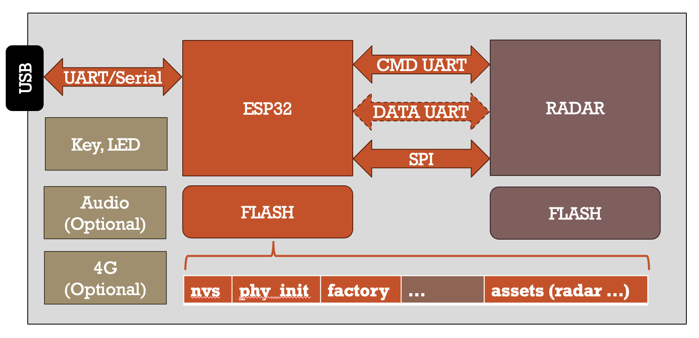

# Wavvar MMWK

Chinese version: [中文文档](./README_CN.md)

Wavvar MMWK (mmWave Kit) is a product-level mmWave radar sensor platform. This directory contains all pre-built firmwares, documentation, and CLI tools needed to operate and manage MMWK devices.

## Features

- **Radar Development Fast-track**: The default [**BRIDGE mode**](./docs/en/bridge.md) transforms MMWK into a transparent gateway, allowing you to stream raw radar data directly to high-level applications or AI agents via MQTT ([CLIv1](./docs/CLIv1.md) default, [MCPv1](./docs/en/mcpv1.md) compatibility). Start prototyping your radar-powered application in minutes, not months.
- **TI Firmware Compatible**: Runs standard TI radar binaries without modification. This allows you to leverage the entire TI radar ecosystem — develop on TI EVMs, use TI signal processing toolboxes, and deploy directly to MMWK with zero code migration.
- **Dual-MCU Architecture**: Separates radar processing (TI C674x) from application logic (ESP32/ESP32S3). This ensures uninterrupted real-time radar performance while providing the flexibility to run complex networking, AI logic, and custom application code on the ESP MCU.
- **Flexible Data Pipeline**: Supports multiple operating modes (BRIDGE, HUB, RAW). This versatility allows you to switch between transparent data forwarding and on-device intelligent processing based on your specific application requirements.
- **AI-Native Support**: The device natively implements a canonical CLI JSON control protocol ([CLIv1](./docs/CLIv1.md)) over UART and MQTT, while the host provides an LLM-friendly CLI tool. [MCP/JSON-RPC 2.0](./docs/en/mcpv1.md) remains supported as a compatibility layer for callers that explicitly select `--protocol mcp`.
- **Comprehensive Tooling**: Includes open-source CLI, integration tests, and documentation. These resources reduce development friction and ensure a robust dev-to-deploy cycle with proven reference implementations.
- **Production & Deployment Ready**: Built for scale with robust OTA updates, standardized configuration management, and field-proven reliability, providing everything you need for mass production and large-scale deployment.
- **Ecosystem & Customization**: Our ecosystem provides comprehensive tailored solutions—from 200Hz high-frequency radar firmware and multi-functional applications (people tracking, vital signs) to full-stack customization for cloud platforms and mobile apps.

## Hardware

### Architecture

Every MMWK board consists of two MCUs: ESP and radar. The mmwk component provides the driver for the ESP chip and the radar chip.



The ESP chip communicates with the radar chip through three interfaces:

- **CMD UART** — Command channel for sending configuration and control commands to the radar
- **DATA UART** — High-speed data channel for receiving radar output (point clouds, TLV frames, etc.)
- **SPI** — Alternative high-bandwidth interface for radar data transfer

The ESP's flash is partitioned to hold NVS (device settings), PHY init data, the factory application, and an **assets** partition that stores radar firmware binaries and configuration files. In managed startup flows such as bridge `auto` and hub `auto`, the ESP can load radar firmware from this assets partition and flash/configure the radar chip automatically.

Optional peripherals include ESP-side user I/O, Audio, and 4G/LTE modules on selected variants. The host connects to the ESP via USB-UART/Serial for local access.

### Board Types

Name | ESP | Audio | Radar | LED | 4G/LTE Support
--- | --- | --- | --- | --- | ---
[MINI](./modules/mini.md) | ESP32 | No | IWR6843AoP | 1 | No
[PRO](./modules/pro.md) | ESP32S3 | Optional | IWR6843AoP | 1 | No
[RPI](./modules/rpx.md#3-rpi-6432-sensing-module) | ESP32S3 | Yes | IWRL6432AoP | 1 | No
[CFH](./modules/rpx.md#2-6843-series-sensing-modules) | ESP32S3 | Yes | IWR6843AoP | 1 | No
IOT | ESP32S3 | No | IWR6843AoP | 1 | Yes
[WDR](./modules/mdr.md) | ESP32S3 | Yes | IWRL6432AoP | 2 | Optional

`LED` specifically refers to the radar-chip LED. Its IO follows the TI reference examples and must be controlled by the radar firmware.

All boards also include one ESP-controlled button and one ESP-controlled LED.

If you need product-line specific hardware context beyond the [bridge workflow docs](./docs/en/bridge.md), start with the [Product Module Overview](./modules/README.md). The RPX line now has dedicated introductions for [MINI](./modules/mini.md) and [PRO](./modules/pro.md), while [RPI](./modules/rpx.md#3-rpi-6432-sensing-module) and [CFH](./modules/rpx.md#2-6843-series-sensing-modules) remain in the [RPX module guide](./modules/rpx.md). The `WDR/MDR` controller-and-radar-board path is covered by the [MDR module introduction](./modules/mdr.md), the [WDR-M main controller carrier board introduction](./modules/wdr-m.md), the [WDR-4G communication board introduction](./modules/wdr-4g.md), the [ML6432A_BO module introduction](./modules/ml6432a_bo.md), and the [ML6432A module introduction](./modules/ml6432a.md).

The hardware architecture of separate MCUs enables users to quickly evaluate any TI radar firmware. Users can utilize all of TI's toolchains and development boards to develop and debug radar firmware, and then develop applications on the MMWK's ESP MCU. Existing TI radar firmware such as People Tracking and Vital Signs can all be used on MMWK.

The ESP chip acts as a controller for the radar chip. It is responsible for powering, flashing firmware, configuring the radar chip, and even extra radar data processing. The radar chip handles signal processing and data generation. The mmwk component provides a unified interface for the two chips, transparent to the user.

The ESP chip can be used for implementing application-level algorithms such as AI inference, MQTT, and custom control/protocol layers (CLIv1 default, MCPv1 compatibility). The mmwk component provides a unified interface for the ESP chip, transparent to the user.


### MMWK vs. TI Evaluation Boards

MMWK uses the same TI radar chips and is fully compatible with standard TI firmware binaries. The recommended development workflow leverages each platform's strengths:

```
┌─────────────────────────────────────────────────────────────────────────┐
│                        Recommended Workflow                             │
│                                                                         │
│  Stage 1: Algorithm Research            Stage 2: Deployment & Scale     │
│  ─────────────────────────              ─────────────────────────────   │
│  TI EVM + DCA1000                       MMWK                            │
│                                                                         │
│  • Lab environment                      • Real-world scenarios          │
│  • Raw ADC capture via DCA1000          • Standalone operation          │
│  • MATLAB / Python offline analysis     • WiFi / MQTT / 4G connectivity │
│  • Algorithm prototyping & tuning       • On-device ESP processing      │
│  • Full TI toolchain (CCS, mmWave SDK)  • OTA firmware updates          │
│                                         • CLIv1 default control + MCPv1 compat │
│                                                                         │
│  ──────────────── firmware binary ──────────────▶                       │
│  Same .bin + .cfg works on both platforms                               │
└─────────────────────────────────────────────────────────────────────────┘
```

**Stage 1 — Algorithm R&D (TI EVM + DCA1000):** Use TI's evaluation modules (e.g., IWR6843AoP EVM) together with the DCA1000 data capture card for raw ADC-level data collection, offline analysis in MATLAB/Python, and algorithm prototyping. This is the ideal environment for tuning chirp parameters, developing signal processing chains, and validating detection performance under controlled lab conditions.

**Stage 2 — Scenario Expansion & Application Deployment (MMWK):** Once the algorithm and firmware are validated on the TI EVM, flash the same `.bin` + `.cfg` onto an MMWK board. MMWK adds WiFi/MQTT/4G connectivity, on-device ESP processing, OTA updates, and a canonical CLIv1 control plane with MCPv1 compatibility — everything needed to move from lab research to real-world deployment in diverse scenarios (elderly care, smart home, healthcare, etc.).

> **Key point:** The firmware binary developed and tested on a TI evaluation board can be directly loaded onto MMWK without modification. MMWK extends the TI ecosystem rather than replacing it.

### Bring Your Own Device & Software

MMWK provides the freedom to bring your own software and hardware to the ecosystem:
- **Software (BYOS)**: Build on top of the existing application layer or rewrite the entire firmware stack to suit your proprietary sensing logic and cloud integration needs.
- **Device (BYOD)**: Run MMWK-related software on your own hardware. We are actively expanding support for standard TI radar EVMs and ESP32 development boards to ensure maximum hardware portability.


## Getting Started

MMWK defaults to [BRIDGE mode](./docs/en/bridge.md). Use this section to choose the right first document based on your board's current state:

1. **[Factory Flash Guide](./docs/en/flash.md)**: Start here if your board is blank or erased and you need the first ESP bridge flash.
2. **[MMWK Sensor BRIDGE Mode](./docs/en/bridge.md)**: Start here if bridge firmware is already running and you want the first end-to-end bridge bring-up, including radar flash plus collection.
3. **[Device OTA Guide](./docs/en/ota.md)**: Start here if the device is already running bridge firmware and you only need an ESP OTA update.

[MMWK Bridge Mode](./docs/en/bridge.md) is the canonical getting-started guide for bridge mode. It routes you onward to factory flash, radar flash plus collection, OTA, and the deeper [MMWK Sensor BRIDGE Reference](./docs/en/bridge-reference.md).


## Tools

Every MMWK device exposes its capabilities through a standardized protocol. The open-source CLI tool communicates with the device over this protocol, and any custom application can do the same.

```
┌─────────────────┐     CLIv1 (default) / MCPv1 (compat)     ┌──────────────────┐
│   mmwk_cli      │ ──── UART (serial) or MQTT ────────────▶ │  MMWK Device     │
│   (Python)      │ ◀──── notifications / responses ──────── │  (ESP firmware)  │
└─────────────────┘                                          └──────────────────┘
       ▲                                                              ▲
       │  same protocol                                               │
       ▼                                                              │
  Custom App /                                                CLIv1 builtin protocol
  AI Agent (Claude, etc.)                                     (optional MCPv1 compat layer)
```

### Control Protocol

Current host workflows default to a canonical CLI JSON protocol that keeps the same service/action semantics as the legacy MCP tool layer. MCP remains available for compatibility callers that explicitly pass `--protocol mcp`.

The device accepts commands and pushes sensor events over two transports:

- **UART** (115200 baud, newline-delimited JSON)
- **MQTT** (for WiFi / LAN / cloud remote access)

The canonical CLI JSON specification is documented in [Wavvar MMWK Canonical CLI Protocol V1.0](./docs/CLIv1.md).

If you need the MCP compatibility path, any MCP-compatible client — including AI Agents like Claude — can still discover tools (`tools/list`), invoke device actions (`tools/call`), and receive real-time sensor notifications without custom drivers. The full MCP compatibility spec is documented in [Wavvar MMWK MCP Protocol Specification V1.3](./docs/en/mcpv1.md).

### MMWK CLI (Open Source)

[mmwk_cli](./mmwk_cli/) is an **open-source** Python CLI that defaults to the canonical CLI JSON protocol, with MCP still available as a compatibility fallback when needed. It is both a ready-to-use management utility and a reference implementation showing how to build custom host applications on top of the MMWK control protocols.

- **Cross-platform** — Python 3.10+, runs on macOS, Linux, and Windows
- **Dual transport** — UART (serial) for local access, MQTT for remote management over the network
- **Firmware updates** — HTTP OTA (fastest) and UART chunk transfer (no WiFi needed)
- **Runtime reconf** — `radar reconf` switches runtime `welcome` / `verify` / cfg behavior without flashing firmware again
- **Startup contract discovery** — `device hi` and `mgmt.device` expose `startup_mode` plus `supported_modes`; BRIDGE supports `["auto", "host"]`, HUB supports `["auto"]`
- **Device control** — Handshake, radar start/stop, WiFi/MQTT configuration, firmware partition management
- **Zero setup shell wrapper** — `./mmwk_cli/mmwk_cli.sh` bootstraps the CLI on macOS/Linux; direct Python usage remains available as an advanced fallback from the `mmwk_cli` directory via `PYTHONPATH=scripts python3 -m mmwk_cli`
- **Built-in server helper** — `./mmwk_cli/server.sh` provides a quick local MQTT broker and HTTP file server to assist with firmware OTA and data collection workflows
- **AI command-line ready** — Designed to be seamlessly used by autonomous AI agents (like Claude) to discover, control, and interact with the sensor
- **Integration tests included** — End-to-end flash, OTA, and persistence verification test suite

For full usage and command reference, see [CLI README](./mmwk_cli/docs/en/README.md).


## Radar Firmwares

Any firmware that can run on the supported radar chips can be used with MMWK. Go to the TI website to download the latest firmwares either from the [mmWave SDK](https://www.ti.com/tool/download/MMWAVE-SDK) for IWR6843AoP or [mmWave Low Power SDK](https://www.ti.com/tool/download/MMWAVE-L-SDK) for IWRL6432AoP. Another good resource is the [RADAR-TOOLBOX](https://www.ti.com/tool/download/RADAR-TOOLBOX).

A configuration file is required for most standard TI firmwares. It is a text file containing the configuration parameters for the radar. The radar processing will not start until the configuration file is received. A few TI firmwares do not require a configuration file and will start processing as soon as the firmware is loaded.

> **NOTE**: The configuration file is specific to each firmware. MAKE SURE YOU USE THE CORRECT ONE. The configuration file is usually named `*.cfg`. You are strongly recommended to test the firmware and configuration file with the TI evaluation board before using it in this project.

### TI Pre-built Radar Firmwares

The following radar firmwares are included in `firmwares/radar/`:

| Chip | Firmware | Directory | Files |
|------|----------|-----------|-------|
| IWR6843AoP | Out-of-box Demo | `iwr6843/oob/` | `.bin` + `.cfg` |
| IWR6843AoP | Vital Signs Detection | `iwr6843/vital_signs/` | `.bin` + `.cfg` |
| IWRL6432AoP | Presence Detection | `iwrl6432/presence/` | `.appimage` + `.cfg` |

### MMWK_ROID

ROID is Wavvar's custom radar firmware line for high-sample ROI observation and fine micro-motion analysis. It keeps layered outputs from `RAW ROI` to `PHASE`, `BREATH`, and `HEART`, which makes it a stronger fit for higher-precision heart / respiration observation and research-oriented signal analysis than coarse presence-only paths.

It can serve as the firmware base for advanced vital-sign workflows while also leaving room for ECG-like waveform research and blood-pressure algorithm validation. This firmware is commercially licensed; contact `bp@wavvar.com`.

See [MMWK_ROID Overview](./docs/en/roid.md) for the English document and [中文版本](./docs/zh-cn/roid.md) for the Chinese document.

## ESP Firmwares

Pre-built ESP firmwares are located in `firmwares/esp/`. Each variant is built for a specific board type and special functions.

For bridge firmware lifecycle docs:

- [Factory Flash Guide](./docs/en/flash.md) for blank/erased devices and package-based first flash.
- [Device OTA Guide](./docs/en/ota.md) for OTA updates on devices already running bridge firmware.


### mmwk_sensor_bridge

mmwk_sensor_bridge is the BRIDGE mode firmware running on the ESP chip. In this mode, the ESP performs no radar signal processing and acts purely as a transparent bridge between the radar chip and the external host.

**Core features:**

- **Radar firmware management** — In bridge `auto`, the ESP can automatically load radar firmware (`.bin` + `.cfg`) from SPIFFS and perform managed bring-up; in bridge `host`, startup ownership stays with the host and the ESP does not automatically send radar configuration
- **OTA flashing** — Supports remote radar firmware updates via HTTP/MQTT, as well as UART chunk transfer
- **Raw data forwarding** — Forwards raw data frames from the radar chip directly to the host without any signal processing
- **Control protocol** — Built-in canonical CLI JSON control over both UART (115200 baud) and MQTT, with MCPv1 JSON-RPC compatibility for callers that explicitly select `--protocol mcp`
- **WiFi provisioning** — Creates a hotspot (`MMWK_XXXX`) on first boot; users configure WiFi credentials via a browser captive portal
- **MQTT relay** — Once connected to WiFi, relays radar data and receives control commands through an MQTT broker

### mmwk_sensor_hub

mmwk_sensor_hub is the HUB mode firmware running on the ESP chip. It extends the BRIDGE capabilities with on-device radar processing and exposes the additional `hub` MCP tool for higher-level sensing workflows.

This is not provided as a pre-built firmware.

## Legal Notice

The radar firmware binaries provided in `firmwares/radar/` include original builds from [**Texas Instruments (TI)**](https://www.ti.com) and custom builds from [**Wavvar**](https://wavvar.com).

- **TI Firmwares**: Binaries sourced from TI toolboxes or SDKs remain the property of Texas Instruments. They are included for evaluation and integration purposes. Official releases can be found in the [TI Radar Toolbox](https://dev.ti.com/tirex/explore/node?node=A__AGun-M.W.r.X.G.X.r.G.X.r.G.X.A).
- **Wavvar Firmwares**: Custom binaries (like MMWK_ROID) are developed by and are the property of Wavvar.
