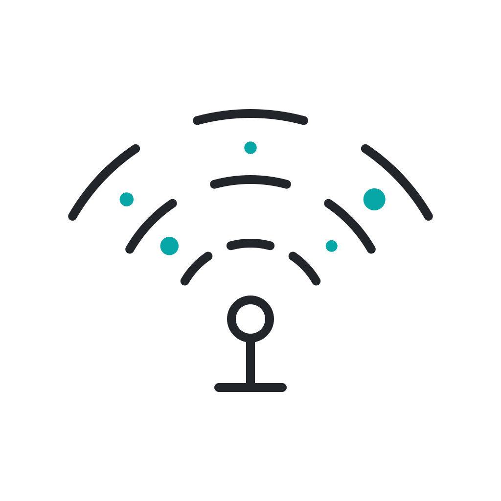

# Wavvar MMWK

<p align="center">
  
</p>

Chinese version: [中文文档](./README_CN.md)

Wavvar MMWK (mmWave Kit) is a product-level mmWave radar sensor platform. This directory contains all pre-built firmwares, documentation, and CLI tools needed to operate and manage MMWK devices.

## 1. Features

- **Radar Development Fast-track**: The [**mmWave Sensor Development Kit**](./docs/en/mmwk-sensor.md) gives MMWK a shared sensor platform for CLI control, Wi-Fi/MQTT/4G connectivity, OTA, radar firmware management, and raw radar passthrough. Start prototyping your radar-powered application in minutes, not months.
- **TI Firmware Compatible**: Runs standard TI radar binaries without modification. This allows you to leverage the entire TI radar ecosystem — develop on TI EVMs, use TI signal processing toolboxes, and deploy directly to MMWK with zero code migration.
- **Dual-MCU Architecture**: Separates radar processing (TI C674x) from application logic (ESP32/ESP32S3). This ensures uninterrupted real-time radar performance while providing the flexibility to run complex networking, AI logic, and custom application code on the ESP MCU.
- **Flexible Data Pipeline**: Supports multiple operating modes (BRIDGE, HUB, RAW). This versatility allows you to switch between transparent data forwarding and on-device intelligent processing based on your specific application requirements.
- **AI-Native Support**: The device natively implements a canonical CLI JSON control protocol ([CLIv1](./docs/CLIv1.md)) over UART and MQTT, while the host provides an LLM-friendly CLI tool. [MCP/JSON-RPC 2.0](./docs/en/mcpv1.md) remains supported as a compatibility layer for callers that explicitly select `--protocol mcp`.
- **Comprehensive Tooling**: Includes open-source CLI, integration tests, and documentation. These resources reduce development friction and ensure a robust dev-to-deploy cycle with proven reference implementations.
- **Production & Deployment Ready**: Built for scale with robust OTA updates, standardized configuration management, and field-proven reliability, providing everything you need for mass production and large-scale deployment.
- **Ecosystem & Customization**: Our ecosystem provides comprehensive tailored solutions—from 200Hz high-frequency radar firmware and multi-functional applications (people tracking, vital signs) to full-stack customization for cloud platforms and mobile apps.

## 2. Hardware

### 2.1 Architecture

Every MMWK board consists of two MCUs: ESP and radar. The mmwk component provides the driver for the ESP chip and the radar chip.


The ESP chip communicates with the radar chip through three interfaces:

- **CMD UART** — Command channel for sending configuration and control commands to the radar
- **DATA UART** — High-speed data channel for receiving radar output (point clouds, TLV frames, etc.)
- **SPI** — Alternative high-bandwidth interface for radar data transfer

The ESP's flash is partitioned to hold NVS (device settings), PHY init data, the factory application, and an **assets** partition that stores radar firmware binaries and configuration files. In managed startup flows such as bridge `auto` and hub `auto`, the ESP can load radar firmware from this assets partition and flash/configure the radar chip automatically.

Peripherals vary by board. PRO and WSR include onboard 4G/LTE Cat1 as standard, while selected variants provide ESP-side user I/O, audio, or external 4G/LTE modules. The host connects through USB-UART/Serial, or through native Type-C USB on WDR and WSR.

### 2.2 Board Types

Name | ESP | Audio | Radar | LED | 4G/LTE Support
--- | --- | --- | --- | --- | ---
[MINI](./modules/mini.md) | ESP32 | No | IWR6843AoP | 1 | No
[PRO](./modules/pro.md) | ESP32S3 | Optional | IWR6843AoP | 1 | Standard Cat1/4G
[WSR](./modules/wsr.md) | ESP32S3 | Optional | IWR6843AoP | 1 | Standard Cat1/4G
[RPI](./modules/rpx.md#3-rpi-6432-sensing-module) | ESP32S3 | Yes | IWRL6432AoP | 1 | No
[CFH](./modules/rpx.md#2-6843-series-sensing-modules) | ESP32S3 | Yes | IWR6843AoP | 1 | No
IOT | ESP32S3 | No | IWR6843AoP | 1 | Yes
[WDR](./modules/wdr-m.md) | ESP32S3 | Yes | IWRL6432AoP | 2 | Optional

`LED` specifically refers to the radar-chip LED. Its IO follows the TI reference examples and must be controlled by the radar firmware. All boards also include one ESP-controlled button and one ESP-controlled LED; their shared behavior is documented in the [mmWave Sensor Development Kit](./docs/en/mmwk-sensor.md#5-user-interaction). For product-line hardware details, start with the [Product Module Overview](./modules/README.md).

MMWK's dual-MCU architecture lets users evaluate standard TI radar firmware quickly: develop and debug the radar firmware on TI toolchains and evaluation boards, then deploy the same radar binary and configuration on MMWK while building application logic on the ESP MCU. The ESP powers, flashes, configures, and supervises the radar chip, while the radar chip owns RF signal processing and data generation.

The ESP MCU can also run application-level logic such as AI inference, MQTT connectivity, and custom control or protocol layers. The `mmwk` component presents a unified interface across the ESP and radar sides, so common workflows stay consistent across supported boards.


### 2.3 MMWK vs. TI Evaluation Boards

MMWK uses the same TI radar chips and is fully compatible with standard TI firmware binaries. The recommended development workflow leverages each platform's strengths:

```
┌─────────────────────────────────────────────────────────────────────────┐
│                        Recommended Workflow                             │
│                                                                         │
│  Stage 1: Algorithm Research            Stage 2: Deployment & Scale     │
│  ─────────────────────────              ─────────────────────────────   │
│  TI EVM + DCA1000                       MMWK                            │
│                                                                         │
│  • Lab environment                      • Real-world scenarios          │
│  • Raw ADC capture via DCA1000          • Standalone operation          │
│  • MATLAB / Python offline analysis     • WiFi / MQTT / 4G connectivity │
│  • Algorithm prototyping & tuning       • On-device ESP processing      │
│  • Full TI toolchain (CCS, mmWave SDK)  • OTA firmware updates          │
│                                         • CLIv1 default control + MCPv1 compat │
│                                                                         │
│  ──────────────── firmware binary ──────────────▶                       │
│  Same .bin + .cfg works on both platforms                               │
└─────────────────────────────────────────────────────────────────────────┘
```

**Stage 1 — Algorithm R&D (TI EVM + DCA1000):** Use TI's evaluation modules (e.g., IWR6843AoP EVM) together with the DCA1000 data capture card for raw ADC-level data collection, offline analysis in MATLAB/Python, and algorithm prototyping. This is the ideal environment for tuning chirp parameters, developing signal processing chains, and validating detection performance under controlled lab conditions.

**Stage 2 — Scenario Expansion & Application Deployment (MMWK):** Once the algorithm and firmware are validated on the TI EVM, flash the same `.bin` + `.cfg` onto an MMWK board. MMWK adds WiFi/MQTT/4G connectivity, on-device ESP processing, OTA updates, and a canonical CLIv1 control plane with MCPv1 compatibility — everything needed to move from lab research to real-world deployment in diverse scenarios (elderly care, smart home, healthcare, etc.).

> **Key point:** The firmware binary developed and tested on a TI evaluation board can be directly loaded onto MMWK without modification. MMWK extends the TI ecosystem rather than replacing it.

### 2.4 Bring Your Own Device & Software

MMWK provides the freedom to bring your own software and hardware to the ecosystem:
- **Software (BYOS)**: Build on top of the existing application layer or rewrite the entire firmware stack to suit your proprietary sensing logic and cloud integration needs.
- **Device (BYOD)**: Run MMWK-related software on your own hardware. We are actively expanding support for standard TI radar EVMs and ESP32 development boards to ensure maximum hardware portability.


## 3. Getting Started

### 3.1 Prerequisites

**Hardware:** Choose a supported MMWK board first; the board table above and the [Product Module Overview](./modules/README.md) explain the available hardware families. A UART-to-USB adapter is needed when your factory-flash path or board wiring exposes only UART, and it is also the fastest way to run first-time UART configuration/debug commands. If the board already exposes a supported USB serial interface, use that interface for local CLI access.

**Host CLI:** The CLI supports macOS/Linux POSIX shells through `./cli/run.sh` and Windows PowerShell through `./cli/run.ps1`. Both wrappers resolve relative firmware/config/output paths from the directory where you invoke the wrapper. The POSIX wrapper manages its own `./cli/venv`; the PowerShell wrapper uses the active/system Python 3.10+ environment, so install `./cli/requirements.txt` first. Task helpers also have PowerShell wrappers with documented parity limits in the [CLI README](./cli/docs/en/README.md#host-platform-entry-points).

**Network:** Prepare either Wi-Fi provisioning or, on cellular-capable boards, a usable 4G/Cat1 SIM and antenna. Wi-Fi can be configured through the device AP/browser portal or quickly through UART CLI; 4G is only available on supported boards and is selected through the shared network-priority behavior. Network readiness matters before MQTT control, MQTT raw collection, HTTP OTA downloads, or upload/record tests.

**Servers:** MQTT and HTTP can run locally on your laptop, on a LAN machine, or in the cloud. MQTT is the control and data broker: it carries CLI JSON command/response traffic and the raw radar topics used by collection workflows. HTTP is used when the device must download radar/ESP firmware or config files for OTA, and it can also act as the upload endpoint for record verification. For a local lab setup, start with the CLI [Local Server Helper](./cli/docs/en/README.md#local-server-helper-serversh); the helper runs a Python aMQTT broker from `./cli/requirements.txt`, so no system Mosquitto install is required.

### 3.2 Application Scenarios

**Collect radar data:** Use this path when an [`mmwk_sensor`](./docs/en/mmwk-sensor.md) firmware profile is already running and you want raw radar data, point-cloud/data validation, or a repeatable capture workflow. Configure Wi-Fi or 4G, make sure MQTT is reachable, then follow the [mmWave Sensor Development Kit](./docs/en/mmwk-sensor.md) and the [Local MQTT/HTTP End-to-End Collection Example](./cli/docs/en/data-collection.md#9-local-mqtthttp-end-to-end-collection-example). For task-oriented wrappers, use [Radar Task Tools](./cli/docs/en/radar-task-tools.md) and [Develop Radar With Bridge](./cli/docs/en/bridge-ti-radar-debug.md).

**Flash your own radar firmware:** Use this path when you have a radar firmware/config pair that you developed or selected yourself. Validate the `.bin` / `.appimage` plus `.cfg` pairing on the radar development board when possible, then use the MMWK bridge capability to flash, configure, and collect from the same artifact pair. The main references are [Radar Firmwares](#5-radar-firmwares), [Develop Radar With Bridge](./cli/docs/en/bridge-ti-radar-debug.md), and the CLI [Firmware Flashing Workflow](./cli/docs/en/README.md#firmware-flashing-workflow). Use HTTP when you want network OTA download; use UART or MQTT chunk transfer when that is the better fit for your bench setup.

**Update ESP firmware by OTA:** Use this path when the device is already running the current public `mmwk_sensor_bridge` package and you only need to update the ESP firmware itself. You need an HTTP URL that the device can reach; this can come from local `server.sh` or a cloud/LAN HTTP server. Follow the [Device OTA Guide](./docs/en/ota.md).

**Restore the factory baseline:** Use this path when the ESP is blank, erased, badly misconfigured, or you need to return to the published bridge factory image. A full factory restore uses `factory.zip` and is covered by the [Factory Flash Guide](./docs/en/flash.md); the local serial path requires the target serial port and ESP-IDF, while the ESP Launchpad DIY path can use the extracted merged factory image. If the current firmware is still healthy and you only need to clear saved settings, use the shared KEY behavior in [User Interaction](./docs/en/mmwk-sensor.md#5-user-interaction) or the CLI `node factory-reset` command from the [CLI README](./cli/docs/en/README.md#command-reference).

[mmWave Sensor Development Kit](./docs/en/mmwk-sensor.md) is the canonical getting-started guide and reference for the shared [`mmwk_sensor`](./docs/en/mmwk-sensor.md) platform. It routes you onward to factory flash, radar flash plus collection, OTA, shared user interaction, control transport, raw passthrough, and runtime verification.

## 4. Tools

Every MMWK device exposes its capabilities through a standardized protocol. The open-source CLI tool communicates with the device over this protocol, and any custom application can do the same.

```
┌─────────────────┐     CLIv1 (default) / MCPv1 (compat)     ┌──────────────────┐
│   mmwk_cli      │ ──── UART (serial) or MQTT ────────────▶ │  MMWK Device     │
│   (Python)      │ ◀──── notifications / responses ──────── │  (ESP firmware)  │
└─────────────────┘                                          └──────────────────┘
       ▲                                                              ▲
       │  same protocol                                               │
       ▼                                                              │
  Custom App /                                                CLIv1 builtin protocol
  AI Agent (Claude, etc.)                                     (optional MCPv1 compat layer)
```

The diagram shows the intended integration model: `mmwk_cli` is the open-source host implementation and the best-supported path for Agent / LLM-driven operation, while custom applications can speak the same standard CLI JSON protocol directly. The protocol is transport-neutral across UART and MQTT, with MCPv1 kept as an explicit compatibility mode for callers that need it.

- [CLI README](./cli/docs/en/README.md)
- [Wavvar MMWK Canonical CLI Protocol V1.1](./docs/CLIv1.md)
- [Wavvar MMWK MCP Protocol Specification V1.3](./docs/en/mcpv1.md)
- [Radar Task Tools](./cli/docs/en/radar-task-tools.md)
- [Develop Radar With Bridge](./cli/docs/en/bridge-ti-radar-debug.md)

## 5. Radar Firmwares

Any firmware that can run on the supported radar chips can be used with MMWK. Go to the TI website to download the latest firmwares either from the [mmWave SDK](https://www.ti.com/tool/download/MMWAVE-SDK) for IWR6843AoP or [mmWave Low Power SDK](https://www.ti.com/tool/download/MMWAVE-L-SDK) for IWRL6432AoP. Another good resource is the [RADAR-TOOLBOX](https://www.ti.com/tool/download/RADAR-TOOLBOX).

A configuration file is required for most standard TI firmwares. It is a text file containing the configuration parameters for the radar. The radar processing will not start until the configuration file is received. A few TI firmwares do not require a configuration file and will start processing as soon as the firmware is loaded.

> **NOTE**: The configuration file is specific to each firmware. MAKE SURE YOU USE THE CORRECT ONE. The configuration file is usually named `*.cfg`. You are strongly recommended to test the firmware and configuration file with the TI evaluation board before using it in this project.

### 5.1 TI Pre-built Radar Firmwares

The following radar firmwares are included in `firmwares/radar/`:

| Chip | Firmware | Directory | Files |
|------|----------|-----------|-------|
| IWR6843AoP | Out-of-box Demo | `iwr6843/oob/` | `.bin` + `.cfg` |
| IWR6843AoP | Vital Signs Detection | `iwr6843/vital_signs/` | `.bin` + `.cfg` |
| IWRL6432AoP | Presence Detection | `iwrl6432/presence/` | `.appimage` + `.cfg` |

### 5.2 ROID

[ROID](./docs/en/roid.md) is Wavvar's custom radar firmware line for high-sample ROI observation and fine micro-motion analysis. It keeps layered outputs from `RAW ROI` to `PHASE`, `BREATH`, and `HEART`, which makes it a stronger fit for higher-precision heart / respiration observation and research-oriented signal analysis than coarse presence-only paths.

It can serve as the firmware base for advanced vital-sign workflows while also leaving room for ECG-like waveform research and blood-pressure algorithm validation. This firmware is commercially licensed; contact `bp@wavvar.com`.

## 6. ESP Firmwares

Pre-built ESP firmwares are located in `firmwares/esp/`. Each variant is built for a specific board type and special functions.

For current public ESP firmware lifecycle docs:

- [Factory Flash Guide](./docs/en/flash.md) for blank/erased devices and package-based first flash.
- [Device OTA Guide](./docs/en/ota.md) for OTA updates on devices already running the current public firmware package.

### 6.1 Bridge

`mmwk_sensor_bridge` is the baseline transparent-passthrough firmware profile built on the [`mmwk_sensor`](./docs/en/mmwk-sensor.md) platform. It is used for radar firmware development, flashing, configuration, tuning, raw radar collection, point-cloud/data validation, and real-time visualization workflows.

Bridge focuses on connecting the host, ESP, radar firmware, radar configuration, and radar data streams. It keeps the shared platform capabilities such as CLI JSON over UART/MQTT, Wi-Fi provisioning, MQTT relay, OTA/radar firmware management, and raw passthrough.

### 6.2 Hub

`mmwk_sensor_hub` is another firmware profile built on the same [`mmwk_sensor`](./docs/en/mmwk-sensor.md) platform. It provides a radar sensor hub profile that can expose sensor surfaces such as heart rate, respiration, sleep, and body movement, while retaining bridge capabilities such as radar raw / point-cloud real-time display and host-side validation.

Hub internals are intentionally not described in this public package documentation. This is not provided as a pre-built firmware.

## 7. Legal Notice

The radar firmware binaries provided in `firmwares/radar/` include original builds from [**Texas Instruments (TI)**](https://www.ti.com) and custom builds from [**Wavvar**](https://wavvar.com).

- **TI Firmwares**: Binaries sourced from TI toolboxes or SDKs remain the property of Texas Instruments. They are included for evaluation and integration purposes. Official releases can be found in the [TI Radar Toolbox](https://dev.ti.com/tirex/explore/node?node=A__AGun-M.W.r.X.G.X.r.G.X.r.G.X.A).
- **Wavvar Firmwares**: Custom binaries such as ROID are developed by and are the property of Wavvar.
