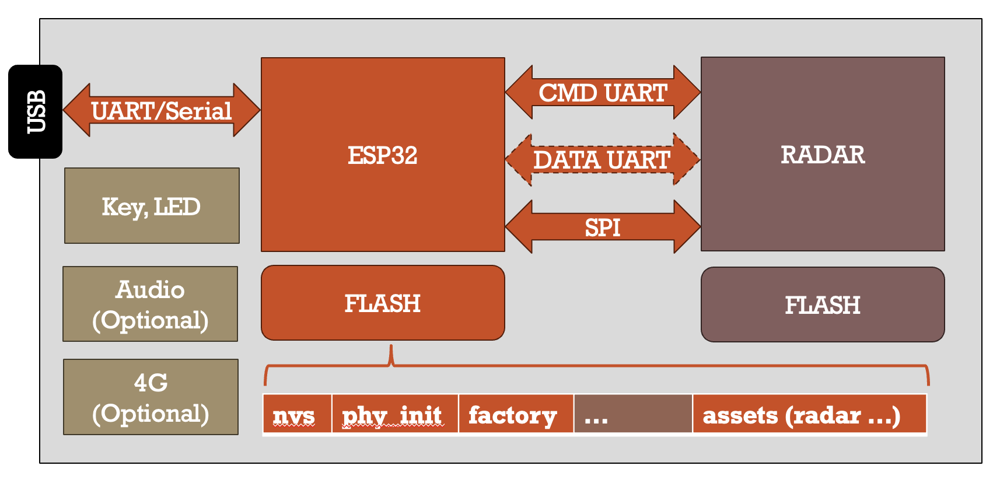

# Wavvar MMWK

English version: [English docs](./README.md)

Wavvar MMWK（mmWave Kit）是一个面向产品化的毫米波雷达传感器平台。本目录包含运行和管理 MMWK 设备所需的预编译固件、文档和 CLI 工具。

## 1. 特性

- **雷达开发快速起步**：[**mmWave Sensor Development Kit**](./docs/zh-cn/mmwk-sensor.md) 为 MMWK 提供共享 sensor 平台能力，包括 CLI 控制、Wi-Fi/MQTT/4G 联网、OTA、雷达固件管理和原始雷达透传，几分钟内就能开始原型验证。
- **兼容 TI 固件**：可直接运行标准 TI 雷达二进制，无需修改。你可以使用完整的 TI 雷达生态，在 TI EVM 上开发，最终零迁移部署到 MMWK。
- **双 MCU 架构**：将雷达处理（TI C674x）与应用逻辑（ESP32/ESP32S3）分离，在保证实时雷达性能的同时，保留复杂联网、AI 逻辑和自定义应用开发能力。
- **灵活的数据管线**：支持 BRIDGE、HUB、RAW 等多种运行模式，可按场景在透明转发和板载智能处理之间切换。
- **AI 原生支持**：设备端通过 UART 和 MQTT 内置标准 CLI JSON 控制协议（[CLIv1](./docs/CLIv1_CN.md)），主机端提供对大语言模型高度友好的 CLI 工具；同时保留 [MCP/JSON-RPC 2.0](./docs/zh-cn/mcpv1.md) 的兼容层，供显式指定 `--protocol mcp` 的调用方使用。
- **完整工具链**：包含开源 CLI、集成测试和文档，降低开发门槛，并提供从开发到部署的参考实现。
- **面向量产与部署**：具备 OTA、标准化配置管理和经过现场验证的可靠性，适合量产与大规模部署。
- **生态与定制能力**：支持 200Hz 高频雷达固件、人员跟踪、生命体征等多类应用，也支持云平台和移动端的全栈定制。

## 2. 硬件

### 2.1 架构

每块 MMWK 板卡都由两个 MCU 组成：ESP 和雷达芯片。`mmwk` 组件为 ESP 芯片和雷达芯片提供统一驱动。



ESP 芯片通过三种接口与雷达芯片通信：

- **CMD UART**：用于发送配置与控制命令
- **DATA UART**：用于接收雷达输出数据（点云、TLV 帧等）的高速通道
- **SPI**：雷达数据传输的另一种高带宽接口

ESP 的 Flash 分区中包含 NVS（设备设置）、PHY 初始化数据、出厂应用，以及一个用于存放雷达固件二进制与配置文件的 **assets** 分区。在 bridge `auto`、hub `auto` 这类受管启动流程里，ESP 可以从该分区加载雷达固件，并自动完成雷达刷写与配置。

不同板卡的外设配置有所不同。PRO 标准板自带 4G/LTE Cat1，部分型号还提供 ESP 侧用户 IO、音频或外接 4G/LTE 模块。主机通过 USB-UART/Serial 与 ESP 连接，实现本地访问。

### 2.2 板卡型号

Name | ESP | Audio | Radar | LED | 4G/LTE Support
--- | --- | --- | --- | --- | ---
[MINI](./modules/mini_cn.md) | ESP32 | No | IWR6843AoP | 1 | No
[PRO](./modules/pro_cn.md) | ESP32S3 | Optional | IWR6843AoP | 1 | 标配 Cat1/4G
[RPI](./modules/rpx_cn.md#3-rpi-6432-感知模块) | ESP32S3 | Yes | IWRL6432AoP | 1 | No
[CFH](./modules/rpx_cn.md#2-6843-系列感知模块) | ESP32S3 | Yes | IWR6843AoP | 1 | No
IOT | ESP32S3 | No | IWR6843AoP | 1 | Yes
[WDR](./modules/wdr-m_cn.md) | ESP32S3 | Yes | IWRL6432AoP | 2 | Optional

这里的 `LED` 特指雷达芯片侧 LED，其 IO 继承自 TI 参考例程，必须由雷达固件控制。所有板卡还包含一个由 ESP 控制的按键和一个由 ESP 控制的 LED；其共享行为见 [mmWave Sensor Development Kit](./docs/zh-cn/mmwk-sensor.md#5-用户交互)。产品线级别的硬件背景请从 [模组产品总览](./modules/README_CN.md) 开始。

双 MCU 架构让用户可以快速评估标准 TI 雷达固件：先继续使用 TI 工具链和评估板完成雷达固件开发与调试，再将同一份雷达二进制和配置部署到 MMWK，并在 ESP MCU 上开发应用。ESP 负责给雷达供电、刷写、配置和管理运行状态，雷达芯片负责 RF 信号处理与数据生成。

ESP MCU 也可用于实现 AI 推理、MQTT 联网、自定义控制或协议层等应用逻辑。`mmwk` 组件在 ESP 与雷达两侧提供统一接口，让常见工作流在受支持板卡上保持一致。

### 2.3 MMWK 与 TI 评估板对比

MMWK 使用与 TI 相同的雷达芯片，并完全兼容标准 TI 固件二进制。推荐的开发流程是结合两种平台的优势：

```
┌─────────────────────────────────────────────────────────────────────────┐
│                        Recommended Workflow                             │
│                                                                         │
│  Stage 1: Algorithm Research            Stage 2: Deployment & Scale     │
│  ─────────────────────────              ─────────────────────────────   │
│  TI EVM + DCA1000                       MMWK                            │
│                                                                         │
│  • Lab environment                      • Real-world scenarios          │
│  • Raw ADC capture via DCA1000          • Standalone operation          │
│  • MATLAB / Python offline analysis     • WiFi / MQTT / 4G connectivity │
│  • Algorithm prototyping & tuning       • On-device ESP processing      │
│  • Full TI toolchain (CCS, mmWave SDK)  • OTA firmware updates          │
│                                         • CLIv1 控制面（默认）+ MCPv1 兼容   │
│                                                                         │
│  ──────────────── firmware binary ──────────────▶                       │
│  Same .bin + .cfg works on both platforms                               │
└─────────────────────────────────────────────────────────────────────────┘
```

**阶段 1：算法研发（TI EVM + DCA1000）**：使用 TI 官方评估板（例如 IWR6843AoP EVM）配合 DCA1000 采集卡完成 ADC 原始数据采集、MATLAB/Python 离线分析和算法原型验证。这个阶段非常适合调优 chirp 参数、构建信号处理链以及在实验室环境中验证探测性能。

**阶段 2：场景扩展与应用部署（MMWK）**：当算法与固件在 TI EVM 上验证完成后，可以将同一份 `.bin` + `.cfg` 刷到 MMWK 板卡上。MMWK 提供 WiFi/MQTT/4G 联网、ESP 板载处理、OTA，以及标准 CLIv1 控制面（含 MCPv1 兼容），帮助你把实验室研究快速落地到养老、智能家居、医疗等真实场景中。

> **关键点**：在 TI 评估板上开发和验证过的固件二进制可以直接加载到 MMWK，无需修改。MMWK 是对 TI 生态的扩展，而不是替代。

### 2.4 Bring Your Own Device & Software

MMWK 支持你把自己的软件和硬件带入生态：

- **软件（BYOS）**：可以基于现有应用层继续开发，也可以完全重写固件栈以适配专有感知逻辑与云端集成。
- **硬件（BYOD）**：可以将 MMWK 相关软件运行在你自己的硬件上。我们也在持续扩展对 TI 标准 EVM 与 ESP32 开发板的支持。

## 3. 快速开始

### 3.1 前置条件

**硬件：** 先选择一块受支持的 MMWK 板卡，上面的板卡表和 [模组产品总览](./modules/README_CN.md) 可帮助你判断硬件系列。出厂刷机路径或板卡接线只暴露 UART 时，需要 UART-USB 转换器；需要通过 UART 快速下发首次配置或调试命令时，也建议准备 UART-USB 转换器。如果板卡已经提供受支持的 USB 串口，则直接使用该接口作为本地 CLI 入口。

**主机 CLI：** CLI 支持 macOS/Linux POSIX shell 入口 `./cli/run.sh`，也支持 Windows PowerShell 入口 `./cli/run.ps1`。POSIX wrapper 会管理自己的 `./cli/venv`；PowerShell wrapper 使用当前或系统 Python 3.10+ 环境，因此需要先安装 `./cli/requirements.txt`。任务 helper 也提供 PowerShell wrapper，其 parity 差异见 [CLI README](./cli/docs/zh-cn/README.md#主机平台入口)。

**网络：** 准备 Wi-Fi 配网，或在支持蜂窝网络的板卡上准备可用的 4G/Cat1 SIM 卡和天线。Wi-Fi 可以通过设备 AP/浏览器门户配置，也可以通过 UART CLI 快速配置；4G 只适用于支持蜂窝硬件的板卡，并遵循共享网络优先级行为。开始 MQTT 控制、MQTT raw 采集、HTTP OTA 下载或上传/录制验证前，都应先确认网络可用。

**服务器：** MQTT 和 HTTP 可以运行在本机、局域网主机或云服务器上。MQTT 是控制与数据 broker：负责 CLI JSON 命令/响应，以及采集流程使用的 raw 雷达 topic。HTTP 用于设备下载雷达/ESP 固件和配置文件，也可作为 record 验证时的上传端点。本地实验建议从 CLI 的 [本地 Server 辅助脚本](./cli/docs/zh-cn/README.md#本地-server-辅助脚本-serversh) 开始；`server.sh` / `server.ps1` 会提供 [5 分钟采集示例](./docs/zh-cn/collect.md) 和 [设备 OTA 指南](./docs/zh-cn/ota.md) 中需要复用的 MQTT broker 与 HTTP 文件服务上下文。

### 3.2 应用场景

**采集雷达数据：** 如果设备已经运行某个 [`mmwk_sensor`](./docs/zh-cn/mmwk-sensor.md) 固件 profile，而你要采集 raw 雷达数据、验证点云/数据或建立可复现采集流程，请走这条路径。先完成 Wi-Fi 或 4G 联网，确认 MQTT 可达，再阅读 [mmWave Sensor Development Kit](./docs/zh-cn/mmwk-sensor.md) 和 [本地 `server.sh` + `run.sh` Wi-Fi 刷机与 5 分钟采集示例](./docs/zh-cn/collect.md)。如果你要使用任务导向 wrapper，请看 [Radar Task Tools](./cli/docs/zh-cn/radar-task-tools.md) 和 [通过 Bridge 开发雷达](./cli/docs/zh-cn/bridge-ti-radar-debug.md)。

**刷自己的雷达固件：** 如果你已经有自己开发或选择的雷达 firmware/config 配对，请走这条路径。尽量先在雷达开发板上验证 `.bin` / `.appimage` 与 `.cfg` 是否匹配，再使用 MMWK 的 bridge 能力完成刷写、配置和采集验证。主要入口是 [雷达固件](#5-雷达固件)、[通过 Bridge 开发雷达](./cli/docs/zh-cn/bridge-ti-radar-debug.md)，以及 CLI 的 [固件刷写流程](./cli/docs/zh-cn/README.md#固件刷写流程)。需要网络 OTA 下载时使用 HTTP；台架场景也可以根据需要选择 UART 或 MQTT 分块传输。

**ESP OTA 升级：** 如果设备已经运行当前公开的 `mmwk_sensor_bridge` 包，而你只需要更新 ESP 固件本身，请走这条路径。设备需要能访问到一个 HTTP URL；这个 URL 可以由本地 `server.sh` 提供，也可以由局域网或云端 HTTP 服务器提供。具体流程见 [设备 OTA 指南](./docs/zh-cn/ota.md)。

**刷回工厂状态：** 如果 ESP 是空片、已擦除、配置严重异常，或你需要回到公开发布的 bridge 出厂镜像，请走这条路径。完整工厂恢复使用 `factory.zip`，见 [出厂刷机指南](./docs/zh-cn/flash.md)；本地串口路径需要目标串口和 ESP-IDF，ESP Launchpad DIY 路径则可使用解压后的合并出厂镜像。如果当前固件仍能正常运行，而你只是想清除保存配置，请使用 [用户交互](./docs/zh-cn/mmwk-sensor.md#5-用户交互) 中的 KEY 行为，或 CLI README 中的 [`node factory-reset`](./cli/docs/zh-cn/README.md#命令参考) 命令。

[mmWave Sensor Development Kit](./docs/zh-cn/mmwk-sensor.md) 是共享 [`mmwk_sensor`](./docs/zh-cn/mmwk-sensor.md) 平台的规范起步入口和参考文档，会继续把你分流到出厂刷机、雷达刷写加采集、ESP OTA、共享用户交互、控制传输、raw 透传和运行态确认。

## 4. 工具

每台 MMWK 设备都通过标准协议暴露其能力。开源 CLI 通过该协议与设备通信，任何自定义应用也可以使用同样的协议。

```
┌─────────────────┐     CLIv1（默认）/ MCPv1（兼容）     ┌──────────────────┐
│   mmwk_cli      │ ──── UART (serial) or MQTT ──────▶ │  MMWK Device     │
│   (Python)      │ ◀──── notifications / responses ── │  (ESP firmware)  │
└─────────────────┘                                    └──────────────────┘
       ▲                                                        ▲
       │  same protocol                                         │
       ▼                                                        │
  Custom App /                                          CLIv1 内置协议（默认）
  AI Agent (Claude, etc.)                               （可选 MCPv1 兼容层）
```

上图表达的是推荐集成模型：`mmwk_cli` 是开源主机侧实现，也是对 Agent / LLM 操作支持最完整的路径；自定义应用可以直接使用同一套标准 CLI JSON 协议接入设备。协议本身与传输解耦，支持 UART 和 MQTT，MCPv1 则作为显式选择的兼容模式保留。

- [CLI README](./cli/docs/zh-cn/README.md)
- [Wavvar MMWK 标准 CLI 控制协议 V1.1](./docs/CLIv1_CN.md)
- [Wavvar MMWK MCP 协议规范 V1.3](./docs/zh-cn/mcpv1.md)
- [Radar Task Tools](./cli/docs/zh-cn/radar-task-tools.md)
- [通过 Bridge 开发雷达](./cli/docs/zh-cn/bridge-ti-radar-debug.md)

## 5. 雷达固件

任何能运行在受支持雷达芯片上的固件，都可以与 MMWK 配合使用。你可以从 TI 官网下载最新固件：

- [mmWave SDK](https://www.ti.com/tool/download/MMWAVE-SDK) 用于 IWR6843AoP
- [mmWave Low Power SDK](https://www.ti.com/tool/download/MMWAVE-L-SDK) 用于 IWRL6432AoP
- [RADAR-TOOLBOX](https://www.ti.com/tool/download/RADAR-TOOLBOX) 也是重要资源

大多数标准 TI 固件都需要配套配置文件。该文件是一个文本文件，包含雷达运行参数；在收到配置文件前，雷达处理不会启动。也有少数 TI 固件无需配置文件，加载后即可开始运行。

> **注意**：配置文件与固件一一对应。请务必使用正确的 `*.cfg`。强烈建议先在 TI 评估板上验证固件和配置文件，再用于本项目。

### 5.1 TI 预编译雷达固件

以下雷达固件已包含在 `firmwares/radar/` 中：

| Chip | Firmware | Directory | Files |
|------|----------|-----------|-------|
| IWR6843AoP | Out-of-box Demo | `iwr6843/oob/` | `.bin` + `.cfg` |
| IWR6843AoP | Vital Signs Detection | `iwr6843/vital_signs/` | `.bin` + `.cfg` |
| IWRL6432AoP | Presence Detection | `iwrl6432/presence/` | `.appimage` + `.cfg` |

### 5.2 ROID

[ROID](./docs/zh-cn/roid.md) 是 Wavvar 面向高采样 ROI 观测与精细微动分析的一条毫米波雷达固件路线。它保留从 `RAW ROI` 到 `PHASE`、`BREATH`、`HEART` 的分层输出，比只给粗粒度存在结果的链路更适合高精度心率 / 呼吸观测，以及研究型信号分析。

它既可作为更高精度生命体征观测的固件基础，也为类心电波形研究和血压算法验证保留了继续扩展的数据入口。该固件按商业授权方式提供，请联系 `bp@wavvar.com`。

## 6. ESP 固件

预编译 ESP 固件位于 `firmwares/esp/`。每个变体对应特定板型和功能组合。

当前公开 ESP 固件生命周期文档：

- [出厂刷机指南](./docs/zh-cn/flash.md)：面向空片/擦除设备和首刷包流程。
- [设备 OTA 指南](./docs/zh-cn/ota.md)：面向已运行当前公开固件包设备的 OTA 更新流程。

### 6.1 Bridge

`mmwk_sensor_bridge` 是基于 [`mmwk_sensor`](./docs/zh-cn/mmwk-sensor.md) 平台的基础透明透传固件 profile，用于雷达固件开发、刷写、配置、调参、raw 雷达采集、点云/数据验证和实时显示等工作流。

Bridge 重点打通主机、ESP、雷达固件、雷达配置和雷达数据流，并保留 CLI JSON over UART/MQTT、Wi-Fi 配网、MQTT 中继、OTA/雷达固件管理和 raw 透传等共享平台能力。

### 6.2 Hub

`mmwk_sensor_hub` 是另一个基于同一 [`mmwk_sensor`](./docs/zh-cn/mmwk-sensor.md) 平台的固件 profile。它提供雷达传感器的 sensor hub profile，可支持心率、呼吸、睡眠、体动等传感器面，同时保留 bridge 能力，包括 raw 雷达数据、点云实时显示和主机侧验证等流程。

Hub 内部实现不在这份公开包文档中展开。当前未提供该固件的预编译版本。

## 7. 法律声明

`firmwares/radar/` 中提供的雷达固件二进制既包含来自 [**Texas Instruments (TI)**](https://www.ti.com) 的原始构建，也包含来自 [**Wavvar**](https://wavvar.com) 的自定义构建。

- **TI 固件**：来自 TI 工具箱或 SDK 的二进制仍归 Texas Instruments 所有，这些文件在仓库中仅用于评估和集成。官方发布请参考 [TI Radar Toolbox](https://dev.ti.com/tirex/explore/node?node=A__AGun-M.W.r.X.G.X.r.G.X.r.G.X.A)。
- **Wavvar 固件**：ROID 等自定义二进制由 Wavvar 开发并拥有。
