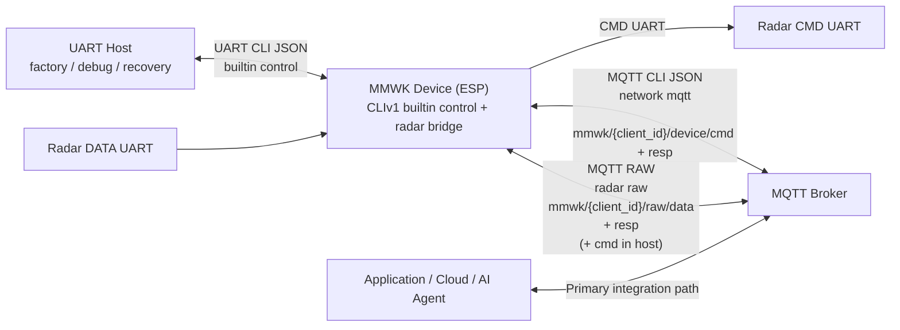

# MMWK CLI Wrapper

This document covers the host-side MMWK CLI wrappers for controlling and managing MMWK bridge/hub devices. The POSIX entrypoint is [`./run.sh`](../../run.sh) on macOS/Linux/Git Bash, and the PowerShell entrypoint is [`.\run.ps1`](../../run.ps1) on Windows. Both wrappers call the Python CLI in [`mmwk/`](../../mmwk/) and expose the same command surface over UART (Serial) and MQTT, defaulting to canonical CLI JSON while also supporting MCP when paired with an MCP-enabled firmware build.

The CLI now defaults to the canonical CLI JSON protocol. Most MMWK firmware builds also ship with CLI as the built-in control protocol. Some firmware versions additionally provide MCP support; contact us if you need an MCP-enabled firmware version. When using such a firmware version, select `--protocol mcp`.

## Raw Semantics Contract

- `raw_resp = startup-trimmed command-port output from on_cmd_data`
- `raw_data = raw data-port bytes from on_radar_data`
- `on_cmd_resp is an application-layer command response`, and it is different from raw capture.
- `on_radar_frame is an application-layer frame callback`, and it is different from raw capture.
- Startup noise before the first printable ASCII byte is trimmed in the radar driver before host-visible command-port output is published.

---

## Table of Contents
- [Installation](#installation)
- [Host Platform Entry Points](#host-platform-entry-points)
- [Quick Start](#quick-start)
- [Core Concepts](#core-concepts)
  - [Device Identification](#device-identification)
  - [Network & Provisioning](#network--provisioning)
- [Communication Layers](#communication-layers)
  - [Recommended Architecture](#recommended-architecture)
  - [UART (Local)](#uart-local)
  - [MQTT (Remote)](#mqtt-remote)
- [Command Reference](#command-reference)
- [Project Documentation](#project-documentation)
- [Hardware Interaction](#hardware-interaction)
- [Troubleshooting](#troubleshooting)

---

## Installation

### Prerequisites
- Python 3.10 or higher
- USB serial access to the device (when using UART)
- For POSIX workflows: macOS/Linux with `bash`, or Windows with Git Bash
- For Windows PowerShell workflows: PowerShell plus Python dependencies installed with `pip install -r requirements.txt`

The examples in this README use POSIX shell syntax (`./run.sh`, `./server.sh`) unless a PowerShell example is shown. On Windows PowerShell, use the matching `.ps1` wrapper and Windows serial ports such as `COM3`.

### Setup (Recommended)
```bash
# From the cli directory on macOS/Linux
./run.sh --help   # Print wrapper help and available commands
```

The wrapper creates `./venv` and installs dependencies on the first non-help command.

PowerShell wrappers use your active/system Python environment instead of creating `./venv` automatically:

```powershell
# From the cli directory on Windows PowerShell
py -m pip install -r requirements.txt
.\run.ps1 --help
```

### Setup (Manual)
```bash
python3 -m venv venv
source venv/bin/activate
pip install -r requirements.txt
```

## Host Platform Entry Points

| Workflow | macOS / Linux / Git Bash | Windows PowerShell | Notes |
|---|---|---|---|
| Main CLI | `./run.sh ...` | `.\run.ps1 ...` | `run.sh` manages `./venv`; `run.ps1` uses the active/system Python 3.10+ environment. |
| Local MQTT + HTTP server | `./server.sh ...` | `.\server.ps1 ...` | Both require `mosquitto` in `PATH` for the MQTT broker. |
| Registry task helpers | `./config.sh`, `./collect.sh` | `.\config.ps1`, `.\collect.ps1` | `config.ps1` delegates to `config.sh` and requires Bash, for example Git Bash. `collect.ps1` delegates to Bash when available; without Bash, `--trigger` pure-MQTT mode and a limited registry collection fallback remain available. |
| Direct Python | `python3 -m mmwk ...` | `py -m mmwk ...` or `python -m mmwk ...` | Use only when intentionally bypassing wrappers. |

PowerShell command arguments are the same as the POSIX examples except for the wrapper name and serial-port spelling:

```powershell
.\run.ps1 node info -p COM3
.\server.ps1 run --serve-dir C:\mmwk\artifacts --host-ip 192.168.4.8
.\collect.ps1 --trigger device-reboot --device-id DC5475C879C0
```

## Surface Update (2026-04-13)

- `bridge` and `hub` now share one sensor runtime core; they remain compile-time profiles.
- The hub-only public increment is `scene` plus the extra sensor endpoints/events that appear only after the requested sensor set passes support check.
- Public capability introspection now uses `endpoint list` and `proto list|status|manifest`.
- Public raw recorder/config control now uses `radar raw status`, `radar raw config get|set --json ...`, and `radar raw start|stop|trigger`.
- `node claim` is the UART/local device identity claim flow; it obtains `cid`/`oid` and optional MQTT credentials. `network prov` remains Wi-Fi provisioning.
- Legacy discovery roots were removed from public help/discovery; the command reference below reflects the current public surface.
- `scene` is hub-only. On bridge, direct `scene` calls return unknown tool.

---

## CLI Key Protection

Factory or empty-key devices remain open for bring-up. After you set a key, protected commands over UART and MQTT require `--key`; there is no login/session flow in CLIv1.

```bash
./run.sh node key status -p /dev/cu.usbserial-0001
./run.sh node key set --new-key YOUR_KEY -p /dev/cu.usbserial-0001
./run.sh radar status --key YOUR_KEY -p /dev/cu.usbserial-0001
./run.sh node key clear --key YOUR_KEY -p /dev/cu.usbserial-0001
```

`node key status` is public. `node key set` sets the initial key on an open device; once protection is enabled, updating the key also requires the current `--key`. `node info` still works without a key, but after protection is enabled the unauthenticated response is limited to public identity fields and `auth_enabled/auth_required`. Factory reset clears the key.

```bash
./run.sh node factory-reset --key YOUR_KEY -p /dev/cu.usbserial-0001
```

`node factory-reset` is key-protected whenever key protection is enabled. On success, CLI prints exactly one line: `已触发重置`. The device reboots after 1 second. During that short pending window, only `node info` and repeated `node factory-reset` are accepted; other commands are rejected with a pending-reset state error. `node info` reports `factory_reset_pending=true` during that window.

## Device Claim

`node claim` obtains the device identity (`cid` and `oid`) and optional MQTT credentials from a claim provider. It is local only and must use UART; MQTT transport is rejected.

```bash
./run.sh node claim --endpoint https://claim.example.com/device --token ONE_TIME_TOKEN -p /dev/cu.usbserial-0001
```

`--endpoint` overrides the firmware default for that attempt. `--token` is one-time input only: it is not persisted and is never returned. A successful claim persists `dev.cid` and `dev.oid`; later `node info` shows `cid` and `oid`. If the device is still in factory state, `node info` also shows `factory: INIT`; after claim or user reset this field is omitted. `network prov` is still only Wi-Fi provisioning and does not claim device identity.

---

## Quick Start

Use this path when you receive a new device and want the shortest end-to-end flow:
1. verify UART control,
2. flash your own radar firmware + config,
3. confirm the radar is running,
4. collect startup-trimmed command-port text plus data-port raw bytes.

### 1. Verify UART Control Path
Check the shell wrapper and discover device identity:
```bash
./run.sh --help
./run.sh node info -p /dev/cu.usbserial-0001
```

Expected `node info` fields include `name`, `board`, `version`, `id`, plus, when MQTT is configured, `uri`, `client_id`, `raw_data_topic`, and `raw_resp_topic`. It also includes `factory_reset_pending` to expose the short reset transition state. In factory state it includes `factory: INIT`; after `node claim`, it includes claimed device identity fields `cid` and `oid`. Here `name` / `version` are the canonical ESP firmware identity fields.
Startup ownership is now exposed on radar-facing surfaces instead: `radar status` returns `mode` and `modes`, while `fw.boot_mode` inside the `fw` object reports the runtime radar boot path. BRIDGE reports `["auto", "host"]`; HUB reports `["auto"]`.

### 2. Flash Your Radar Firmware + Config (UART, simplest)
For a fresh device, UART flash is the most direct path because it does not require Wi-Fi first:
```bash
./run.sh radar fw flash \
  --fw ../firmwares/radar/iwr6843/oob/out_of_box_6843_aop.bin \
  --cfg ../firmwares/radar/iwr6843/oob/out_of_box_6843_aop.cfg \
  -p /dev/cu.usbserial-0001
```

The command waits for the device to finish flashing and for the radar to come back to a runnable state.

### 3. Confirm the Flash Really Landed
Run these checks after `radar fw flash` or `radar fw ota`:
```bash
./run.sh radar fw version -p /dev/cu.usbserial-0001
./run.sh radar status -p /dev/cu.usbserial-0001
./run.sh node info -p /dev/cu.usbserial-0001
```

Use the results as follows:
- `radar status` should report a usable state such as `running`.
- After `radar fw flash`, `radar fw ota`, `radar config apply`, or the first boot after a factory/baseline recovery path, keep polling `radar status` until it returns `running`. Do not replace that gate with a fixed sleep.
- `node info` shows the ESP-side selected/default radar metadata entry (`radar_fw`, `radar_cfg`, and related identity fields), which may still be the bridge's bundled OOB asset after a direct flash/OTA.
- `radar fw version` returns the version string previously matched from the radar startup CLI output. If flash/OTA was performed without an expected version string, this field may be empty even though flashing succeeded.
- Use `radar fw version` + `radar status` to verify the live radar image after flash.

### 4. Configure Wi-Fi + MQTT for Data Collection
`collect` captures data from MQTT topics. On a fresh device, configure Wi-Fi and MQTT first. Here, `network mqtt` stores the broker/auth settings while the device's MQTT identity and CLI JSON/raw topics are derived from the Wi-Fi STA MAC:
```bash
./run.sh network wifi --ssid YOUR_SSID --pass YOUR_PASSWORD -p /dev/cu.usbserial-0001
./run.sh network mqtt --uri mqtt://192.168.1.100:1883 -p /dev/cu.usbserial-0001
./run.sh node reboot -p /dev/cu.usbserial-0001
```

For PRO devices and 4G-equipped WDR devices, store the mobile profile and then choose the preferred network:
```bash
./run.sh network 4g --apn YOUR_APN -p /dev/cu.usbserial-0001
./run.sh network priority --pref 4g -p /dev/cu.usbserial-0001
```

`network priority --pref wifi|4g` controls the preferred network. Saving Wi-Fi credentials does not automatically change a 4G preference. If `pref=4g` cannot connect, the device may use Wi-Fi as the current temporary bearer. The saved preference remains `4g`; `network status` reports this as `pref=4g,curr=wifi`, and `network diag` keeps the 4G failure reason.

For SDK hardware acceptance runs, 4G is also explicit: pass the runner's `--4g` for PRO devices or 4G-equipped WDR devices; omit it to keep Wi-Fi as the test default.

Provisioning AP SSID follows `MMWK-[board][app]-[MAC suffix]`. Factory default Wi-Fi is `MMWK / mmwk123456`.

MQTT can be edited in the portal only while the device is still in factory state. After factory onboarding, bridge shows MQTT as read-only with password masked as `********`. After factory onboarding, hub hides MQTT settings from the portal.

On a fresh bridge device, configure Wi-Fi, run `network mqtt`, reboot, and then verify with `node info` or `network status`. Treat `state=connected && ready=true` as the network-ready contract, and `mqtt_state=connected` as the MQTT-ready contract for MQTT-dependent flows. `node info` remains useful for identity and published metadata, but it is not the primary runtime readiness signal. Missing bridge agent keys default to `mqtt=1` and `raw_auto=1`, so this is the normal fresh-bridge bring-up path.

If you are recovering from older persisted settings or troubleshooting a bridge whose MQTT control path was manually disabled, use the explicit agent override path.
Use `node agent --mqtt 1 --raw-auto 1` only for manual override or troubleshooting.

### 5. Collect Data and Verify Both Paths
The simplest host-side smoke test is:
```bash
./run.sh collect --duration 12 \
  --data-output ./data_resp.sraw \
  --resp-output ./cmd_resp.log \
  -p /dev/cu.usbserial-0001
```

When `-p/--port` is provided, `collect` first uses UART for discovery and waits for the device to regain a non-zero runtime IP before arming MQTT raw capture. This reduces the chance of losing startup `raw_resp` while Wi-Fi/MQTT is still reconnecting after reboot or radar restart.

After `radar fw flash`, `radar fw ota`, `radar config apply`, or the first boot after factory/baseline recovery, treat `radar status = running` as the explicit ready gate before any pure-MQTT late-attach collection. If you use `collect -p` as the startup proof path for that recovery window, require `cmd_resp.log` to be non-empty.

At the end, `collect` prints a summary similar to:
- `Data topic frames (DATA UART / binary): ...`
- `Resp topic frames (CMD UART / startup-trimmed command-port text): ...`
- `Data output: ...`
- `Resp output: ...`

For the basic bring-up scenario, treat this as the minimum pass criteria:
- `Resp topic frames > 0`: raw command/config responses came back.
- `Data topic frames > 0`: raw radar payloads came back.
- `data_resp.sraw` and `cmd_resp.log` are both non-empty.
- `cmd_resp.log` starts at the first printable ASCII byte and reads as startup-trimmed command-port text.

If `Resp topic frames > 0` but `Data topic frames == 0`, the control path is alive but the radar data path is still not healthy. Re-check `radar status`, MQTT reachability, `node agent --raw-auto`, and whether the flashed `.cfg` matches the `.bin`.

---

## Core Concepts

### Device Identification

#### 1. Device ID (Hardware UUID)
The **Device ID** is a unique, fixed identifier derived from the hardware MAC address (e.g., `240AC4123456`).
- **Discovery**: Use the `node info` command.
- **Usage**: Stable hardware identity for the board itself.

#### 2. Claimed ID / MQTT Client ID / Topic ID
After `node claim`, the canonical device identity is `cid` / `oid`, and MQTT uses `mqtt.cid` when supplied by the claim provider. If `mqtt.cid` is absent, MQTT falls back to `dev.cid`; before claim, it falls back to the Wi-Fi STA MAC rendered as uppercase hex with the firmware-configured prefix.
- **Default device command topics**: `mmwk/{client_id}/device/cmd` and `mmwk/{client_id}/device/resp`
- **Default raw data topics**: `mmwk/{client_id}/raw/data` and `mmwk/{client_id}/raw/resp` in every mode; host mode additionally exposes `mmwk/{client_id}/raw/cmd`
- **CLI note**: when using `--transport mqtt`, pass the current `client_id` from `node info` or `network mqtt` as `--device-id`.

#### 3. MQTT Channels and Responsibilities
- `network mqtt` configures the broker connection plus the CLI JSON interaction topics used by the built-in control plane: `mmwk/{client_id}/device/cmd` and `mmwk/{client_id}/device/resp`.
- The MQTT raw passthrough plane publishes to the fixed topics `mmwk/{client_id}/raw/data` and `mmwk/{client_id}/raw/resp`. In host mode it also derives the optional `mmwk/{client_id}/raw/cmd`.
- Public `radar raw` commands manage recorder/config surfaces, while host-side `collect` and `collect.sh --trigger` subscribe to the MQTT raw passthrough topics.
- `raw_data` corresponds to raw data-port bytes from `on_radar_data` and is typically collected as `data_resp.sraw`.
- `raw_resp` corresponds to startup-trimmed command-port output from `on_cmd_data` and is typically collected as `cmd_resp.log`.
- `on_cmd_resp` and `on_radar_frame` are application-layer callbacks and are different from raw capture outputs.
- `raw_cmd` is an optional host-mode MQTT ingress for radar CMD UART passthrough and is distinct from the CLI JSON command topic `mmwk/{client_id}/device/cmd`.
- Recommended practice: real applications, services, dashboards, and agents should integrate through MQTT. UART is mainly for factory setup, initial flashing, bring-up, bench debugging, and emergency fallback.

#### 4. Startup Ownership Contract

- `mode` means the saved/configured default mode.
- `modes` means the startup modes supported by the active profile.
- `fw.boot_mode` means the runtime radar boot path (`flash`, `host`, `uart`, `spi`).
- In BRIDGE, `auto` means ESP-managed radar bring-up and `host` means host-controlled radar bring-up.
- In HUB, only `auto` is supported.
- `radar start --mode auto|host` persists the new default startup policy and then restarts the current radar service in that mode.
- `radar start` without `--mode` uses the saved `mode`.
- `radar stop` stops the current radar service without rewriting `mode`.
- `radar status` is query-only and no longer accepts `--set`.
- `raw_auto` only controls raw-plane auto-start. It does not decide who owns radar startup.
- In bridge `host`, the ESP still exposes raw transport, but it does not automatically send radar configuration as part of boot ownership.

### Network & Provisioning

If the device has no saved Wi-Fi credentials, it enters **Provisioning Mode** automatically:
1. **Connect**: Join the Wi-Fi AP `MMWK_XXXX` (XXXX = last 4 MAC digits).
2. **Portal**: Browse to `http://192.168.4.1` (usually opens automatically).
3. **Configure**: Enter your Wi-Fi credentials and save.

To configure via CLI (UART):
```bash
./run.sh network wifi --ssid "MyWiFi" --pass "MyPass" -p /dev/cu.usbserial-0001
```

On PRO devices and 4G-equipped WDR devices, configure 4G separately and choose the active preference:
```bash
./run.sh network 4g --apn YOUR_APN -p /dev/cu.usbserial-0001
./run.sh network priority --pref wifi -p /dev/cu.usbserial-0001
./run.sh network priority --pref 4g -p /dev/cu.usbserial-0001
```

To inspect runtime provisioning/retry state:
```bash
./run.sh network status -p /dev/cu.usbserial-0001
```

Treat `network status` as the primary runtime readiness contract. `state=connected && ready=true` means the device is network-ready; states such as `prov_waiting`, `retry_backoff`, and `failed` explain why it is not ready yet. `mqtt_state` is separate: it reports `disconnected | connecting | connected` for the MQTT transport and should be used by MQTT-dependent flows instead of any LED-derived signal.

---

## Communication Layers

### Recommended Architecture



This is the recommended communication model:
- **UART** is the local service path. Use it for factory provisioning, initial flashing, low-level bring-up, bench debugging, and rescue access when the device is not yet on the network.
- **MQTT CLI JSON** is the builtin device interaction channel configured by `network mqtt`. It is the right path for real applications to send commands, read status, and manage devices remotely.
- **MQTT RAW** is the radar passthrough channel auto-derived from the device MQTT identity. In bridge/auto mode it is an output-only radar surface carrying `raw_data` and `raw_resp`; host mode can additionally enable `raw_cmd`.
- **Radar Raw Recorder Surface** is the public `radar raw` command family for recorder state/config and recording triggers.
- **MCPv1** remains a compatibility/reference layer. Use it only when an MCP client specifically requires that protocol shape.
- **Application guidance**: if you are building a product feature, service, AI agent, dashboard, or cloud workflow, integrate through MQTT. Do not treat a persistent UART cable as the normal application architecture.

### UART (Local)
Primary transport for factory setup, local debugging, and recovery. Ordinary UART commands use a persistent local proxy by default, so repeated short CLI calls reuse one physical serial open instead of toggling the USB-UART reset lines each time. Use `--reset` only when you intentionally want a hardware reboot via DTR/RTS. Use `--uart-proxy off` or `MMWK_CLI_UART_PROXY_MODE=off` to bypass the proxy for host-driver debugging.
```bash
# Fast flash with reset
./run.sh radar fw flash --fw fw.bin -p /dev/cu.usbserial-0001 --baudrate 921600 --reset
```

### MQTT (Remote)
Recommended transport for real applications, dashboards, automation, and fleet/device management over the network.
```bash
./run.sh radar status --transport mqtt --broker 192.168.1.5 --device-id DC5475C879C0
```
- **Topics**: `mmwk/{client_id}/device/cmd` (input) and `mmwk/{client_id}/device/resp` (output).
- **Configured by**: `network mqtt`
- **`--device-id` meaning**: pass the current `client_id` used in `mmwk/{client_id}/...`; before claim, the MAC-form fallback is uppercase hex.
- **Raw passthrough relation**: the device publishes MQTT raw passthrough traffic to `mmwk/{client_id}/raw/data` and `mmwk/{client_id}/raw/resp`. Host mode can additionally derive `mmwk/{client_id}/raw/cmd`.
- **Default QoS**: 1 (At least once delivery).

---

## Compatibility Facades

- Canonical public entry names are `node`, `proto`, `endpoint`, `scene`, `radar.fw`, `radar.diag`, `radar.raw`, plus the `network` and `collect` flows documented below.
- `entity` is compatibility-only. `device.catalog` is compatibility-only. `device.proto` is compatibility-only. They remain only behind explicit compatibility shims and are not part of public help or discovery.
- For multi-sensor devices, child endpoints own measurements, events, and truth. Composite endpoints only aggregate or orchestrate topology such as `area`, `safety`, `vitals`, `maintenance`, and hub `scene`.
- `scene` is a hub-only composite facade for topology, capability selection, and orchestration. It does not replace endpoint truth ownership or become a second semantic center.
- Use `endpoint list --json` and `endpoint describe` to inspect the Matter-oriented registry fields, including `endpoint_key`, `parent_endpoint_key`, `parts`, `endpoint_family`, `semantic_class`, `truth_source`, `canonical_device_type`, and `cluster_families`.

---

## Command Reference

| Command | Action Description |
|---------|---------------------|
| `node info` | Handshake: identify model, version, and published metadata |
| `node claim` | Claim device identity and credentials over UART/local transport |
| `node factory-reset` | Trigger factory reset (clear NVS + runtime assets, reboot after 1s) |
| `node reboot` | Reboot the device |
| `node ota` | Update the ESP firmware via HTTP OTA |
| `node agent` | Enable/disable built-in agent services |
| `node heartbeat` | Configure system heartbeat packets |
| `node key status/set/clear` | Inspect, set, update, or clear CLI key protection |
| `endpoint list` | Show the active Matter-oriented endpoint directory for the current profile / effective sensor set |
| `proto list/status/manifest` | Inspect node public protocol directory |
| `radar fw ota` | Update firmware via HTTP download (fastest) |
| `radar fw flash` | Update firmware via JSON chunks (reliable) |
| `radar start` | Persist an optional start mode and start/restart the radar service |
| `radar stop` | Stop the current radar service without changing persisted start mode |
| `radar config apply` | Reconfigure the runtime radar contract without flashing firmware |
| `radar config read` | Read back radar cfg text (file cfg by default, hub `--gen` optional) |
| `radar status` | Query radar sensing state, `mode`, and `modes` |
| `radar fw version` | Query running firmware version |
| `radar raw status` | Show radar raw recorder state |
| `radar raw config get/set --json` | Read or update radar raw recorder config |
| `radar raw start/stop/trigger` | Manage radar raw recorder lifecycle |
| `radar diag` | Inspect or set radar diagnostics |
| `radar fw list/set/switch/del/download` | Manage firmware partitions stored on device |
| `collect` | Subscribe `raw_data` / `raw_resp` and save DATA/CMD UART capture files on host |
| `endpoint list/describe/read/config get/config set` | Inspect the Matter-oriented endpoint directory and runtime state (`endpoint list --json` / `endpoint describe` expose `endpoint_key`, `parent_endpoint_key`, `parts`, `truth_source`, and device-type metadata) |
| `scene read/set/apply/wait` | Manage hub-only scene orchestration and radar config flows |
| `network wifi/4g/priority/mqtt/prov/status/ntp` | Configure networking; `network status` returns `state`, `active_ip`, `pref`, `curr`, `ready`, and `mqtt_state` |

### Command Examples

```bash
# --- Node ---
./run.sh node info -p /dev/cu.usbserial-0001
./run.sh node claim --endpoint https://claim.example.com/device --token ONE_TIME_TOKEN -p /dev/cu.usbserial-0001
./run.sh node factory-reset --key YOUR_KEY -p /dev/cu.usbserial-0001
./run.sh node reboot -p /dev/cu.usbserial-0001
./run.sh node ota --fw mmwk_sensor_bridge_full.bin -p /dev/cu.usbserial-0001
./run.sh node agent --mqtt 1 --uart 1 --led 1 -p /dev/cu.usbserial-0001
./run.sh node heartbeat --interval 60 --fields rssi heap uptime -p /dev/cu.usbserial-0001
./run.sh node key status -p /dev/cu.usbserial-0001
./run.sh node key set --new-key YOUR_KEY -p /dev/cu.usbserial-0001
./run.sh node key clear --key YOUR_KEY -p /dev/cu.usbserial-0001
./run.sh endpoint list -p /dev/cu.usbserial-0001
./run.sh proto list -p /dev/cu.usbserial-0001

# --- Radar ---
./run.sh radar status -p /dev/cu.usbserial-0001
./run.sh radar status --key YOUR_KEY -p /dev/cu.usbserial-0001
./run.sh radar start --mode auto -p /dev/cu.usbserial-0001
./run.sh radar stop -p /dev/cu.usbserial-0001
./run.sh radar fw version -p /dev/cu.usbserial-0001
./run.sh radar fw ota --fw ../firmwares/radar/iwr6843/oob/out_of_box_6843_aop.bin -p /dev/cu.usbserial-0001
./run.sh radar fw flash --fw fw.bin --cfg config.cfg -p /dev/cu.usbserial-0001
./run.sh radar config apply --welcome --no-verify -p /dev/cu.usbserial-0001
./run.sh radar config read -p /dev/cu.usbserial-0001
./run.sh radar raw status -p /dev/cu.usbserial-0001
./run.sh radar raw config set --json '{"auto_upload": true, "max_duration_sec": 30}' -p /dev/cu.usbserial-0001
./run.sh radar raw trigger --event factory_test --duration-s 15 -p /dev/cu.usbserial-0001
./run.sh radar diag snapshot -p /dev/cu.usbserial-0001

# --- Firmware Catalog ---
./run.sh radar fw list -p /dev/cu.usbserial-0001
./run.sh radar fw set --index 0 -p /dev/cu.usbserial-0001
./run.sh radar fw del --index 1 -p /dev/cu.usbserial-0001
./run.sh radar fw download --source http://example.com/fw.bin --name oob --fw-version 1.0.0 --size 524288 -p /dev/cu.usbserial-0001

# --- Recording ---
./run.sh radar raw start --uri http://192.168.1.100:8080/upload -p /dev/cu.usbserial-0001
./run.sh radar raw stop -p /dev/cu.usbserial-0001
./run.sh radar raw trigger --event MANUAL --duration-s 10 -p /dev/cu.usbserial-0001
./run.sh collect --duration 12 --data-output ./data_resp.sraw --resp-output ./cmd_resp.log -p /dev/cu.usbserial-0001

# --- Endpoints ---
./run.sh endpoint list -p /dev/cu.usbserial-0001
./run.sh endpoint list --json -p /dev/cu.usbserial-0001
./run.sh endpoint describe mgmt.device -p /dev/cu.usbserial-0001
./run.sh endpoint read mgmt.device -p /dev/cu.usbserial-0001
./run.sh endpoint config get radar.raw -p /dev/cu.usbserial-0001
./run.sh endpoint config set radar.raw --config-json '{"auto_upload": true}' -p /dev/cu.usbserial-0001
./run.sh scene read -p /dev/cu.usbserial-0001   # hub only

# --- Network ---
./run.sh network wifi --ssid "MyWiFi" --pass "MyPass" -p /dev/cu.usbserial-0001
./run.sh network 4g --apn YOUR_APN -p /dev/cu.usbserial-0001
./run.sh network priority --pref 4g -p /dev/cu.usbserial-0001
./run.sh network priority --pref wifi -p /dev/cu.usbserial-0001
./run.sh network mqtt --uri mqtt://broker.local -p /dev/cu.usbserial-0001
./run.sh network prov --enable -p /dev/cu.usbserial-0001
./run.sh network status -p /dev/cu.usbserial-0001
./run.sh network ntp --server pool.ntp.org --tz-offset 28800 -p /dev/cu.usbserial-0001
```

---

## Using run.sh

The `run.sh` wrapper script handles virtual environment setup, dependency installation, and serial port detection automatically. On Windows PowerShell, use `.\run.ps1` after installing `requirements.txt`; it forwards the same command arguments to the Python CLI.

```bash
# Show help and detected serial ports
./run.sh --help

# All commands are transparently forwarded to the Python CLI
./run.sh node info -p /dev/cu.usbserial-0001
./run.sh radar fw ota --fw firmware.bin -p /dev/cu.usbserial-0001
```

### Local Server Helper (`server.sh`)

`server.sh` is a companion script that instantly spins up a local MQTT broker and an HTTP file server. Use `.\server.ps1` for the same server runtime from Windows PowerShell. This is highly recommended when you want to use the CLI for Wi-Fi-based OTA flashing and local MQTT data collection workflows without relying on external cloud infrastructure.

**Key Capabilities:**
- **Local MQTT Broker:** Uses your local `mosquitto` installation, which must already be available in `PATH`.
- **Built-in HTTP Server:** Wraps Python's `http.server` to serve firmware binaries and configuration files required for OTA updates.
- **Context Export:** Features an `env` command that generates `MMWK_SERVER_XXX` variable lines pointing to your host IP, MQTT URI, and HTTP Base URL. Pass them directly to `run.sh`, or read the values into PowerShell variables before calling `run.ps1`.

**Common Commands:**
```bash
# 1. Start in foreground (blocks terminal, recommended for monitoring)
./server.sh run --serve-dir /path/to/artifacts --target-ip 192.168.4.8

# 2. Or start in background (detached)
./server.sh start --serve-dir /path/to/artifacts --target-ip 192.168.4.8

# 3. Check status and output assigned IPs and URIs
./server.sh status
./server.sh env

# 4. Stop the background services
./server.sh stop
```

**Advanced OOTB OTA Flow:**
If you already have a device running the current public `mmwk_sensor_bridge` firmware package, you can simplify the update process:
```bash
./server.sh run --device-ota --device-ota-board mini --host-ip 192.168.4.8
eval "$(./server.sh env)"
./run.sh node ota --url "$MMWK_SERVER_DEVICE_OTA_URL" -p /dev/cu.usbserial-0001
```

When `--device-ota` is used, `server.sh` first looks for the legacy top-level `firmwares/esp/<board>/mmwk_sensor_bridge_full.bin`. If that file is absent, it automatically falls back to the latest published `firmwares/esp/<board>/mmwk_sensor_bridge/v*/ota.zip`, extracts the OTA `.bin`, and exports the resolved path and URL via `MMWK_SERVER_DEVICE_OTA_*`.

**Notes:**
- MQTT always binds to `1883` by default.
- HTTP serves files on `8380` by default.
- If `--serve-dir` is omitted, `server.sh` serves the current working directory you launched it from.
- `server.sh status` validates both PID liveness and actual TCP listening state.
- `server.sh env` prints the resolved host IP, MQTT URI, and HTTP base URL for reuse in `network mqtt`, `radar fw ota`, `node ota`, and `collect`.
- In PowerShell, `.\server.ps1 env` prints the same `KEY=value` lines; copy the needed URL values into PowerShell variables or pass them directly to `.\run.ps1`.
- For an OTA-only flow for already-running devices, use [Device OTA Guide](../../../docs/en/ota.md). Factory flashing is covered by [Factory Flash Guide](../../../docs/en/flash.md).
- This helper is intended only for local development, local flash, and data collection workflows.

### Advanced: Direct Python Usage

Use this only if you intentionally want to bypass `./run.sh`:
```bash
python3 -m mmwk node info -p /dev/cu.usbserial-0001
```

---

## Project Documentation

- **[run.sh](../../run.sh) / [run.ps1](../../run.ps1)**: POSIX and Windows PowerShell CLI wrappers.
- **[server.sh](../../server.sh) / [server.ps1](../../server.ps1)**: POSIX and Windows PowerShell local MQTT + HTTP helper wrappers.
- **[mmwk/](../../mmwk/)**: Python implementation wrapped by the host entrypoints (CLI entrypoint, transport layer, protocol clients, and flash/OTA commands).
- **[Wavvar MMWK Canonical CLI Protocol V1.1](../../../docs/CLIv1.md)**: Default canonical CLI JSON protocol specification.
- **[Wavvar MMWK MCP Protocol Specification V1.3](../../../docs/en/mcpv1.md)**: MCP/JSON-RPC specification for MCP-enabled firmware builds (`--protocol mcp` with the matching MCP firmware version).
- **[Radar Task Tools](./radar-task-tools.md)**: Task-oriented wrappers for UART setup, network OTA, and MQTT raw collection from the `cli` directory.
- **[Develop Radar With Bridge](./bridge-ti-radar-debug.md)**: Publication-safe bridge-development guide with separate 6843 and 6432 workflows.
- **[Config Helper](./config.md)**: Helper workflow for Wi-Fi/MQTT configuration and mDNS device discovery from the `cli` directory.
- **[Collect Trigger Helper](./collect-trigger.md)**: Pure-MQTT raw capture helper workflow from the `cli` directory.
- **[firmwares/](../../../firmwares/)**: Pre-built firmware binaries (ESP bridge + TI radar) for various board models.

---

## Hardware Interaction

`mmwk_sensor` firmware keeps the ESP-side LED and button behavior consistent by default across all supported boards. This CLI document only covers command entry points; see [mmWave Sensor Development Kit](../../../docs/en/mmwk-sensor.md#5-user-interaction) for the detailed behavior.

---

## Firmware Flashing Workflow

### Method A: UART Chunk Transfer (No WiFi Required)

This method transfers firmware over the serial port in Base64-encoded chunks. It works without any network connection and is the most reliable option.

```bash
# 1) Flash firmware + config via UART
./run.sh radar fw flash \
  --fw ../firmwares/radar/iwr6843/oob/out_of_box_6843_aop.bin \
  --cfg ../firmwares/radar/iwr6843/oob/out_of_box_6843_aop.cfg \
  -p /dev/cu.usbserial-0001

# 2) Verify radar status and firmware version
./run.sh radar status -p /dev/cu.usbserial-0001
./run.sh radar fw version -p /dev/cu.usbserial-0001
```

Keep polling `radar status` until it returns `running` after flash. Apply the same explicit gate after `radar fw ota`, `radar config apply`, or the first boot after factory/baseline recovery.

Optional arguments:
- `--chunk-size <bytes>` — Transfer chunk size (default: 256 for UART, 512 for MQTT)
- `--reboot-delay <sec>` — Delay before auto-rebooting ESP after flash success (default: 5, 0=disable)
- `--progress-interval <sec>` — How often the device reports flash progress (default: 5, 0=disable)
- `--version <str>` — Firmware version substring used for optional verification/persistence
- `--verify` / `--no-verify` — Enable or skip welcome-text version matching
- `--welcome` / `--no-welcome` — Declare whether the target firmware emits startup CLI/welcome output
- `--reset` — Reset device via DTR/RTS before connecting

Version behavior:
- The runtime version check is text-based. After the radar boots and before any config commands are sent, the driver scans the startup CLI/welcome output and succeeds as soon as it finds the expected version string anywhere in that text.
- `radar fw flash` and `radar fw ota` both infer radar metadata from sibling `meta.json` next to the firmware binary: `welcome` plus optional `version`.
- `welcome` is the firmware characteristic that tells the device whether startup CLI/welcome output should exist at all.
- For `welcome=true`, any non-empty startup text counts as welcome. It is not a fixed banner template and it may span multiple lines.
- `welcome` matters for two reasons: it proves the radar firmware really booted and reached its startup CLI, and it provides the only runtime-visible radar fw version string that MMWK can persist as `radar fw version`.
- `version` is the substring to look for inside that startup CLI/welcome output.
- When `--verify` is enabled, MMWK searches for the version substring anywhere in the accumulated startup text. It does not assume a single fixed line.
- `--verify` enables version matching and requires a version string. `--no-verify` skips that match even if metadata provides one.
- If no version is provided, flashing can still succeed, but `radar fw version` may remain empty.
- If `welcome` is declared incorrectly, MMWK can either wait for a banner that never appears, or skip the only runtime proof/version source it has.
- If `welcome=true` and no startup CLI/welcome output arrives before timeout, treat that as a radar startup failure: the firmware likely did not boot on the radar. In that case `radar status` keeps `state=error` and includes a `details` object explaining the failure.
- If you need a custom recognizable radar fw version, make the radar firmware's startup CLI output include that exact string.

### Method B: HTTP OTA (WiFi Required, Fastest)

This method starts a local HTTP server on the host and instructs the device to download firmware from it. Requires the device to be on the same network as the host.

```bash
# 1) Ensure device is connected to WiFi (if not already)
./run.sh network wifi --ssid YOUR_SSID --pass YOUR_PASSWORD -p /dev/cu.usbserial-0001
./run.sh node reboot -p /dev/cu.usbserial-0001  # apply WiFi settings

# 2) Flash firmware via HTTP OTA
./run.sh radar fw ota \
  --fw ../firmwares/radar/iwr6843/oob/out_of_box_6843_aop.bin \
  --cfg ../firmwares/radar/iwr6843/oob/out_of_box_6843_aop.cfg \
  --http-port 8380 \
  -p /dev/cu.usbserial-0001

# 3) Verify radar status and firmware version
./run.sh radar status -p /dev/cu.usbserial-0001
./run.sh radar fw version -p /dev/cu.usbserial-0001
```

On the first boot after OTA, the ESP may still be waiting for the radar app to finish starting. Poll `radar status` until it returns `running`; do not replace that check with a fixed sleep.

Optional arguments:
- `--http-port <port>` — Local HTTP server port (default: 8380)
- `--base-url <url>` — Use an external HTTP base URL instead of starting a local server
- `--force` — Force OTA even when the target version already matches the persisted radar fw version
- `--version <str>` — Firmware version string
- `--verify` / `--no-verify` — Enable or skip welcome-text version matching
- `--welcome` / `--no-welcome` — Declare whether the target firmware emits startup CLI/welcome output
- `--ota-timeout <sec>` — OTA timeout (default: 120)

Version behavior:
- For `radar fw ota`, explicit `--version`, `--verify`, and `--welcome` values override `meta.json` inference.
- The device only verifies a version when `--verify` is enabled. Otherwise it still honors `welcome`, but skips version matching.
- The device still uses startup CLI/welcome output after reboot, before any radar config commands are sent, as the verification source.
- For `welcome=true`, that startup output can be any non-empty string sequence and may span multiple lines. It is not required to match a fixed banner format.
- That startup CLI/welcome output is important not only for optional matching, but also as the runtime proof that the radar fw actually booted and as the source of the radar fw's real version text.
- If `welcome=true` and no startup CLI/welcome output arrives before timeout, treat that as a radar startup failure: the firmware likely did not boot on the radar. In that case `radar status` keeps `state=error` and includes a `details` object explaining the failure.
- If you need a custom recognizable radar fw version, change the radar firmware's startup CLI output to print the target string.

### Method C: Runtime Reconfiguration (No Firmware Flash)

Use `radar config apply` when the radar fw binary is already correct and you only want to change the runtime contract or runtime cfg selection without flashing firmware again.

```bash
./run.sh radar config apply --welcome --no-verify
./run.sh radar config apply --welcome --verify --version "1.2.3"
./run.sh radar config apply --welcome --no-verify --cfg ./runtime.cfg
./run.sh radar config apply --welcome --no-verify --clear-cfg
```

Runtime reconf behavior:
- `radar config apply` is bridge-only; host mode is rejected.
- default behavior is `cfg_action=keep`, which preserves the current runtime cfg selection.
- `--cfg` maps to `cfg_action=replace`, uploads only the cfg file, and finishes with `uart_data action=reconf_done`.
- `--clear-cfg` maps to `cfg_action=clear`, which removes the persisted runtime cfg override.
- unlike `radar fw flash` and `radar fw ota`, `radar config apply` does not flash firmware.
- After any `radar config apply`, wait for `radar status` to return `running` before you rely on `radar fw version` or any late-attach `collect` flow.

Related startup-mode behavior:
- BRIDGE reports `modes: ["auto", "host"]` on radar-facing status surfaces, while device-facing surfaces no longer expose startup policy.
- BRIDGE supports `["auto", "host"]`; HUB supports `["auto"]`.
- In bridge `host`, `raw_auto=1` auto-starts `mmwk/{client_id}/raw/data`, `mmwk/{client_id}/raw/resp`, and `mmwk/{client_id}/raw/cmd`.

### Method D: Read Back the Current Radar CFG

Use `radar config read` when you want to inspect the current radar cfg text without changing firmware or runtime contract state.

```bash
./run.sh radar config read -p /dev/cu.usbserial-0001
./run.sh radar config read --gen -p /dev/cu.usbserial-0001
```

Readback behavior:
- default behavior reads the current effective file cfg text.
- the effective file cfg is the selected runtime override cfg when one is present; otherwise it is the default firmware metadata cfg.
- `--gen` requests the hub-generated cfg and is supported only on hub runtimes.
- bridge rejects `--gen`; it never falls back to the file cfg when `--gen` is requested.
- missing, unreadable, empty, or otherwise unavailable cfg targets are hard errors.
- CLI writes only the cfg text to stdout, so redirecting or diffing the output preserves the raw cfg text.

### Flashing via MQTT Transport

Both methods also work over MQTT instead of UART. Add `--transport mqtt` and provide broker details:

```bash
./run.sh radar fw flash \
  --fw fw.bin --cfg config.cfg \
  --transport mqtt --broker 192.168.1.100 --device-id DC5475C879C0 \
  --mqtt-delay 0.05
```

---

## Data Collection Workflow

### Method A: Host-Side MQTT Collection (via `collect` Command)

The `collect` command is the simplest way to capture both radar data-port raw bytes and command-port output on the host. When a UART port is specified, it auto-discovers all MQTT parameters from the device via `node info`, uses the bridge raw bootstrap path to ensure MQTT raw passthrough is active, subscribes to the appropriate topics, and saves payloads to local files. `cmd_resp.log` keeps the startup-trimmed command-port text stream, starting from the first printable ASCII byte.

Before using it on a fresh device, make sure the board can actually reach a Wi-Fi network and MQTT broker (see the Quick Start section above).

Treat this default `-p/--port` flow as the strict startup-aware path. If your collection window starts at reboot, OTA recovery, or any other fresh startup/welcome phase, keep `raw_resp` mandatory and expect `cmd_resp.log` to be non-empty.
After `radar fw flash`, `radar fw ota`, `radar config apply`, or the first boot after factory/baseline recovery, use `radar status = running` as the explicit ready gate before any pure-MQTT late-attach collect window.

```bash
# One-liner: auto-discover config and collect for 12 seconds
./run.sh collect --duration 12 \
  --data-output ./data_resp.sraw \
  --resp-output ./cmd_resp.log \
  -p /dev/cu.usbserial-0001
```

What happens under the hood:
1. Sends `node info` over UART to discover MQTT broker, client ID, and topic configuration
2. Waits for the device to regain a usable runtime IP when Wi-Fi/MQTT is still recovering
3. Queries `node agent` and `radar fw list` to backfill any missing fields
4. Uses the bridge raw bootstrap path to make sure MQTT raw passthrough is active on the device
5. Connects to the MQTT broker and subscribes to `mmwk/{client_id}/raw/data` and `mmwk/{client_id}/raw/resp`
6. Writes received payloads to the output files for the specified duration, keeping `cmd_resp.log` as startup-trimmed command-port text

Recommended smoke-test criteria after the run:
- `Resp topic frames > 0`: command/config responses were received
- `Data topic frames > 0`: raw radar payloads were received
- `data_resp.sraw` exists and is non-empty
- `cmd_resp.log` exists and starts at the first printable ASCII byte
- `cmd_resp.log` is readable as startup-trimmed command-port text

If you need end-to-end evidence for the OTA/config stage itself, use `radar fw ota` with raw capture enabled before the OTA command is sent:

```bash
./run.sh radar fw ota --fw ./radar.bin --cfg ./radar.cfg \
  --raw-resp-output ./ota_cmd_resp.log \
  -p /dev/cu.usbserial-0001
```

That mode arms the `raw_resp` capture before OTA starts, so welcome output, cfg-line responses, and later command-port bytes can all land in the same capture session.

You can also provide explicit MQTT parameters to skip auto-discovery:

```bash
./run.sh collect --duration 30 \
  --broker mqtt://192.168.1.100:1883 \
  --device-id DC5475C879C0 \
  --data-topic mmwk/DC5475C879C0/raw/data \
  --resp-topic mmwk/DC5475C879C0/raw/resp \
  --data-output ./data_resp.sraw --resp-output ./cmd_resp.log
```

If the radar has already been running for a while and you are only attaching late for a steady-state observation window, add `--resp-optional` to the pure-MQTT form above. Only do that after `radar status` already reports `running`. That late-attach mode does not restart the radar to force startup text, so do not use it as startup/welcome proof.

### External Tools

`collect` remains the official command. The helper scripts below stay outside the main CLI wrapper, and the working directory is the `cli` directory. POSIX examples use `*.sh`; on Windows PowerShell use the matching `*.ps1` wrapper where available, with the parity notes in [Host Platform Entry Points](#host-platform-entry-points).

- [Radar Task Tools](radar-task-tools.md): use `./config.sh init|update|list` plus `./collect.sh` when you want registry-backed UART setup, network update, and MQTT raw collection.
- [Develop Radar With Bridge](bridge-ti-radar-debug.md): end-to-end bridge-development guide for choosing the right board and running `config.sh init|update|list` plus `collect.sh` on 6843- and 6432-series radar.
- [Config Helper](config.md): use `./config.sh set` when you need to push Wi-Fi/MQTT settings over UART or an existing MQTT control path, and `./config.sh search` when you need to find device ids over mDNS.
- [Collect Trigger Helper](collect-trigger.md): use `./collect.sh --trigger ...` when you intentionally need pure MQTT for both control and raw capture.

Do not treat these helpers as a replacement for the strict startup-aware `collect -p` flow.

### Method B: Manual MQTT Subscription

If you prefer direct MQTT subscriptions, configure the device first via UART and then subscribe using any MQTT client.

**Step 1: Configure WiFi and MQTT** (if not already done)
```bash
./run.sh network wifi --ssid YOUR_SSID --pass YOUR_PASSWORD -p /dev/cu.usbserial-0001
./run.sh network mqtt --uri mqtt://192.168.1.100:1883 -p /dev/cu.usbserial-0001
./run.sh node reboot -p /dev/cu.usbserial-0001
```

On fresh bridge devices this is enough to bring up MQTT control. Use `node agent --mqtt 1 --raw-auto 1` only for manual override or troubleshooting when persisted agent values need repair.

**Step 2: Ensure raw passthrough auto-start is enabled** (fresh bridge defaults to `raw_auto=1`)
```bash
./run.sh node agent --raw-auto 1 -p /dev/cu.usbserial-0001
./run.sh node reboot -p /dev/cu.usbserial-0001
```

**Step 3: Subscribe with Mosquitto (or any MQTT client)**
```bash
# Subscribe to all MMWK topics
mosquitto_sub -h 192.168.1.100 -t 'mmwk/#' -v

# Or subscribe to specific topics
mosquitto_sub -h 192.168.1.100 -t 'mmwk/DC5475C879C0/raw/data'
mosquitto_sub -h 192.168.1.100 -t 'mmwk/DC5475C879C0/raw/resp'
```

### Method C: Device-Side Recording

For on-device recording (writes to SD card / flash and uploads via HTTP):

```bash
# 1) Query current radar status
./run.sh radar status -p /dev/cu.usbserial-0001

# 2) Start recording (uri must be a reachable HTTP URL)
./run.sh radar raw start --uri http://192.168.1.100:8080/upload -p /dev/cu.usbserial-0001

# 3) (Optional) Trigger an event snippet
./run.sh radar raw trigger --event MANUAL --duration-s 10 -p /dev/cu.usbserial-0001

# 4) Stop recording
./run.sh radar raw stop -p /dev/cu.usbserial-0001
```

### Radar Raw Recorder

Use the public `radar raw` surface for recorder state/config and recording triggers:

```bash
# Show recorder state
./run.sh radar raw status -p /dev/cu.usbserial-0001

# Read or update recorder config
./run.sh radar raw config get -p /dev/cu.usbserial-0001
./run.sh radar raw config set --json '{"auto_upload": true, "max_duration_sec": 30}' -p /dev/cu.usbserial-0001

# Manage recorder lifecycle
./run.sh radar raw start --uri http://192.168.1.100:8080/upload -p /dev/cu.usbserial-0001
./run.sh radar raw trigger --event MANUAL --duration-s 10 -p /dev/cu.usbserial-0001
./run.sh radar raw stop -p /dev/cu.usbserial-0001
```

---

## Troubleshooting

### "Address already in use" (Error 48)
When using `radar fw ota`, the CLI starts an HTTP server on port 8380 (or your chosen port). If this port is occupied, use `--http-port <new_port>`.

### UART Connection Issues
Ensure no other serial monitor (e.g. `screen`, `minicom`) is holding the port. Use the `--reset` flag only when the device is stuck or you explicitly need a reboot. If a POSIX host misbehaves with the default no-reset backend, set `MMWK_CLI_UART_NORESET_BACKEND=pyserial` before running the CLI.

### FAQ: Flash Chunk Timeout / `err=-8` Auto-Retry
If you see logs like `Chunk N attempt 1 failed ... retrying` or `err=-8` during `radar fw flash`, this usually means temporary device-side processing pressure.
If the next retry succeeds and the test continues, it is considered recoverable.

When retries happen frequently or finally fail:
- Re-run after closing all serial tools (`screen`, `minicom`, `idf.py monitor`).
- Use a stable USB cable/port and avoid hubs.
- Try a smaller chunk size for manual flash, e.g.:
  `./run.sh radar fw flash --chunk-size 512 --fw <fw.bin> --cfg <cfg.cfg> -p <port>`

### FAQ: Config Was Sent but the Radar Returns No Data
If the radar config file was clearly sent, but you still get no radar data frames back, the most likely cause is a wrong `.cfg` for the radar fw that is currently running. In that state the radar fw often accepts the text and then effectively hangs after applying the config.

Check these first:
- Make sure the `.cfg` matches the exact radar fw/demo that is booted.
- Make sure the board / antenna variant is correct, for example AOP vs non-AOP.
- Make sure the CLI commands in the config match the firmware's expected command set.
- Prove the same firmware + config pair works correctly on the radar development board itself before blaming MMWK transport.

This is usually a radar-side configuration problem, not an ESP-side UART/MQTT transport problem.

### FAQ: `welcome=true` but No Welcome Text Ever Appears
When the target firmware is declared with `welcome=true`, the startup CLI/welcome text is the runtime proof that the radar firmware really booted. Here "welcome text" means any non-empty startup output from the radar CLI, and it may be multi-line rather than a fixed banner string.

The driver trims startup junk before the first printable ASCII byte, so host-visible command-port capture should begin with readable startup text in `cmd_resp.log` or `ota_cmd_resp.log`.

If no welcome text appears before timeout:
- Treat it as a radar startup failure, not as a silent success.
- Expect `radar status` to return `state=error` together with a `details` object.
- `details.kind=startup_failed` means the firmware likely did not boot on the radar.
- `details.error_code` / `details.error_name` preserve the underlying driver error for debugging.
- `details.cmd_bytes_seen` and `details.cmd_bytes_total` tell you whether the command port produced any bytes at all, and roughly how much boot traffic arrived.
- `details.leading_noise_bytes` explains startup noise such as leading `0x00` / `0xff` before readable text.
- `details.welcome_preview` gives you the printable startup preview that the device also summarizes in its radar-side boot observation log.
