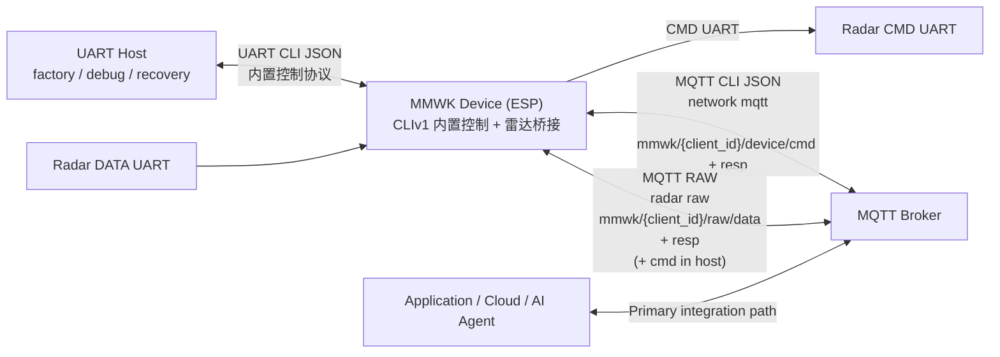

# MMWK CLI Wrapper

本文档介绍 MMWK 主机侧 CLI wrapper。macOS / Linux / Git Bash 使用 POSIX 入口 [`./run.sh`](../../run.sh)，Windows PowerShell 使用 [`.\run.ps1`](../../run.ps1)。两类入口都会调用 [`mmwk/`](../../mmwk/) 中的 Python CLI，并通过 UART（串口）和 MQTT 暴露同一套命令面，默认走标准 CLI JSON；在配套的 MCP 固件版本下，也支持 MCP 协议。

CLI 现在默认使用标准 CLI JSON 协议。大多数 MMWK 固件版本也默认内置 CLI 控制协议。部分固件版本还提供 MCP 支持；如需 MCP 版本，请联系我们获取对应固件版本。使用这类固件版本时，请显式指定 `--protocol mcp`。

## 原始语义契约

- `raw_resp = startup-trimmed command-port output from on_cmd_data`
- `raw_data = raw data-port bytes from on_radar_data`
- `on_cmd_resp is an application-layer command response`，且它与 raw capture 不同。
- `on_radar_frame is an application-layer frame callback`，且它与 raw capture 不同。
- 雷达驱动会在对外发布命令口输出前，先裁掉启动阶段第一个 printable ASCII 字节之前的脏数据。

---

## 目录

- [安装](#安装)
- [主机平台入口](#主机平台入口)
- [快速开始](#快速开始)
- [核心概念](#核心概念)
- [通信层](#通信层)
- [命令参考](#命令参考)
- [项目文档](#项目文档)
- [硬件交互](#硬件交互)
- [固件刷写流程](#固件刷写流程)
- [数据采集流程](#数据采集流程)
- [故障排查](#故障排查)

---

## 安装

### 前置条件

- Python 3.10+
- 使用 UART 时，需要设备的 USB 串口访问权限
- POSIX 工作流：macOS / Linux 上的 `bash`，或 Windows 上的 Git Bash
- Windows PowerShell 工作流：PowerShell，并先用 `pip install -r requirements.txt` 安装 Python 依赖

本文档默认示例使用 POSIX shell 写法（`./run.sh`、`./server.sh`）。在 Windows PowerShell 下，请使用对应的 `.ps1` wrapper，并使用 `COM3` 这类 Windows 串口名。

### 推荐安装方式

```bash
./run.sh --help
```

shell wrapper 会在第一次执行非 help 命令时创建 `./venv` 并安装依赖。

PowerShell wrapper 不会自动创建 `./venv`，而是使用当前或系统 Python 环境：

```powershell
py -m pip install -r requirements.txt
.\run.ps1 --help
```

### 手动安装方式

```bash
python3 -m venv venv
source venv/bin/activate
pip install -r requirements.txt
```

## 主机平台入口

| 工作流 | macOS / Linux / Git Bash | Windows PowerShell | 说明 |
|---|---|---|---|
| 主 CLI | `./run.sh ...` | `.\run.ps1 ...` | `run.sh` 会管理 `./venv`；`run.ps1` 使用当前或系统 Python 3.10+ 环境。 |
| 本地 MQTT + HTTP server | `./server.sh ...` | `.\server.ps1 ...` | 两者都要求本机 `PATH` 中存在 `mosquitto`。 |
| 注册表任务 helper | `./config.sh`、`./collect.sh` | `.\config.ps1`、`.\collect.ps1` | `config.ps1` 会转调 `config.sh`，因此需要 Bash，例如 Git Bash。`collect.ps1` 有 Bash 时会转调 `collect.sh`；没有 Bash 时，仍可使用 `--trigger` pure-MQTT 模式和受限的 registry 采集 fallback。 |
| 直接 Python | `python3 -m mmwk ...` | `py -m mmwk ...` 或 `python -m mmwk ...` | 仅在你明确要绕过 wrapper 时使用。 |

PowerShell 下参数与 POSIX 示例保持一致，主要差异是 wrapper 名和串口名：

```powershell
.\run.ps1 node info -p COM3
.\server.ps1 run --serve-dir C:\mmwk\artifacts --host-ip 192.168.4.8
.\collect.ps1 --trigger device-reboot --device-id DC5475C879C0
```

## Surface 更新（2026-04-13）

- `bridge` 和 `hub` 现在共享一套 sensor runtime core，但二者仍然是编译期 profile。
- hub 唯一新增的公开面是 `scene`，以及那些只有在 requested sensor set 通过 support check 后才会暴露出来的额外 sensor endpoint/event。
- 能力发现统一收敛到 `endpoint list` 和 `proto list|status|manifest`。
- 原始录制/配置统一收敛到 `radar raw status`、`radar raw config get|set --json ...`、`radar raw start|stop|trigger`。
- `node claim` 是 UART/local 的设备身份 claim 流程，用来获取 `cid`/`oid` 和可选 MQTT 凭据；`network prov` 仍然只是 Wi-Fi 配网。
- `scene` 仅 hub 支持；bridge 上直接调用 `scene` 会返回 unknown tool。

---

## CLI Key 保护

出厂态或空 key 设备保持开放，方便 bring-up。设置 key 以后，UART 和 MQTT 上的受保护命令都需要 `--key`；CLIv1 没有 login/session 流程。

```bash
./run.sh node key status -p /dev/cu.usbserial-0001
./run.sh node key set --new-key YOUR_KEY -p /dev/cu.usbserial-0001
./run.sh radar status --key YOUR_KEY -p /dev/cu.usbserial-0001
./run.sh node key clear --key YOUR_KEY -p /dev/cu.usbserial-0001
```

`node key status` 是公开命令。`node key set` 可在开放设备上设置初始 key；保护启用后，更新 key 也需要当前正确的 `--key`。`node info` 仍可不带 key 调用，但保护启用后，未认证响应只包含公开身份字段和 `auth_enabled/auth_required`。恢复出厂设置会清除 key。

```bash
./run.sh node factory-reset --key YOUR_KEY -p /dev/cu.usbserial-0001
```

当 key 保护启用时，`node factory-reset` 同样需要正确的 `--key`。成功后 CLI 只输出一行：`已触发重置`。设备会在 1 秒后重启。这个短暂 pending 窗口内，只允许 `node info` 与重复 `node factory-reset`；其他命令会被拒绝并返回 reset pending 状态错误。窗口期间 `node info` 会返回 `factory_reset_pending=true`。

## 设备身份 Claim

`node claim` 从 claim provider 获取设备身份（`cid` / `oid`）和可选 MQTT 凭据。它只能通过本地 UART 执行；MQTT transport 会被拒绝。

```bash
./run.sh node claim --endpoint https://claim.example.com/device --token ONE_TIME_TOKEN -p /dev/cu.usbserial-0001
```

`--endpoint` 只覆盖本次 claim 的固件默认地址。`--token` 是一次性输入，不会持久化，也不会在响应中返回。claim 成功后会持久化 `dev.cid` 和 `dev.oid`，之后 `node info` 会显示 `cid` 和 `oid`。设备仍处于工厂状态时，`node info` 还会显示 `factory: INIT`；claim 或用户 reset 之后该字段不再显示。`network prov` 仍只负责 Wi-Fi 配网，不负责 claim 设备身份。

---

## 快速开始

拿到新设备后的最短端到端路径通常是：

1. 验证 UART 控制路径
2. 刷写雷达固件与配置
3. 确认雷达已运行
4. 采集启动 trim 后的命令口文本与数据口原始字节

### 1. 验证 UART 控制路径

```bash
./run.sh --help
./run.sh node info -p /dev/cu.usbserial-0001
```

期望 `node info` 返回的字段包括 `name`、`board`、`version`、`id`，以及在 MQTT 已配置时返回的 `uri`、`client_id`、`raw_data_topic`、`raw_resp_topic`。同时会返回 `factory_reset_pending`，用于表示短暂的重置过渡状态。处于工厂状态时会返回 `factory: INIT`；执行 `node claim` 后会返回 claim 得到的设备身份字段 `cid` 和 `oid`。其中 `name` / `version` 是 ESP 固件身份的标准字段。
启动所有权现在改为由雷达面暴露：`radar status` 返回 `mode` 与 `modes`，`fw.boot_mode` 则表示当前运行态的雷达 boot path。BRIDGE 报告 `["auto", "host"]`，HUB 报告 `["auto"]`。

### 2. 刷写雷达固件与配置

```bash
./run.sh radar fw flash \
  --fw ../firmwares/radar/iwr6843/oob/out_of_box_6843_aop.bin \
  --cfg ../firmwares/radar/iwr6843/oob/out_of_box_6843_aop.cfg \
  -p /dev/cu.usbserial-0001
```

### 3. 确认刷写已生效

```bash
./run.sh radar fw version -p /dev/cu.usbserial-0001
./run.sh radar status -p /dev/cu.usbserial-0001
./run.sh node info -p /dev/cu.usbserial-0001
```

对 `radar fw flash`、`radar fw ota`、`radar config apply`，以及 factory / baseline 恢复路径后的第一次上电，都要持续轮询 `radar status`，直到返回 `running`。不要用固定 sleep 替代这个 gate。

### 4. 配置 Wi-Fi 与 MQTT

```bash
./run.sh network wifi --ssid YOUR_SSID --pass YOUR_PASSWORD -p /dev/cu.usbserial-0001
./run.sh network mqtt --uri mqtt://192.168.1.100:1883 -p /dev/cu.usbserial-0001
./run.sh node reboot -p /dev/cu.usbserial-0001
```

对于 PRO 设备以及带 4G 的 WDR 设备，可以单独保存 4G 配置，再选择优先网络：

```bash
./run.sh network 4g --apn YOUR_APN -p /dev/cu.usbserial-0001
./run.sh network priority --pref 4g -p /dev/cu.usbserial-0001
```

`network priority --pref wifi|4g` 用于设置 Wi-Fi/4G 优先网络。保存 Wi-Fi 凭据不会自动改掉 4G 优先级。如果 `pref=4g` 无法联网，设备可以临时使用 Wi-Fi 作为当前承载网络。保存的首选项仍保持 `4g`；`network status` 会显示 `pref=4g,curr=wifi`，`network diag` 会保留 4G 失败原因。

SDK 硬件验收同样保持显式选择：PRO 设备或带 4G 的 WDR 设备测试时给 runner 传 `--4g`；不传时测试默认仍走 Wi-Fi。

配网 AP 名称遵循 `MMWK-[板][应用]-[MAC后两字节]`。默认 Wi-Fi 为 `MMWK / mmwk123456`。自动 portal 配网可能会临时将测试主机连接到设备 AP，完成后再恢复原 Wi-Fi。在 WSL 下，自动 portal 配网会通过 PowerShell/netsh 控制 Windows Wi-Fi，并从 Windows 侧提交 portal 请求。当环境中同时存在多个 `MMWK-*` AP 时，设置 `TEST_PROVISIONING_AP_SSID`；如需保留旧人工检查点，设置 `TEST_PORTAL_PROVISION_AUTO=false`。

自救 portal 用于 MQTT 服务器配置和诊断，不是 Wi-Fi 配网。出厂配置完成后 portal 仍可见，但是否允许修改 MQTT 由固件策略决定。CLI bridge 固件可以开放 MQTT recovery 编辑；HUB care/rmaker sidecar 只显示状态。只读状态页只暴露 MQTT 状态、最近阶段/错误码、剩余窗口秒数，以及首选 4G 离线时的 4G 诊断；不暴露 MQTT URI、用户名或密码。

对于 fresh bridge，先配置 Wi-Fi，再执行 `network mqtt`、重启，并通过 `node info` 或 `network status` 验证。应把 `state=connected && ready=true` 视为网络 ready 契约，把 `mqtt_state=connected` 视为 MQTT ready 契约。`node info` 仍适合看身份和已发布元数据，但不应作为主要运行时就绪信号。缺失 bridge agent key 时，默认值就是 `mqtt=1`、`raw_auto=1`，这就是正常 fresh-bridge bring-up 路径。

只有在手动 override 或排障时，才需要执行 `node agent --mqtt 1 --raw-auto 1`。

### 5. 采集并验证数据

```bash
./run.sh collect --duration 12 \
  --data-output ./data_resp.sraw \
  --resp-output ./cmd_resp.log \
  -p /dev/cu.usbserial-0001
```

当传入 `-p/--port` 时，`collect` 会先通过 UART 做自动发现，并等待设备重新拿到非零运行时 IP 后再 arm MQTT raw capture。这样可以降低设备刚重启或雷达刚 restart 时，因为 Wi-Fi / MQTT 仍在重连而丢掉启动阶段 `raw_resp` 的概率。

对 `radar fw flash`、`radar fw ota`、`radar config apply`，以及 factory / baseline 恢复路径后的第一次上电，先把 `radar status = running` 当成显式 ready gate，再去做纯 MQTT 的 late-attach 采集。如果你把 `collect -p` 当成这段恢复窗口的启动证明路径，就要要求 `cmd_resp.log` 非空。

默认这条带 `-p/--port` 的 `collect` 路径应视为严格的启动期采集路径。如果你的采集窗口就是从 reboot、OTA 恢复或其他 fresh startup/welcome 阶段开始，`raw_resp` 就必须是必需项，`cmd_resp.log` 也应非空。

如果你要拿到 OTA/config 阶段本身的 welcome、cfg 逐行回应和后续命令口输出，不要等 OTA 结束后再跑 `collect`，而是直接在 `radar fw ota` 时开启 raw capture：

```bash
./run.sh radar fw ota --fw ./radar.bin --cfg ./radar.cfg \
  --raw-resp-output ./ota_cmd_resp.log \
  -p /dev/cu.usbserial-0001
```

这种模式会在 OTA 命令发送前先订阅 `raw_resp`，因此 welcome、cfg 回显和后续命令口输出都会进入同一轮采集。

如果雷达其实已经稳定运行了一段时间，而你只是想在后面再接入做稳态观察，可以在纯 MQTT 的 `collect` 调用里加上 `--resp-optional`。这种 late-attach 模式不会为了逼出启动文本而重启雷达，所以不能拿来当启动/welcome 证明。

### 外挂工具

`collect` 仍然是官方命令。下面这些 helper 都挂在主 CLI wrapper 之外，工作目录应为 `cli` 目录。POSIX 示例使用 `*.sh`；Windows PowerShell 下使用可用的同名 `*.ps1` wrapper，具体差异见 [主机平台入口](#主机平台入口)。

- [Radar Task Tools](radar-task-tools.md)：当你想直接走任务级工作流时，使用 `./config.sh init|update|list` 与 `./collect.sh` 完成基于注册表的 UART 配置、网络更新和 MQTT raw 采集。
- [通过 Bridge 开发雷达](bridge-ti-radar-debug.md)：面向 6843 和 6432 的端到端 bridge 开发说明，包含 `config.sh init|update|list` 与 `collect.sh` 的使用顺序。
- [配置助手](config.md)：当你需要通过 UART 或现有 MQTT 控制链路下发 Wi-Fi / MQTT 设置时，使用 `./config.sh set`；需要通过 mDNS 查找 device id 时，使用 `./config.sh search`。
- [采集触发助手](collect-trigger.md)：当你明确需要控制面与 raw 采集都只走 pure MQTT 时，使用 `./collect.sh --trigger ...`。

不要把这些 helper 当成严格启动期 `collect -p` 路径的替代品。

最小通过标准：

- `Resp topic frames > 0`
- `Data topic frames > 0`
- `data_resp.sraw` 非空
- `cmd_resp.log` 非空
- `cmd_resp.log` 从第一个 printable ASCII 字节开始，用户看到的是启动 trim 后的命令口文本

---

## 核心概念

### Device ID

设备的硬件唯一标识，可通过 `node info` 获取。

### Claimed ID / MQTT Client ID

执行 `node claim` 后，标准设备身份是 `cid` / `oid`。MQTT 优先使用 claim provider 下发的 `mqtt.cid`；如果没有 `mqtt.cid`，则使用 `dev.cid`；没有 claim 身份时，回退到 Wi-Fi STA MAC 的大写十六进制形式，并带上固件配置的前缀。该值用于 MQTT 会话和 canonical topic 推导：

- `mmwk/{client_id}/device/cmd`
- `mmwk/{client_id}/device/resp`
- `mmwk/{client_id}/raw/data`
- `mmwk/{client_id}/raw/resp`
- `mmwk/{client_id}/raw/cmd`（仅 host 模式）

### MQTT 通道职责

- `network mqtt`：配置 broker / 鉴权，设备控制 topic 固定为 `mmwk/{client_id}/device/...`
- MQTT raw 透传平面固定发布到 `mmwk/{client_id}/raw/...`；host 模式下会额外派生 `raw/cmd`
- 公开的 `radar raw` 命令族只负责录制器状态/配置和录制触发；`collect` / `collect.sh --trigger` 负责订阅 MQTT raw topic
- `raw_resp` 对应 `on_cmd_data` 的启动 trim 后命令口输出，`raw_data` 对应 `on_radar_data` 的数据口原始字节
- bridge/auto 模式下 MQTT raw 平面是只出不进的，只对外发布 `mmwk/{client_id}/raw/data` 和 `mmwk/{client_id}/raw/resp`；host 模式下才会额外开放 `mmwk/{client_id}/raw/cmd`
- `on_cmd_resp`、`on_radar_frame` 属于应用层回调，与 raw capture 不同
- 推荐真实应用通过 MQTT 集成，UART 主要用于刷写、bring-up、调试和兜底

### 启动所有权契约

- `mode` 表示当前保存/当前配置的默认模式。
- `modes` 表示当前 profile 支持的启动模式列表。
- `fw.boot_mode` 表示当前运行时观察到的雷达 boot path（`flash`、`host`、`uart`、`spi`）。
- 对 BRIDGE，`auto` 表示 ESP 接管雷达 bring-up，`host` 表示主机接管雷达 bring-up。
- 对 HUB，目前只支持 `auto`。
- `radar start --mode auto|host` 会先持久化新的默认模式，再按该模式重启当前雷达服务。
- 不带 `--mode` 的 `radar start` 会按已保存的 `mode` 启动。
- `radar stop` 只停止当前雷达服务，不会改写 `mode`。
- `radar status` 现在是只读查询，不再接受 `--set`。
- `raw_auto` 只控制 raw 平面的自动启动，不决定由谁负责雷达启动。
- 在 bridge `host` 下，ESP 仍然暴露 raw 传输面，但不会在启动期自动下发雷达配置。

### 网络与配网

当设备没有保存 WiFi 凭据时，会自动进入配网模式：

1. 连接 `MMWK_XXXX`
2. 打开 `http://192.168.4.1`
3. 输入 WiFi 信息

CLI 配置方式：

```bash
./run.sh network wifi --ssid "MyWiFi" --pass "MyPass" -p /dev/cu.usbserial-0001
./run.sh network 4g --apn YOUR_APN -p /dev/cu.usbserial-0001
./run.sh network priority --pref wifi -p /dev/cu.usbserial-0001
./run.sh network priority --pref 4g -p /dev/cu.usbserial-0001
./run.sh network status -p /dev/cu.usbserial-0001
```

应把 `network status` 视为主要运行时 ready 契约。`state=connected && ready=true` 表示设备已具备网络可用性；`prov_waiting`、`retry_backoff`、`failed` 等状态则说明当前仍未就绪的原因。`mqtt_state` 与之分离，固定表示 MQTT transport 的 `disconnected | connecting | connected`，MQTT 相关流程应基于它而不是任何 LED 推导信号。

---

## 通信层

### 推荐架构



- **UART**：本地工厂配置、刷写、bring-up、调试
- **MQTT CLI JSON**：默认内置控制通道，通过 `network mqtt` 暴露设备控制与状态读取
- **MQTT RAW**：雷达原始数据透传。bridge/auto 模式下只负责输出 `raw_data` / `raw_resp`；host 模式下可额外启用 `raw_cmd`
- **MCPv1**：兼容/参考层，仅在 MCP 客户端明确需要该协议形态时使用

### UART（本地）
普通 UART 命令默认使用本地持久 proxy，因此连续短命令会复用同一个物理串口打开句柄，不再每次都触发 USB-UART 复位线。只有你明确传 `--reset` 时，CLI 才会通过 DTR/RTS 做硬件重启。如需排查主机串口驱动行为，可用 `--uart-proxy off` 或 `MMWK_CLI_UART_PROXY_MODE=off` 绕过 proxy。

```bash
./run.sh radar fw flash --fw fw.bin -p /dev/cu.usbserial-0001 --baudrate 921600 --reset
```

### MQTT（远程）

```bash
./run.sh radar status --transport mqtt --broker 192.168.1.5 --device-id DC5475C879C0
```

---

## 兼容 facade

- 公开标准入口固定为 `node`、`proto`、`endpoint`、`scene`、`radar.fw`、`radar.diag`、`radar.raw`，以及下文的 `network` / `collect` 流程。
- `entity` 仅用于兼容。`device.catalog` 仅用于兼容。`device.proto` 仅用于兼容。它们只保留在显式兼容 shim 中，不属于公开 help/discovery。
- 对多传感器设备，子 endpoint 拥有测量真值、事件真值和状态真值。组合 endpoint 只做聚合或编排，例如 `area`、`safety`、`vitals`、`maintenance` 和 hub 专属的 `scene`。
- `scene` 是 hub 专属的组合 facade，用来表达拓扑、能力选择和编排；它不会替代 endpoint 的真值归属，也不会变成第二语义中心。
- 使用 `endpoint list --json` 和 `endpoint describe` 查看面向 Matter 的目录字段，包括 `endpoint_key`、`parent_endpoint_key`、`parts`、`endpoint_family`、`semantic_class`、`truth_source`、`canonical_device_type` 和 `cluster_families`。

---

## 命令参考

| Command | 说明 |
|---------|------|
| `node info` | 读取设备身份与已发布元数据 |
| `node claim` | 通过 UART/local claim 设备身份与凭据 |
| `node factory-reset` | 触发恢复出厂（清 NVS + 运行期资源，1 秒后重启） |
| `node reboot` | 重启设备 |
| `node ota` | 升级 ESP 固件 |
| `node agent` | 配置 agent 服务 |
| `node heartbeat` | 配置心跳 |
| `node key status/set/clear` | 查看、设置、更新或清除 CLI key 保护 |
| `endpoint list` | 查看当前 profile / effective sensor set 的面向 Matter 的 endpoint 目录 |
| `proto list/status/manifest` | 查看节点公开协议目录 |
| `radar fw ota` | HTTP OTA 升级雷达固件 |
| `radar fw flash` | UART / MQTT 分块升级雷达固件 |
| `radar start` | 持久化可选启动模式并启动/重启当前雷达服务 |
| `radar stop` | 停止当前雷达服务，但不改写已保存模式 |
| `radar config apply` | 在不重新刷 firmware 的前提下重配置运行时雷达契约 |
| `radar config read` | 回读雷达 cfg 文本（默认 file cfg，可选 hub `--gen`） |
| `radar status` | 只读查询雷达状态、`mode` 与 `modes` |
| `radar fw version` | 查询雷达固件版本 |
| `radar raw status` | 查看 radar raw 录制器状态 |
| `radar raw config get/set --json` | 读取或修改 radar raw 录制器配置 |
| `radar raw start/stop/trigger` | 控制 radar raw 录制器生命周期 |
| `radar diag` | 查看或设置雷达诊断信息 |
| `radar fw list/set/switch/del/download` | 管理设备上的固件分区 |
| `collect` | 采集 `raw_data` / `raw_resp` 并保存到主机 |
| `endpoint list/describe/read/config get/config set` | 查看面向 Matter 的 endpoint 目录与运行时状态（`endpoint list --json` / `endpoint describe` 会暴露 `endpoint_key`、`parent_endpoint_key`、`parts`、`truth_source` 等语义字段） |
| `scene read/set/apply/wait` | hub 专属的 scene 编排与配置接口 |
| `network wifi/4g/priority/mqtt/prov/status/ntp` | 网络配置，其中 `network status` 用于查询 `state` / `active_ip` / `pref` / `curr` / `ready` / `mqtt_state` |

### 命令示例

```bash
# --- Node ---
./run.sh node info -p /dev/cu.usbserial-0001
./run.sh node claim --endpoint https://claim.example.com/device --token ONE_TIME_TOKEN -p /dev/cu.usbserial-0001
./run.sh node factory-reset --key YOUR_KEY -p /dev/cu.usbserial-0001
./run.sh endpoint list -p /dev/cu.usbserial-0001
./run.sh proto list -p /dev/cu.usbserial-0001
./run.sh node key status -p /dev/cu.usbserial-0001
./run.sh node key set --new-key YOUR_KEY -p /dev/cu.usbserial-0001
./run.sh node key clear --key YOUR_KEY -p /dev/cu.usbserial-0001
./run.sh node reboot -p /dev/cu.usbserial-0001
./run.sh node agent --mqtt 1 --raw-auto 1 --led 1 -p /dev/cu.usbserial-0001

# --- Radar ---
./run.sh radar status -p /dev/cu.usbserial-0001
./run.sh radar status --key YOUR_KEY -p /dev/cu.usbserial-0001
./run.sh radar start --mode auto -p /dev/cu.usbserial-0001
./run.sh radar stop -p /dev/cu.usbserial-0001
./run.sh radar fw version -p /dev/cu.usbserial-0001
./run.sh radar config apply --welcome --no-verify -p /dev/cu.usbserial-0001
./run.sh radar config read -p /dev/cu.usbserial-0001
./run.sh radar raw status -p /dev/cu.usbserial-0001
./run.sh radar raw config set --json '{"auto_upload": true, "max_duration_sec": 30}' -p /dev/cu.usbserial-0001
./run.sh radar raw trigger --event factory_test --duration-s 15 -p /dev/cu.usbserial-0001

# --- 固件目录 ---
./run.sh radar fw list -p /dev/cu.usbserial-0001
./run.sh radar fw set --index 0 -p /dev/cu.usbserial-0001
./run.sh radar fw del --index 1 -p /dev/cu.usbserial-0001
./run.sh radar fw download --source http://example.com/fw.bin --name oob --fw-version 1.0.0 --size 524288 -p /dev/cu.usbserial-0001

# --- 录制 ---
./run.sh radar raw start --uri http://192.168.1.100:8080/upload -p /dev/cu.usbserial-0001
./run.sh radar raw stop -p /dev/cu.usbserial-0001
./run.sh radar raw trigger --event MANUAL --duration-s 10 -p /dev/cu.usbserial-0001
./run.sh collect --duration 12 --data-output ./data_resp.sraw --resp-output ./cmd_resp.log -p /dev/cu.usbserial-0001

# --- Endpoints ---
./run.sh endpoint list -p /dev/cu.usbserial-0001
./run.sh endpoint list --json -p /dev/cu.usbserial-0001
./run.sh endpoint describe mgmt.device -p /dev/cu.usbserial-0001
./run.sh endpoint read mgmt.device -p /dev/cu.usbserial-0001
./run.sh endpoint config get radar.raw -p /dev/cu.usbserial-0001
./run.sh endpoint config set radar.raw --config-json '{"auto_upload": true}' -p /dev/cu.usbserial-0001
./run.sh scene read -p /dev/cu.usbserial-0001   # 仅 hub

# --- Network ---
./run.sh network wifi --ssid "MyWiFi" --pass "MyPass" -p /dev/cu.usbserial-0001
./run.sh network 4g --apn YOUR_APN -p /dev/cu.usbserial-0001
./run.sh network priority --pref 4g -p /dev/cu.usbserial-0001
./run.sh network priority --pref wifi -p /dev/cu.usbserial-0001
./run.sh network mqtt --uri mqtt://broker.local -p /dev/cu.usbserial-0001
./run.sh network prov --enable -p /dev/cu.usbserial-0001
./run.sh network status -p /dev/cu.usbserial-0001
./run.sh collect --duration 12 --data-output ./data_resp.sraw --resp-output ./cmd_resp.log -p /dev/cu.usbserial-0001
```

---

## 使用 `run.sh`

`run.sh` 会自动处理虚拟环境、依赖安装和串口检测。Windows PowerShell 下先安装 `requirements.txt`，再使用 `.\run.ps1`；它会把同样的命令参数转发给 Python CLI。

```bash
./run.sh --help
./run.sh node info -p /dev/cu.usbserial-0001
```

### 本地 Server 辅助脚本 (`server.sh`)

`server.sh` 是一个配套的高效辅助脚本。Windows PowerShell 下可以使用同一运行时的 `.\server.ps1`。它用于一键启动本地 MQTT Broker 和 HTTP 文件服务器，配合 CLI 执行 Wi-Fi OTA 升级和本地 MQTT 数据采集，无需依赖外部云基础设施。

**核心能力：**
- **本地 MQTT Broker**：依赖本机已安装且在 `PATH` 中可见的 `mosquitto`。
- **内置 HTTP 服务器**：封装 Python 自带的 `http.server`，提供固件与配置文件的 OTA 下载服务。
- **上下文导出**：提供 `env` 命令，输出包含主机 IP、MQTT URI、HTTP Base URL 的 `MMWK_SERVER_XXX` 变量行，可直接传递给 `run.sh`，或在 PowerShell 中取值后传给 `run.ps1`。

**常用命令：**

```bash
# 1. 前台运行（阻塞当前终端，推荐用于实时查看日志）
./server.sh run --serve-dir /path/to/artifacts --target-ip 192.168.4.8

# 2. 或在后台分离运行 (Detached mode)
./server.sh start --serve-dir /path/to/artifacts --target-ip 192.168.4.8

# 3. 检查服务存活状态，获取分配的 IP 行和配置
./server.sh status
./server.sh env

# 4. 停止后台服务
./server.sh stop
```

**进阶 OTA 流程：**
仅用于已经运行当前公开 `mmwk_sensor_bridge` 固件包的设备升级整个 ESP 固件流水线时：
```bash
./server.sh run --device-ota --device-ota-board mini --host-ip 192.168.4.8
eval "$(./server.sh env)"
./run.sh node ota --url "$MMWK_SERVER_DEVICE_OTA_URL" -p /dev/cu.usbserial-0001
```

启用 `--device-ota` 时，`server.sh` 会优先查找 legacy 顶层路径 `firmwares/esp/<board>/mmwk_sensor_bridge_full.bin`。如果这个文件不存在，它会自动回退到最新发布的 `firmwares/esp/<board>/mmwk_sensor_bridge/v*/ota.zip`，解出 OTA `.bin`，并通过 `MMWK_SERVER_DEVICE_OTA_*` 导出最终解析出的路径和 URL。

**说明：**
- MQTT 默认使用端口 `1883`。
- HTTP 默认从 `--serve-dir` 对外提供文件，端口 `8380`。
- 如果没有显式传入 `--serve-dir`，`server.sh` 会对外提供它启动时的当前工作目录。
- `server.sh status` 会同时检查 PID 存活和实际 TCP 端口监听状态。
- `server.sh env` 会输出可直接复用的主机 IP、MQTT URI 和 HTTP Base URL，方便传给 `network mqtt`、`radar fw ota`、`node ota` 和 `collect`。
- 在 PowerShell 下，`.\server.ps1 env` 会输出同样的 `KEY=value` 行；可以把需要的 URL 值复制到 PowerShell 变量，或直接传给 `.\run.ps1`。
- 仅适用于已运行设备的 OTA 流程请看 [设备 OTA 指南](../../../docs/zh-cn/ota.md)，出厂刷机请看 [出厂烧录指南](../../../docs/zh-cn/flash.md)。
- 该助手脚本仅面向本地开发、本地刷机和数据采集工作流设计。

### 高级用法：直接调用 Python

```bash
python3 -m mmwk node info -p /dev/cu.usbserial-0001
```

---

## 项目文档

- **[run.sh](../../run.sh) / [run.ps1](../../run.ps1)**：POSIX 与 Windows PowerShell 主 CLI wrapper
- **[server.sh](../../server.sh) / [server.ps1](../../server.ps1)**：POSIX 与 Windows PowerShell 本地 MQTT + HTTP helper wrapper
- **[mmwk/](../../mmwk/)**：被主机入口包装的 Python 实现
- **[Wavvar MMWK 标准 CLI 控制协议 V1.1](../../../docs/CLIv1_CN.md)**：默认标准 CLI JSON 协议规范
- **[Wavvar MMWK MCP 协议规范 V1.3](../../../docs/zh-cn/mcpv1.md)**：面向 MCP 固件版本的 MCP/JSON-RPC 协议规范（配套 MCP 固件版本时使用 `--protocol mcp`）
- **[Radar Task Tools](./radar-task-tools.md)**：在 `cli` 目录下执行的任务导向 wrapper，用于 UART 配置、网络 OTA 和 MQTT raw 采集
- **[通过 Bridge 开发雷达](./bridge-ti-radar-debug.md)**：发布友好的 bridge 开发说明，分别覆盖 6843 和 6432 的推荐板型与具体步骤
- **[配置助手](./config.md)**：在 `cli` 目录下执行的 Wi-Fi/MQTT 配置与 mDNS 设备搜索辅助流程
- **[采集触发助手](./collect-trigger.md)**：在 `cli` 目录下执行的 pure-MQTT raw 采集辅助流程
- **[firmwares/](../../../firmwares/)**：预编译固件目录

---

## 硬件交互

`mmwk_sensor` 固件默认在所有支持板型上保持一致的 ESP 侧 LED 与按键行为。CLI 文档只说明命令入口；用户交互细节请看 [mmWave Sensor Development Kit](../../../docs/zh-cn/mmwk-sensor.md#5-用户交互)。

---

## 固件刷写流程

### UART 分块传输

```bash
./run.sh radar fw flash \
  --fw ../firmwares/radar/iwr6843/oob/out_of_box_6843_aop.bin \
  --cfg ../firmwares/radar/iwr6843/oob/out_of_box_6843_aop.cfg \
  -p /dev/cu.usbserial-0001
```

版本号行为说明：
- 当前运行时版本校验是基于文本匹配的：雷达启动后、发送任何配置命令之前，驱动会扫描启动阶段的 CLI/welcome 输出，只要在文本中找到期望版本字符串就认为匹配成功。
- `radar fw flash` 和 `radar fw ota` 都会从固件二进制旁边的 `meta.json` 推断雷达 metadata：`welcome` 加上可选的 `version`。
- `welcome` 表示该固件是否会输出启动 CLI/welcome 文本，这是固件特征本身。
- 当 `welcome=true` 时，只要雷达启动阶段输出了任意非空字符串，就算 welcome 成立；它不是固定模板，而且完全可能是多行输出。
- `welcome` 很重要，因为它同时承担两个作用：一是证明雷达固件确实已经启动并进入启动 CLI；二是提供 MMWK 唯一能保存成 `radar fw version` 的真实运行时版本字符串。
- `version` 表示 welcome 文本里的目标子串。
- 当启用 `--verify` 时，MMWK 会在整段启动输出里查找版本子串，不要求它出现在某一条固定文本里。
- `--verify` 会打开版本匹配，并且要求必须提供版本字符串；`--no-verify` 即使 metadata 里有版本也会跳过匹配。
- 如果没有提供版本，刷机仍然可能成功，但 `radar fw version` 可能保持为空。
- 如果 `welcome` 声明错了，MMWK 要么会一直等待一个根本不会出现的启动文本，要么会跳过它唯一的运行态启动证明和版本来源。
- 如果 `welcome=true`，但在超时窗口内始终没有任何启动 CLI/welcome 输出，应直接视为雷达启动失败：固件大概率没有在雷达侧成功启动。此时 `radar status` 会保持 `state=error`，并附带 `details` 字段解释失败原因。
- 如果你需要定制一个可识别的雷达固件版本号，请让雷达固件的启动 CLI 输出打印出那个目标字符串。

### HTTP OTA

```bash
./run.sh network wifi --ssid YOUR_SSID --pass YOUR_PASSWORD -p /dev/cu.usbserial-0001
./run.sh node reboot -p /dev/cu.usbserial-0001
./run.sh radar fw ota \
  --fw ../firmwares/radar/iwr6843/oob/out_of_box_6843_aop.bin \
  --cfg ../firmwares/radar/iwr6843/oob/out_of_box_6843_aop.cfg \
  --http-port 8380 \
  -p /dev/cu.usbserial-0001
```

OTA 后第一次上电时，ESP 侧可能还在等待雷达 app 真正启动完成。请持续轮询 `radar status`，直到返回 `running`；不要用固定 sleep 去替代这一步。

版本号行为说明：
- 对 `radar fw ota` 来说，显式传入的 `--version`、`--verify`、`--welcome` 会覆盖 `meta.json` 推断结果。
- `--force` 会强制执行 OTA，即使目标版本已经和设备当前持久化版本一致。
- 设备侧只有在启用 `--verify` 时，才会通过重启后的启动 CLI/welcome 输出去匹配版本字符串；否则仍然会尊重 `welcome`，但不会做版本匹配。
- 对 `welcome=true` 来说，这段启动输出只要求“有任意非空字符串”，并且允许是多行文本，不要求固定 banner 格式。
- 这段启动 CLI/welcome 文本不只是给可选的版本匹配用，它本身也是“雷达固件真的启动了”的运行态证明，同时还是雷达固件真实版本文本的来源。
- 如果 `welcome=true`，但在超时窗口内始终没有任何启动 CLI/welcome 输出，应直接视为雷达启动失败：固件大概率没有在雷达侧成功启动。此时 `radar status` 会保持 `state=error`，并附带 `details` 字段解释失败原因。
- 如果你需要定制一个可识别的雷达固件版本号，请修改雷达固件启动 CLI 的输出文本，让它打印目标版本字符串。

### 方法 C：运行时重配置（不重新刷 firmware）

当雷达固件二进制本身已经正确，只需要切换运行时契约或运行时 cfg 选择时，请使用 `radar config apply`，这样可以 without flashing firmware 再次应用新的运行时约束。

```bash
./run.sh radar config apply --welcome --no-verify
./run.sh radar config apply --welcome --verify --version "1.2.3"
./run.sh radar config apply --welcome --no-verify --cfg ./runtime.cfg
./run.sh radar config apply --welcome --no-verify --clear-cfg
```

运行时重配置行为：
- `radar config apply` 只在 bridge 模式下可用；host mode is rejected。
- 默认行为是 `cfg_action=keep`，保留当前运行时 cfg 选择。
- `--cfg` 对应 `cfg_action=replace`，只上传 cfg 文件，并以 `uart_data action=reconf_done` 收尾。
- `--clear-cfg` 对应 `cfg_action=clear`，用于移除持久化的运行时 cfg override。
- 与 `radar fw flash`、`radar fw ota` 不同，`radar config apply` 不会重新刷写 firmware。
- 每次执行完 `radar config apply` 后，都要先等 `radar status` 返回 `running`，再去依赖 `radar fw version` 或任何 late-attach `collect` 流程。

相关启动模式行为：
- BRIDGE 会在雷达相关状态面暴露 `modes: ["auto", "host"]`，设备面不再暴露启动模式配置。
- BRIDGE 支持 `["auto", "host"]`；HUB 支持 `["auto"]`。
- 在 bridge `host` 且 `raw_auto=1` 时，会自动启动 `mmwk/{client_id}/raw/data`、`mmwk/{client_id}/raw/resp` 和 `mmwk/{client_id}/raw/cmd`。

### 方法 D：回读当前雷达 CFG

当你只想检查当前雷达 cfg 文本，而不想改 firmware 或运行时契约状态时，请使用 `radar config read`。

```bash
./run.sh radar config read -p /dev/cu.usbserial-0001
./run.sh radar config read --gen -p /dev/cu.usbserial-0001
```

回读行为：
- 默认读取当前实际生效的 file cfg 文本。
- 所谓“当前实际生效的 file cfg”，是指当前选中的运行时 override cfg；如果没有 override，则读取 firmware metadata 里的默认 cfg。
- `--gen` 用来请求 hub 运行时生成的 cfg，并且只在 hub runtime 下可用。
- bridge 会拒绝 `--gen`；只要请求了 `--gen`，就不会再回退到 file cfg。
- 缺失、不可读、为空或其他不可用的 cfg 目标都属于硬错误。
- CLI 只会把 cfg 文本写到 stdout，因此重定向或 diff 时能保留原始 cfg 文本。

### 通过 MQTT 刷写

```bash
./run.sh radar fw flash \
  --fw fw.bin --cfg config.cfg \
  --transport mqtt --broker 192.168.1.100 --device-id DC5475C879C0
```

---

## 数据采集流程

### 方法 A：`collect`

`collect` 会自动：

1. 通过 `node info` 发现 MQTT 信息
2. 当 Wi-Fi / MQTT 仍在恢复时，等待设备重新拿到可用运行时 IP
3. 查询补充字段
4. 通过 bridge raw bootstrap 路径确保 MQTT raw 透传已就绪
5. 订阅 `raw_data` 和 `raw_resp`
6. 把 payload 写入输出文件，其中 `cmd_resp.log` 保留从第一个 printable ASCII 字节开始的命令口文本

```bash
./run.sh collect --duration 12 \
  --data-output ./data_resp.sraw \
  --resp-output ./cmd_resp.log \
  -p /dev/cu.usbserial-0001
```

当采集窗口发生在 reboot、OTA 恢复、`radar config apply` 恢复，或 factory / baseline 恢复路径后的第一次启动期时，请把这条带 `-p` 的路径视为严格启动期采集，并要求 `cmd_resp.log` / `raw_resp` 非空。纯 MQTT 的 late-attach 采集只应在 `radar status` 已经返回 `running` 之后使用。

### 方法 B：手工订阅 MQTT

```bash
./run.sh network wifi --ssid YOUR_SSID --pass YOUR_PASSWORD -p /dev/cu.usbserial-0001
./run.sh network mqtt --uri mqtt://192.168.1.100:1883 -p /dev/cu.usbserial-0001
./run.sh node agent --raw-auto 1 -p /dev/cu.usbserial-0001
./run.sh node reboot -p /dev/cu.usbserial-0001
```

对于 fresh bridge，上述流程就足以建立 MQTT 控制；只有在手动 override 或排障时，才需要执行 `node agent --mqtt 1 --raw-auto 1`。

```bash
mosquitto_sub -h 192.168.1.100 -t 'mmwk/#' -v
```

### 方法 C：设备侧录制

```bash
./run.sh radar raw start --uri http://192.168.1.100:8080/upload -p /dev/cu.usbserial-0001
./run.sh radar raw trigger --event MANUAL --duration-s 10 -p /dev/cu.usbserial-0001
./run.sh radar raw stop -p /dev/cu.usbserial-0001
```

### Radar Raw 录制器

```bash
./run.sh radar raw status -p /dev/cu.usbserial-0001
./run.sh radar raw config get -p /dev/cu.usbserial-0001
./run.sh radar raw config set --json '{"auto_upload": true, "max_duration_sec": 30}' -p /dev/cu.usbserial-0001
./run.sh radar raw trigger --event MANUAL --duration-s 10 -p /dev/cu.usbserial-0001
```

---

## 故障排查

### “Address already in use” (Error 48)

本地 HTTP OTA 端口被占用时，可以改用其他端口：

```bash
./run.sh radar fw ota --fw firmware.bin --http-port 8381 -p /dev/cu.usbserial-0001
```

### MQTT 不通或采集不到数据

- 检查设备和主机是否都能访问同一个 broker
- 确认 `network mqtt` 已配置
- 如果设备携带的是旧持久化值，再检查 `node agent --mqtt 1 --raw-auto 1`
- 优先使用 `collect -p` 做启动期托管采集；如果要恢复 bridge raw 自启动，重新执行 `node agent --raw-auto 1` 并重启

### 串口权限问题

- Linux：把用户加入 `dialout`
- macOS：确认没有其他程序占用串口
- 如果设备卡死或你明确需要重启，再使用 `--reset`
- 如果 POSIX 主机和默认 no-reset 后端不兼容，可先导出 `MMWK_CLI_UART_NORESET_BACKEND=pyserial`

### 雷达刷写后仍未运行

- 重新执行 `radar status`
- 检查 `.bin` 与 `.cfg` 是否匹配
- `node info` 显示的是 ESP 侧当前选择/默认的雷达元信息条目，直刷/OTA 后它仍可能保留 bridge 内置 OOB 资产名
- 如需进一步确认，可执行 `radar fw version`；但要注意它返回的是从启动 CLI 输出中匹配并保存的版本字符串，如果刷机时没有提供期望版本，它可能为空
- 如果目标固件声明了 `welcome=true`，但超时前没有任何 welcome 文本，请直接按“雷达启动失败”处理，并查看 `radar status` 返回的 `details` 字段
- 这里的 welcome 文本指雷达启动阶段输出的任意非空字符串，允许多行，不要求固定格式
- `details.cmd_bytes_seen` / `details.cmd_bytes_total` 可以帮助判断命令口在启动窗口里到底有没有收到字节、总量大概有多少
- `details.leading_noise_bytes` 用来解释为什么 `raw_resp` 前面可能先看到 `0x00` / `0xff` 这类前导噪声
- `details.welcome_preview` 会给出一段可打印的启动预览；设备侧日志也会打印同类 boot observation 摘要
- 请用 `radar fw version` + `radar status` 确认刷机后的实时运行镜像

### FAQ：配置文件已经发送，但雷达没有数据返回

如果可以确认雷达配置文件已经发出去了，但始终没有雷达数据返回，最常见的原因是 `.cfg` 和当前运行的雷达固件不匹配。很多情况下雷达固件会先接受这段文本，然后在应用配置后进入异常/近似死机状态。

优先检查：

- `.cfg` 是否真的对应当前启动的那份雷达固件 / demo
- 板型、天线变体是否一致，例如 AOP 与非 AOP
- 配置里的 CLI 指令是否属于这份固件支持的命令集
- 先在雷达开发板上证明同一份固件 + 配置本身可以正常出数，再回到 MMWK 集成

这通常是雷达侧配置问题，不是 ESP 侧 UART / MQTT 传输问题。
