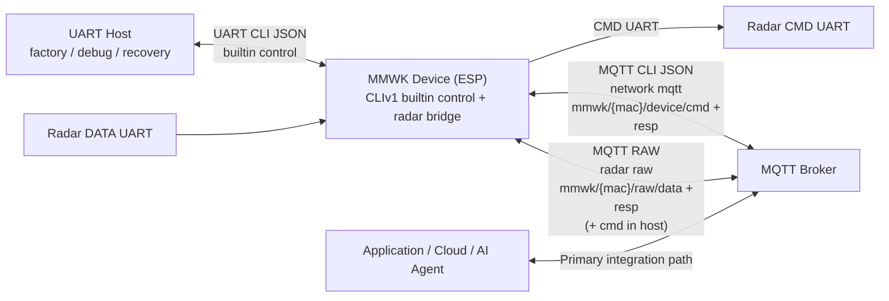

# MMWK CLI Shell Wrapper

This document is for [`./mmwk_cli.sh`](../../mmwk_cli.sh), the recommended shell entrypoint for controlling and managing MMWK bridge/hub devices on **macOS** and **Linux**. The shell wrapper bootstraps the Python CLI in [`scripts/mmwk_cli/`](../../scripts/mmwk_cli/) and exposes the same command surface over UART (Serial) and MQTT, defaulting to [canonical CLI JSON](../../../docs/CLIv1.md) with [MCP fallback](../../../docs/en/mcpv1.md).

`mmwk_cli.sh` now defaults to the [canonical CLI JSON protocol](../../../docs/CLIv1.md). During migration, callers that omit `--protocol` receive a warning so they can upgrade explicitly to `--protocol cli`. Use `--protocol mcp` only as a compatibility fallback documented in the [MCP spec](../../../docs/en/mcpv1.md).

## Raw Semantics Contract

- `raw_resp = startup-trimmed command-port output from on_cmd_data`
- `raw_data = raw data-port bytes from on_radar_data`
- `on_cmd_resp is an application-layer command response`, and it is different from raw capture.
- `on_radar_frame is an application-layer frame callback`, and it is different from raw capture.
- Startup noise before the first printable ASCII byte is trimmed in the radar driver before host-visible command-port output is published.

---

## Table of Contents
- [Installation](#installation)
- [Quick Start](#quick-start)
- [Core Concepts](#core-concepts)
  - [Device Identification](#device-identification)
  - [Network & Provisioning](#network--provisioning)
- [Communication Layers](#communication-layers)
  - [Recommended Architecture](#recommended-architecture)
  - [UART (Local)](#uart-local)
  - [MQTT (Remote)](#mqtt-remote)
- [Command Reference](#command-reference)
- [Project Documentation](#project-documentation)
- [Hardware Interaction](#hardware-interaction)
  - [LED Indicators](#led-indicators)
  - [Button Functions](#button-functions)
- [Troubleshooting](#troubleshooting)

---

## Installation

### Prerequisites
- macOS or Linux with `bash`
- Python 3.10 or higher
- USB serial access to the device (when using UART)

`mmwk_cli.sh` is the documented entrypoint in this README. Direct Python usage remains available as an advanced fallback via `PYTHONPATH=scripts python3 -m mmwk_cli ...`, but the wrapper is the default workflow.

### Setup (Recommended)
```bash
# From the mmwk_cli directory on macOS/Linux
./mmwk_cli.sh --help   # Print wrapper help and available commands
```

The wrapper creates `./venv` and installs dependencies on the first non-help command.

### Setup (Manual)
```bash
python3 -m venv venv
source venv/bin/activate
pip install -r requirements.txt
```

---

## Quick Start

Use this path when you receive a new device and want the shortest end-to-end flow:
1. verify UART control,
2. flash your own radar firmware + config,
3. confirm the radar is running,
4. collect startup-trimmed command-port text plus data-port raw bytes.

### 1. Verify UART Control Path
Check the shell wrapper and discover device identity:
```bash
./mmwk_cli.sh --help
./mmwk_cli.sh device hi -p /dev/cu.usbserial-0001
```

Expected `device hi` fields include `name`, `board`, `version`, `id`, `startup_mode`, and `supported_modes`, plus, when MQTT is configured, `mqtt_uri`, `client_id`, `raw_data_topic`, and `raw_resp_topic`. Here `name` / `version` are the canonical ESP firmware identity fields.
`startup_mode` means the saved/configured default mode, while `supported_modes` is the capability list exposed by the active profile. BRIDGE reports `["auto", "host"]`; HUB reports `["auto"]`.

### 2. Flash Your Radar Firmware + Config (UART, simplest)
For a fresh device, UART flash is the most direct path because it does not require Wi-Fi first:
```bash
./mmwk_cli.sh radar flash \
  --fw ../firmwares/radar/iwr6843/oob/out_of_box_6843_aop.bin \
  --cfg ../firmwares/radar/iwr6843/oob/out_of_box_6843_aop.cfg \
  -p /dev/cu.usbserial-0001
```

The command waits for the device to finish flashing and for the radar to come back to a runnable state.

### 3. Confirm the Flash Really Landed
Run these checks after `radar flash` or `radar ota`:
```bash
./mmwk_cli.sh radar version -p /dev/cu.usbserial-0001
./mmwk_cli.sh radar status -p /dev/cu.usbserial-0001
./mmwk_cli.sh device hi -p /dev/cu.usbserial-0001
```

Use the results as follows:
- `radar status` should report a usable state such as `running`.
- After `radar flash`, `radar ota`, `radar reconf`, or the first boot after a factory/baseline recovery path, keep polling `radar status` until it returns `running`. Do not replace that gate with a fixed sleep.
- `device hi` shows the ESP-side selected/default radar metadata entry (`radar_fw`, `radar_cfg`, and related identity fields), which may still be the bridge's bundled OOB asset after a direct flash/OTA.
- `radar version` returns the version string previously matched from the radar startup CLI output. If flash/OTA was performed without an expected version string, this field may be empty even though flashing succeeded.
- Use `radar version` + `radar status` to verify the live radar image after flash.

### 4. Configure Wi-Fi + MQTT for Data Collection
`collect` captures data from MQTT topics. On a fresh device, configure Wi-Fi and MQTT first. Here, `network mqtt` stores the broker/auth settings while the device's MQTT identity and MCP/raw topics are derived from the Wi-Fi STA MAC:
```bash
./mmwk_cli.sh network config --ssid YOUR_SSID --password YOUR_PASSWORD -p /dev/cu.usbserial-0001
./mmwk_cli.sh network mqtt --mqtt-uri mqtt://192.168.1.100:1883 -p /dev/cu.usbserial-0001
./mmwk_cli.sh device reboot -p /dev/cu.usbserial-0001
```

On a fresh bridge device, configure Wi-Fi, run `network mqtt`, reboot, and then verify with `device hi` or `network status`. Treat `state=connected && ip_ready=true` as the ready contract. `device hi` remains useful for identity and published metadata, but it is not the primary runtime readiness signal. Missing bridge agent keys default to `mqtt_en=1` and `raw_auto=1`, so this is the normal fresh-bridge bring-up path.

If you are recovering from older persisted settings or troubleshooting a bridge whose MQTT control path was manually disabled, use the explicit agent override path.
Use `device agent --mqtt-en 1 --raw-auto 1` only for manual override or troubleshooting.

### 5. Collect Data and Verify Both Paths
The simplest host-side smoke test is:
```bash
./mmwk_cli.sh collect --duration 12 \
  --data-output ./data_resp.sraw \
  --resp-output ./cmd_resp.log \
  -p /dev/cu.usbserial-0001
```

When `-p/--port` is provided, `collect` first uses UART for discovery and waits for the device to regain a non-zero runtime IP before arming MQTT raw capture. This reduces the chance of losing startup `raw_resp` while Wi-Fi/MQTT is still reconnecting after reboot or radar restart.

After `radar flash`, `radar ota`, `radar reconf`, or the first boot after factory/baseline recovery, treat `radar status = running` as the explicit ready gate before any pure-MQTT late-attach collection. If you use `collect -p` as the startup proof path for that recovery window, require `cmd_resp.log` to be non-empty.

At the end, `collect` prints a summary similar to:
- `Data topic frames (DATA UART / binary): ...`
- `Resp topic frames (CMD UART / startup-trimmed command-port text): ...`
- `Data output: ...`
- `Resp output: ...`

For the basic bring-up scenario, treat this as the minimum pass criteria:
- `Resp topic frames > 0`: raw command/config responses came back.
- `Data topic frames > 0`: raw radar payloads came back.
- `data_resp.sraw` and `cmd_resp.log` are both non-empty.
- `cmd_resp.log` starts at the first printable ASCII byte and reads as startup-trimmed command-port text.

If `Resp topic frames > 0` but `Data topic frames == 0`, the control path is alive but the radar data path is still not healthy. Re-check `radar status`, `radar raw`, MQTT reachability, and whether the flashed `.cfg` matches the `.bin`.

---

## Core Concepts

### Device Identification

#### 1. Device ID (Hardware UUID)
The **Device ID** is a unique, fixed identifier derived from the hardware MAC address (e.g., `240AC4123456`).
- **Discovery**: Use the `device hi` command.
- **Usage**: Stable hardware identity for the board itself.

#### 2. MQTT Client ID / Topic ID
The MQTT **Client ID** is fixed to the Wi-Fi STA MAC rendered as 12 lowercase hex characters with no separators. It is a read-only derived value exposed by `device hi` and `network mqtt`.
- **Default device command topics**: `mmwk/{mac}/device/cmd` and `mmwk/{mac}/device/resp`
- **Default raw data topics**: `mmwk/{mac}/raw/data` and `mmwk/{mac}/raw/resp` in every mode; host mode additionally exposes `mmwk/{mac}/raw/cmd`
- **CLI note**: when using `--transport mqtt`, pass the derived MAC-form `client_id` as `--device-id`.

#### 3. MQTT Channels and Responsibilities
- `network mqtt` configures the broker connection plus the MCP interaction topics used to control the device: `mmwk/{mac}/device/cmd` and `mmwk/{mac}/device/resp`.
- `radar raw` reuses the broker connection and publishes to the fixed passthrough topics `mmwk/{mac}/raw/data` and `mmwk/{mac}/raw/resp`. In host mode it also derives the optional `mmwk/{mac}/raw/cmd`.
- `raw_data` corresponds to raw data-port bytes from `on_radar_data` and is typically collected as `data_resp.sraw`.
- `raw_resp` corresponds to startup-trimmed command-port output from `on_cmd_data` and is typically collected as `cmd_resp.log`.
- `on_cmd_resp` and `on_radar_frame` are application-layer callbacks and are different from raw capture outputs.
- `raw_cmd` is an optional host-mode MQTT ingress for radar CMD UART passthrough and is distinct from the MCP command topic `mmwk/{mac}/device/cmd`.
- Recommended practice: real applications, services, dashboards, and agents should integrate through MQTT. UART is mainly for factory setup, initial flashing, bring-up, bench debugging, and emergency fallback.

#### 4. Startup Ownership Contract

- `startup_mode` means the saved/configured default mode.
- `supported_modes` means the startup modes supported by the active profile.
- In BRIDGE, `auto` means ESP-managed radar bring-up and `host` means host-controlled radar bring-up.
- In HUB, only `auto` is supported.
- `device startup --mode auto|host` persists the default startup policy.
- `radar status --set start --mode auto|host` is a one-shot start request for the current radar service.
- `raw_auto` only controls raw-plane auto-start. It does not decide who owns radar startup.
- In bridge `host`, the ESP still exposes raw transport, but it does not automatically send radar configuration as part of boot ownership.

### Network & Provisioning

If the device has no saved Wi-Fi credentials, it enters **Provisioning Mode** automatically:
1. **Connect**: Join the Wi-Fi AP `MMWK_XXXX` (XXXX = last 4 MAC digits).
2. **Portal**: Browse to `http://192.168.4.1` (usually opens automatically).
3. **Configure**: Enter your Wi-Fi credentials and save.

To configure via CLI (UART):
```bash
./mmwk_cli.sh network config --ssid "MyWiFi" --password "MyPass" -p /dev/cu.usbserial-0001
```

To inspect runtime provisioning/retry state:
```bash
./mmwk_cli.sh network status -p /dev/cu.usbserial-0001
```

Treat `network status` as the primary runtime readiness contract. `state=connected && ip_ready=true` means the device is network-ready; states such as `prov_waiting`, `retry_backoff`, and `failed` explain why it is not ready yet.

---

## Communication Layers

### Recommended Architecture



This is the recommended communication model:
- **UART** is the local service path. Use it for factory provisioning, initial flashing, low-level bring-up, bench debugging, and rescue access when the device is not yet on the network.
- **MQTT CLI JSON** is the builtin device interaction channel configured by `network mqtt`. It is the right path for real applications to send commands, read status, and manage devices remotely.
- **MQTT RAW** is the radar passthrough channel configured by `radar raw` or auto-derived when raw forwarding is enabled. In bridge/auto mode it is an output-only radar surface carrying `raw_data` and `raw_resp`; host mode can additionally enable `raw_cmd`.
- **[MCPv1](../../../docs/en/mcpv1.md)** remains a compatibility/reference layer. Use it only when an MCP client specifically requires that protocol shape.
- **Application guidance**: if you are building a product feature, service, AI agent, dashboard, or cloud workflow, integrate through MQTT. Do not treat a persistent UART cable as the normal application architecture.

### UART (Local)
Primary transport for factory setup, local debugging, and recovery. Supports hardware reset via DTR/RTS.
```bash
# Fast flash with reset
./mmwk_cli.sh radar flash --fw fw.bin -p /dev/cu.usbserial-0001 --baudrate 921600 --reset
```

### MQTT (Remote)
Recommended transport for real applications, dashboards, automation, and fleet/device management over the network.
```bash
./mmwk_cli.sh radar status --transport mqtt --broker 192.168.1.5 --device-id dc5475c879c0
```
- **Topics**: `mmwk/{mac}/device/cmd` (input) and `mmwk/{mac}/device/resp` (output).
- **Configured by**: `network mqtt`
- **`--device-id` meaning**: pass the derived MAC-form `client_id` used in `mmwk/{mac}/...`.
- **Raw passthrough relation**: `radar raw` publishes to `mmwk/{mac}/raw/data` and `mmwk/{mac}/raw/resp`. Host mode can additionally derive `mmwk/{mac}/raw/cmd`.
- **Default QoS**: 1 (At least once delivery).

---

## Command Reference

| Command | Action Description |
|---------|---------------------|
| `device hi` | Handshake: identify model, version, and published metadata |
| `device reboot` | Reboot the device |
| `device ota` | Update the ESP firmware via HTTP OTA |
| `device startup` | Configure radar startup mode (auto/host) |
| `device agent` | Enable/disable built-in agent services |
| `device heartbeat` | Configure system heartbeat packets |
| `radar ota` | Update firmware via HTTP download (Fastest) |
| `radar flash` | Update firmware via JSON chunks (Reliable) |
| `radar reconf` | Reconfigure runtime radar contract without flashing firmware |
| `radar cfg` | Read back radar cfg text (file cfg by default, hub `--gen` optional) |
| `radar status`| Start/Stop or query radar sensing state |
| `radar version`| Query running firmware version |
| `radar raw` | Configure/query raw forwarding topics and enablement |
| `radar debug` | Inspect or set radar debug counters |
| `fw list` | List firmware partitions stored on device |
| `fw set` | Set default boot firmware partition |
| `fw del` | Delete a firmware partition |
| `fw download` | Download firmware image to device |
| `record start` | Start SD Card/Flash recording |
| `record stop` | Stop recording |
| `record trigger` | Trigger event recording snippet |
| `raw record status/start/stop/trigger` | Capability-first raw capture recorder lifecycle |
| `collect` | Subscribe `raw_data` / `raw_resp` and save DATA/CMD UART capture files on host |
| `entity list/describe/read/config get/config set` | Inspect capability entities (use `--json` with `list` for full IoT registry) |
| `adapter list/status/manifest` | Inspect protocol adapter projections |
| `scene show/set/apply/wait-ready` | Manage capability-first radar scenes |
| `policy show/explain/set` | Manage capability-first measurement policies |
| `network config`| Set Wi-Fi SSID and Password |
| `network mqtt`| Get/Set MQTT configuration |
| `network prov`| Control Wi-Fi provisioning (--enable / --disable) |
| `network status`| Query Wi-Fi runtime state (`state`, `sta_ip`, `ip_ready`) |
| `network ntp` | Configure NTP time sync |
| `tools` | List available MCP tools |
| `help` | List all device-supported commands |

### Command Examples

```bash
# --- Device ---
./mmwk_cli.sh device hi -p /dev/cu.usbserial-0001
./mmwk_cli.sh device reboot -p /dev/cu.usbserial-0001
./mmwk_cli.sh device ota --fw mmwk_sensor_bridge_full.bin -p /dev/cu.usbserial-0001
./mmwk_cli.sh device startup --mode auto -p /dev/cu.usbserial-0001
./mmwk_cli.sh device agent --mqtt-en 1 --uart-en 1 -p /dev/cu.usbserial-0001
./mmwk_cli.sh device heartbeat --interval 60 --fields rssi heap uptime -p /dev/cu.usbserial-0001

# --- Radar ---
./mmwk_cli.sh radar status -p /dev/cu.usbserial-0001
./mmwk_cli.sh radar status --set start --mode auto -p /dev/cu.usbserial-0001
./mmwk_cli.sh radar version -p /dev/cu.usbserial-0001
./mmwk_cli.sh radar ota --fw ../firmwares/radar/iwr6843/oob/out_of_box_6843_aop.bin -p /dev/cu.usbserial-0001
./mmwk_cli.sh radar flash --fw fw.bin --cfg config.cfg -p /dev/cu.usbserial-0001
./mmwk_cli.sh radar reconf --welcome --no-verify -p /dev/cu.usbserial-0001
./mmwk_cli.sh radar reconf --welcome --no-verify --clear-cfg -p /dev/cu.usbserial-0001
./mmwk_cli.sh radar cfg -p /dev/cu.usbserial-0001
./mmwk_cli.sh radar cfg --gen -p /dev/cu.usbserial-0001
./mmwk_cli.sh radar raw --enable -p /dev/cu.usbserial-0001
./mmwk_cli.sh radar debug snapshot -p /dev/cu.usbserial-0001

# --- Firmware ---
./mmwk_cli.sh fw list -p /dev/cu.usbserial-0001
./mmwk_cli.sh fw set --index 0 -p /dev/cu.usbserial-0001
./mmwk_cli.sh fw del --index 1 -p /dev/cu.usbserial-0001
./mmwk_cli.sh fw download --source http://example.com/fw.bin --name oob --fw-version 1.0.0 --size 524288 -p /dev/cu.usbserial-0001

# --- Record ---
./mmwk_cli.sh record start -p /dev/cu.usbserial-0001
./mmwk_cli.sh record stop -p /dev/cu.usbserial-0001
./mmwk_cli.sh record trigger --event MANUAL --duration 10 -p /dev/cu.usbserial-0001
./mmwk_cli.sh raw record status -p /dev/cu.usbserial-0001
./mmwk_cli.sh raw record trigger --event factory_test --duration 15 -p /dev/cu.usbserial-0001
./mmwk_cli.sh collect --duration 12 --data-output ./data_resp.sraw --resp-output ./cmd_resp.log -p /dev/cu.usbserial-0001

# --- Capability-First ---
./mmwk_cli.sh entity list -p /dev/cu.usbserial-0001
./mmwk_cli.sh entity list --json -p /dev/cu.usbserial-0001
./mmwk_cli.sh entity describe mgmt.device -p /dev/cu.usbserial-0001
./mmwk_cli.sh adapter list -p /dev/cu.usbserial-0001
./mmwk_cli.sh scene show -p /dev/cu.usbserial-0001
./mmwk_cli.sh policy explain -p /dev/cu.usbserial-0001

# --- Network ---
./mmwk_cli.sh network config --ssid "MyWiFi" --password "MyPass" -p /dev/cu.usbserial-0001
./mmwk_cli.sh network mqtt --mqtt-uri mqtt://broker.local -p /dev/cu.usbserial-0001
./mmwk_cli.sh network prov --enable -p /dev/cu.usbserial-0001
./mmwk_cli.sh network status -p /dev/cu.usbserial-0001
./mmwk_cli.sh network ntp --server pool.ntp.org --tz-offset 28800 -p /dev/cu.usbserial-0001

# --- Tools & Help ---
./mmwk_cli.sh tools -p /dev/cu.usbserial-0001
./mmwk_cli.sh help -p /dev/cu.usbserial-0001
```

---

## Using mmwk_cli.sh

The `mmwk_cli.sh` wrapper script handles virtual environment setup, dependency installation, and serial port detection automatically.

```bash
# Show help and detected serial ports
./mmwk_cli.sh --help

# All commands are transparently forwarded to the Python CLI
./mmwk_cli.sh device hi -p /dev/cu.usbserial-0001
./mmwk_cli.sh radar ota --fw firmware.bin -p /dev/cu.usbserial-0001
```

### Local Server Helper (`server.sh`)

`server.sh` is a companion script that instantly spins up a local MQTT broker and an HTTP file server. This is highly recommended when you want to use `mmwk_cli.sh` for Wi-Fi-based OTA flashing and local MQTT data collection workflows without relying on external cloud infrastructure.

**Key Capabilities:**
- **Local MQTT Broker:** Uses your local `mosquitto` installation, which must already be available in `PATH`.
- **Built-in HTTP Server:** Wraps Python's `http.server` to serve firmware binaries and configuration files required for OTA updates.
- **Context Export:** Features an `env` command that generates shell variables (`MMWK_SERVER_XXX`) pointing to your host IP, MQTT URI, and HTTP Base URL, ready to be passed to `mmwk_cli.sh`.

**Common Commands:**
```bash
# 1. Start in foreground (blocks terminal, recommended for monitoring)
./server.sh run --serve-dir /path/to/artifacts --target-ip 192.168.4.8

# 2. Or start in background (detached)
./server.sh start --serve-dir /path/to/artifacts --target-ip 192.168.4.8

# 3. Check status and output assigned IPs and URIs
./server.sh status
./server.sh env

# 4. Stop the background services
./server.sh stop
```

**Advanced OOTB OTA Flow:**
If you already have a device running bridge firmware, you can simplify the update process:
```bash
./server.sh run --device-ota --device-ota-board mini --host-ip 192.168.4.8
eval $(./server.sh env)
./mmwk_cli.sh device ota --url "$MMWK_SERVER_DEVICE_OTA_URL" -p /dev/cu.usbserial-0001
```

**Notes:**
- MQTT always binds to `1883` by default.
- HTTP serves files on `8380` by default.
- If `--serve-dir` is omitted, `server.sh` serves the current working directory you launched it from.
- `server.sh status` validates both PID liveness and actual TCP listening state.
- `server.sh env` prints the resolved host IP, MQTT URI, and HTTP base URL for reuse in `network mqtt`, `radar ota`, `device ota`, and `collect`.
- For an OTA-only flow for already-running bridge devices, use [Bridge Device OTA Guide](../../../docs/en/ota.md). Factory flashing is covered by [Bridge Factory Flash Guide](../../../docs/en/flash.md).
- This helper is intended only for local development, local flash, and data collection workflows.

### Advanced: Direct Python Usage

Use this only if you intentionally want to bypass `./mmwk_cli.sh`:
```bash
PYTHONPATH=scripts python3 -m mmwk_cli device hi -p /dev/cu.usbserial-0001
```

---

## Project Documentation

- **[mmwk_cli.sh](../../mmwk_cli.sh)**: Recommended macOS/Linux shell wrapper with auto venv management.
- **[scripts/mmwk_cli/](../../scripts/mmwk_cli/)**: Python implementation wrapped by `mmwk_cli.sh` (CLI entrypoint, transport layer, protocol clients, and flash/OTA commands).
- **[Wavvar MMWK Canonical CLI Protocol V1.0](../../../docs/CLIv1.md)**: Default canonical CLI JSON protocol specification.
- **[Wavvar MMWK MCP Protocol Specification V1.3](../../../docs/en/mcpv1.md)**: MCP/JSON-RPC compatibility specification (`--protocol mcp`).
- **[MMWK CFG](./mmwk-cfg.md)**: Helper workflow for Wi-Fi/MQTT configuration from the `mmwk_cli` directory.
- **[MMWK RAW](./mmwk-raw.md)**: Pure-MQTT raw capture helper workflow from the `mmwk_cli` directory.
- **[firmwares/](../../../firmwares/)**: Pre-built firmware binaries (ESP bridge + TI radar) for various board models.

---

## Hardware Interaction

### LED Indicators

| Pattern | System Status |
|---------|---------------|
| **Fast Blink (100ms)** | Wi-Fi searching / No connection |
| **Slow Blink (1000ms)** | MQTT searching / No connection |
| **Solid ON (30s)** | Successful MQTT connection |
| **Solid ON (5s)** | Handshake or Button feedback |
| **Pulse** | Processing Update / Flashing |
| **OFF** | Idle/Running (Normal) |

### Button Functions
- **Short Press**: Visual test (LED stays ON for 5s).
- **Long Press (10s)**: **Factory Reset**. Erases NVS settings (Wi-Fi/MQTT) and reboots into Provisioning mode.

---

## Firmware Flashing Workflow

### Method A: UART Chunk Transfer (No WiFi Required)

This method transfers firmware over the serial port in Base64-encoded chunks. It works without any network connection and is the most reliable option.

```bash
# 1) Flash firmware + config via UART
./mmwk_cli.sh radar flash \
  --fw ../firmwares/radar/iwr6843/oob/out_of_box_6843_aop.bin \
  --cfg ../firmwares/radar/iwr6843/oob/out_of_box_6843_aop.cfg \
  -p /dev/cu.usbserial-0001

# 2) Verify radar status and firmware version
./mmwk_cli.sh radar status -p /dev/cu.usbserial-0001
./mmwk_cli.sh radar version -p /dev/cu.usbserial-0001
```

Keep polling `radar status` until it returns `running` after flash. Apply the same explicit gate after `radar ota`, `radar reconf`, or the first boot after factory/baseline recovery.

Optional arguments:
- `--chunk-size <bytes>` — Transfer chunk size (default: 256 for UART, 512 for MQTT)
- `--reboot-delay <sec>` — Delay before auto-rebooting ESP after flash success (default: 5, 0=disable)
- `--progress-interval <sec>` — How often the device reports flash progress (default: 5, 0=disable)
- `--version <str>` — Firmware version substring used for optional verification/persistence
- `--verify` / `--no-verify` — Enable or skip welcome-text version matching
- `--welcome` / `--no-welcome` — Declare whether the target firmware emits startup CLI/welcome output
- `--reset` — Reset device via DTR/RTS before connecting

Version behavior:
- The runtime version check is text-based. After the radar boots and before any config commands are sent, the driver scans the startup CLI/welcome output and succeeds as soon as it finds the expected version string anywhere in that text.
- `radar flash` and `radar ota` both infer radar metadata from sibling `meta.json` next to the firmware binary: `welcome` plus optional `version`.
- `welcome` is the firmware characteristic that tells the device whether startup CLI/welcome output should exist at all.
- For `welcome=true`, any non-empty startup text counts as welcome. It is not a fixed banner template and it may span multiple lines.
- `welcome` matters for two reasons: it proves the radar firmware really booted and reached its startup CLI, and it provides the only runtime-visible radar firmware version string that MMWK can persist as `radar version`.
- `version` is the substring to look for inside that startup CLI/welcome output.
- When `--verify` is enabled, MMWK searches for the version substring anywhere in the accumulated startup text. It does not assume a single fixed line.
- `--verify` enables version matching and requires a version string. `--no-verify` skips that match even if metadata provides one.
- If no version is provided, flashing can still succeed, but `radar version` may remain empty.
- If `welcome` is declared incorrectly, MMWK can either wait for a banner that never appears, or skip the only runtime proof/version source it has.
- If `welcome=true` and no startup CLI/welcome output arrives before timeout, treat that as a radar startup failure: the firmware likely did not boot on the radar. In that case `radar status` keeps `state=error` and includes a `details` object explaining the failure.
- If you need a custom recognizable radar firmware version, make the radar firmware's startup CLI output include that exact string.

### Method B: HTTP OTA (WiFi Required, Fastest)

This method starts a local HTTP server on the host and instructs the device to download firmware from it. Requires the device to be on the same network as the host.

```bash
# 1) Ensure device is connected to WiFi (if not already)
./mmwk_cli.sh network config --ssid YOUR_SSID --password YOUR_PASSWORD -p /dev/cu.usbserial-0001
./mmwk_cli.sh device reboot -p /dev/cu.usbserial-0001  # apply WiFi settings

# 2) Flash firmware via HTTP OTA
./mmwk_cli.sh radar ota \
  --fw ../firmwares/radar/iwr6843/oob/out_of_box_6843_aop.bin \
  --cfg ../firmwares/radar/iwr6843/oob/out_of_box_6843_aop.cfg \
  --http-port 8380 \
  -p /dev/cu.usbserial-0001

# 3) Verify radar status and firmware version
./mmwk_cli.sh radar status -p /dev/cu.usbserial-0001
./mmwk_cli.sh radar version -p /dev/cu.usbserial-0001
```

On the first boot after OTA, the ESP may still be waiting for the radar app to finish starting. Poll `radar status` until it returns `running`; do not replace that check with a fixed sleep.

Optional arguments:
- `--http-port <port>` — Local HTTP server port (default: 8380)
- `--base-url <url>` — Use an external HTTP base URL instead of starting a local server
- `--force` — Force OTA even when the target version already matches the persisted radar version
- `--version <str>` — Firmware version string
- `--verify` / `--no-verify` — Enable or skip welcome-text version matching
- `--welcome` / `--no-welcome` — Declare whether the target firmware emits startup CLI/welcome output
- `--ota-timeout <sec>` — OTA timeout (default: 120)

Version behavior:
- For `radar ota`, explicit `--version`, `--verify`, and `--welcome` values override `meta.json` inference.
- The device only verifies a version when `--verify` is enabled. Otherwise it still honors `welcome`, but skips version matching.
- The device still uses startup CLI/welcome output after reboot, before any radar config commands are sent, as the verification source.
- For `welcome=true`, that startup output can be any non-empty string sequence and may span multiple lines. It is not required to match a fixed banner format.
- That startup CLI/welcome output is important not only for optional matching, but also as the runtime proof that the radar firmware actually booted and as the source of the radar firmware's real version text.
- If `welcome=true` and no startup CLI/welcome output arrives before timeout, treat that as a radar startup failure: the firmware likely did not boot on the radar. In that case `radar status` keeps `state=error` and includes a `details` object explaining the failure.
- If you need a custom recognizable radar firmware version, change the radar firmware's startup CLI output to print the target string.

### Method C: Runtime Reconfiguration (No Firmware Flash)

Use `radar reconf` when the radar firmware binary is already correct and you only want to change the runtime contract or runtime cfg selection without flashing firmware again.

```bash
./mmwk_cli.sh radar reconf --welcome --no-verify
./mmwk_cli.sh radar reconf --welcome --verify --version "1.2.3"
./mmwk_cli.sh radar reconf --welcome --no-verify --cfg ./runtime.cfg
./mmwk_cli.sh radar reconf --welcome --no-verify --clear-cfg
```

Runtime reconf behavior:
- `radar reconf` is bridge-only; host mode is rejected.
- default behavior is `cfg_action=keep`, which preserves the current runtime cfg selection.
- `--cfg` maps to `cfg_action=replace`, uploads only the cfg file, and finishes with `uart_data action=reconf_done`.
- `--clear-cfg` maps to `cfg_action=clear`, which removes the persisted runtime cfg override.
- unlike `radar flash` and `radar ota`, `radar reconf` does not flash firmware.
- After any `radar reconf`, wait for `radar status` to return `running` before you rely on `radar version` or any late-attach `collect` flow.

Related startup-mode behavior:
- BRIDGE reports `startup_mode` and `supported_modes` through `device hi` and `mgmt.device`.
- BRIDGE supports `["auto", "host"]`; HUB supports `["auto"]`.
- In bridge `host`, `raw_auto=1` auto-starts `mmwk/{mac}/raw/data`, `mmwk/{mac}/raw/resp`, and `mmwk/{mac}/raw/cmd`.

### Method D: Read Back the Current Radar CFG

Use `radar cfg` when you want to inspect the current radar cfg text without changing firmware or runtime contract state.

```bash
./mmwk_cli.sh radar cfg -p /dev/cu.usbserial-0001
./mmwk_cli.sh radar cfg --gen -p /dev/cu.usbserial-0001
```

Readback behavior:
- default behavior reads the current effective file cfg text.
- the effective file cfg is the selected runtime override cfg when one is present; otherwise it is the default firmware metadata cfg.
- `--gen` requests the hub-generated cfg and is supported only on hub runtimes.
- bridge rejects `--gen`; it never falls back to the file cfg when `--gen` is requested.
- missing, unreadable, empty, or otherwise unavailable cfg targets are hard errors.
- CLI writes only the cfg text to stdout, so redirecting or diffing the output preserves the raw cfg text.

### Flashing via MQTT Transport

Both methods also work over MQTT instead of UART. Add `--transport mqtt` and provide broker details:

```bash
./mmwk_cli.sh radar flash \
  --fw fw.bin --cfg config.cfg \
  --transport mqtt --broker 192.168.1.100 --device-id dc5475c879c0 \
  --mqtt-delay 0.05
```

---

## Data Collection Workflow

### Method A: Host-Side MQTT Collection (via `collect` Command)

The `collect` command is the simplest way to capture both radar data-port raw bytes and command-port output on the host. When a UART port is specified, it auto-discovers all MQTT parameters from the device via `device hi`, enables raw forwarding, subscribes to the appropriate topics, and saves payloads to local files. `cmd_resp.log` keeps the startup-trimmed command-port text stream, starting from the first printable ASCII byte.

Before using it on a fresh device, make sure the board can actually reach a Wi-Fi network and MQTT broker (see the Quick Start section above).

Treat this default `-p/--port` flow as the strict startup-aware path. If your collection window starts at reboot, OTA recovery, or any other fresh startup/welcome phase, keep `raw_resp` mandatory and expect `cmd_resp.log` to be non-empty.
After `radar flash`, `radar ota`, `radar reconf`, or the first boot after factory/baseline recovery, use `radar status = running` as the explicit ready gate before any pure-MQTT late-attach collect window.

```bash
# One-liner: auto-discover config and collect for 12 seconds
./mmwk_cli.sh collect --duration 12 \
  --data-output ./data_resp.sraw \
  --resp-output ./cmd_resp.log \
  -p /dev/cu.usbserial-0001
```

What happens under the hood:
1. Sends `device hi` over UART to discover MQTT broker, client ID, and topic configuration
2. Waits for the device to regain a usable runtime IP when Wi-Fi/MQTT is still recovering
3. Queries `device agent` and `fw list` to backfill any missing fields
4. Sends `radar raw --enable` to bootstrap raw data forwarding on the device
5. Connects to the MQTT broker and subscribes to `mmwk/{mac}/raw/data` and `mmwk/{mac}/raw/resp`
6. Writes received payloads to the output files for the specified duration, keeping `cmd_resp.log` as startup-trimmed command-port text

Recommended smoke-test criteria after the run:
- `Resp topic frames > 0`: command/config responses were received
- `Data topic frames > 0`: raw radar payloads were received
- `data_resp.sraw` exists and is non-empty
- `cmd_resp.log` exists and starts at the first printable ASCII byte
- `cmd_resp.log` is readable as startup-trimmed command-port text

If you need end-to-end evidence for the OTA/config stage itself, use `radar ota` with raw capture enabled before the OTA command is sent:

```bash
./mmwk_cli.sh radar ota --fw ./radar.bin --cfg ./radar.cfg \
  --raw-resp-output ./ota_cmd_resp.log \
  -p /dev/cu.usbserial-0001
```

That mode arms the `raw_resp` capture before OTA starts, so welcome output, cfg-line responses, and later command-port bytes can all land in the same capture session.

You can also provide explicit MQTT parameters to skip auto-discovery:

```bash
./mmwk_cli.sh collect --duration 30 \
  --broker mqtt://192.168.1.100:1883 \
  --device-id dc5475c879c0 \
  --data-topic mmwk/dc5475c879c0/raw/data \
  --resp-topic mmwk/dc5475c879c0/raw/resp \
  --data-output ./data_resp.sraw --resp-output ./cmd_resp.log
```

If the radar has already been running for a while and you are only attaching late for a steady-state observation window, add `--resp-optional` to the pure-MQTT form above. Only do that after `radar status` already reports `running`. That late-attach mode does not restart the radar to force startup text, so do not use it as startup/welcome proof.

### External Tools

`collect` remains the official command. The helper scripts below stay outside `mmwk_cli.sh`, and the working directory is the `mmwk_cli` directory.

- [MMWK CFG](mmwk-cfg.md): use `./tools/mmwk_cfg.sh` when you need to push Wi-Fi/MQTT settings over UART or an existing MQTT control path, or when you want the script to start or reuse `server.sh` for a local broker.
- [MMWK RAW](mmwk-raw.md): use `./tools/mmwk_raw.sh` when you intentionally need pure MQTT for both control and raw capture.

Do not treat either helper as a replacement for the strict startup-aware `collect -p` flow.

### Method B: Manual MQTT Subscription

If you prefer direct MQTT subscriptions, configure the device first via UART and then subscribe using any MQTT client.

**Step 1: Configure WiFi and MQTT** (if not already done)
```bash
./mmwk_cli.sh network config --ssid YOUR_SSID --password YOUR_PASSWORD -p /dev/cu.usbserial-0001
./mmwk_cli.sh network mqtt --mqtt-uri mqtt://192.168.1.100:1883 -p /dev/cu.usbserial-0001
./mmwk_cli.sh device reboot -p /dev/cu.usbserial-0001
```

On fresh bridge devices this is enough to bring up MQTT control. Use `device agent --mqtt-en 1 --raw-auto 1` only for manual override or troubleshooting when persisted agent values need repair.

**Step 2: Enable raw data forwarding** (auto-enabled on boot when `raw_auto=1`, which is the BRIDGE default)
```bash
./mmwk_cli.sh radar raw --enable -p /dev/cu.usbserial-0001
```

**Step 3: Subscribe with Mosquitto (or any MQTT client)**
```bash
# Subscribe to all MMWK topics
mosquitto_sub -h 192.168.1.100 -t 'mmwk/#' -v

# Or subscribe to specific topics
mosquitto_sub -h 192.168.1.100 -t 'mmwk/dc5475c879c0/raw/data'
mosquitto_sub -h 192.168.1.100 -t 'mmwk/dc5475c879c0/raw/resp'
```

### Method C: Device-Side Recording

For on-device recording (writes to SD card / flash and uploads via HTTP):

```bash
# 1) Query current radar status
./mmwk_cli.sh radar status -p /dev/cu.usbserial-0001

# 2) Start recording (uri must be a reachable HTTP URL)
./mmwk_cli.sh record start --uri http://192.168.1.100:8080/upload -p /dev/cu.usbserial-0001

# 3) (Optional) Trigger an event snippet
./mmwk_cli.sh record trigger --event MANUAL --duration 10 -p /dev/cu.usbserial-0001

# 4) Stop recording
./mmwk_cli.sh record stop -p /dev/cu.usbserial-0001
```

### Raw Data Passthrough Control

Control raw data forwarding separately:

```bash
# Enable raw forwarding
./mmwk_cli.sh radar raw --enable -p /dev/cu.usbserial-0001

# Query raw forwarding status
./mmwk_cli.sh radar raw -p /dev/cu.usbserial-0001

# Disable raw forwarding
./mmwk_cli.sh radar raw --disable -p /dev/cu.usbserial-0001
```

---

## Troubleshooting

### "Address already in use" (Error 48)
When using `radar ota`, the CLI starts an HTTP server on port 8380 (or your chosen port). If this port is occupied, use `--http-port <new_port>`.

### UART Connection Issues
Ensure no other serial monitor (e.g. `screen`, `minicom`) is holding the port. Use the `--reset` flag if the device is stuck in an unresponsive state.

### FAQ: Flash Chunk Timeout / `err=-8` Auto-Retry
If you see logs like `Chunk N attempt 1 failed ... retrying` or `err=-8` during `radar flash`, this usually means temporary device-side processing pressure.  
If the next retry succeeds and the test continues, it is considered recoverable.

When retries happen frequently or finally fail:
- Re-run after closing all serial tools (`screen`, `minicom`, `idf.py monitor`).
- Use a stable USB cable/port and avoid hubs.
- Try a smaller chunk size for manual flash, e.g.:
  `./mmwk_cli.sh radar flash --chunk-size 512 --fw <fw.bin> --cfg <cfg.cfg> -p <port>`

### FAQ: Config Was Sent but the Radar Returns No Data
If the radar config file was clearly sent, but you still get no radar data frames back, the most likely cause is a wrong `.cfg` for the radar firmware that is currently running. In that state the radar firmware often accepts the text and then effectively hangs after applying the config.

Check these first:
- Make sure the `.cfg` matches the exact radar firmware/demo that is booted.
- Make sure the board / antenna variant is correct, for example AOP vs non-AOP.
- Make sure the CLI commands in the config match the firmware's expected command set.
- Prove the same firmware + config pair works correctly on the radar development board itself before blaming MMWK transport.

This is usually a radar-side configuration problem, not an ESP-side UART/MQTT transport problem.

### FAQ: `welcome=true` but No Welcome Text Ever Appears
When the target firmware is declared with `welcome=true`, the startup CLI/welcome text is the runtime proof that the radar firmware really booted. Here "welcome text" means any non-empty startup output from the radar CLI, and it may be multi-line rather than a fixed banner string.

The driver trims startup junk before the first printable ASCII byte, so host-visible command-port capture should begin with readable startup text in `cmd_resp.log` or `ota_cmd_resp.log`.

If no welcome text appears before timeout:
- Treat it as a radar startup failure, not as a silent success.
- Expect `radar status` to return `state=error` together with a `details` object.
- `details.kind=startup_failed` means the firmware likely did not boot on the radar.
- `details.error_code` / `details.error_name` preserve the underlying driver error for debugging.
- `details.cmd_bytes_seen` and `details.cmd_bytes_total` tell you whether the command port produced any bytes at all, and roughly how much boot traffic arrived.
- `details.leading_noise_bytes` explains startup noise such as leading `0x00` / `0xff` before readable text.
- `details.welcome_preview` gives you the printable startup preview that the device also summarizes in its radar-side boot observation log.
