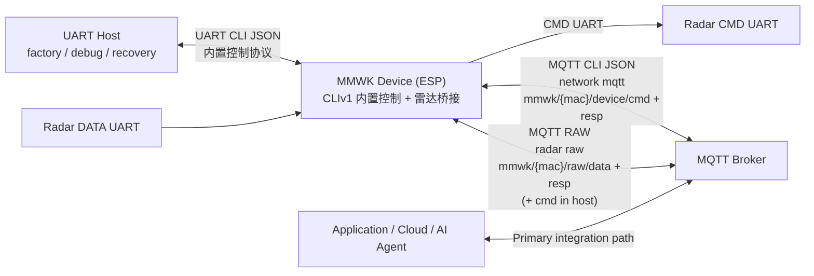

# MMWK CLI Shell Wrapper

本文档介绍 [`./mmwk_cli.sh`](../../mmwk_cli.sh)。它是推荐在 **macOS** 和 **Linux** 上使用的 MMWK bridge/hub 控制入口。该 shell 包装脚本会自动引导 [`scripts/mmwk_cli/`](../../scripts/mmwk_cli/) 中的 Python CLI，并通过 UART（串口）和 MQTT 暴露同一套命令面，默认走标准 CLI JSON，必要时可回退到 MCP。

`mmwk_cli.sh` 现在默认使用标准 CLI JSON 协议。迁移期内，如果调用方省略 `--protocol`，CLI 会打印 warning，提示你升级到显式的 `--protocol cli`。只有兼容性回退场景才建议使用 `--protocol mcp`。

## 原始语义契约

- `raw_resp = startup-trimmed command-port output from on_cmd_data`
- `raw_data = raw data-port bytes from on_radar_data`
- `on_cmd_resp is an application-layer command response`，且它与 raw capture 不同。
- `on_radar_frame is an application-layer frame callback`，且它与 raw capture 不同。
- 雷达驱动会在对外发布命令口输出前，先裁掉启动阶段第一个 printable ASCII 字节之前的脏数据。

---

## 目录

- [安装](#安装)
- [快速开始](#快速开始)
- [核心概念](#核心概念)
- [通信层](#通信层)
- [命令参考](#命令参考)
- [项目文档](#项目文档)
- [硬件交互](#硬件交互)
- [固件刷写流程](#固件刷写流程)
- [数据采集流程](#数据采集流程)
- [故障排查](#故障排查)

---

## 安装

### 前置条件

- macOS 或 Linux，并具备 `bash`
- Python 3.10+
- 使用 UART 时，需要设备的 USB 串口访问权限

`mmwk_cli.sh` 是默认推荐入口。直接调用 Python 也可以，但需要显式使用 `PYTHONPATH=scripts python3 -m mmwk_cli ...`；日常工作流建议优先使用 shell wrapper。

### 推荐安装方式

```bash
./mmwk_cli.sh --help
```

shell wrapper 会在第一次执行非 help 命令时创建 `./venv` 并安装依赖。

### 手动安装方式

```bash
python3 -m venv venv
source venv/bin/activate
pip install -r requirements.txt
```

---

## 快速开始

拿到新设备后的最短端到端路径通常是：

1. 验证 UART 控制路径
2. 刷写雷达固件与配置
3. 确认雷达已运行
4. 采集启动 trim 后的命令口文本与数据口原始字节

### 1. 验证 UART 控制路径

```bash
./mmwk_cli.sh --help
./mmwk_cli.sh device hi -p /dev/cu.usbserial-0001
```

期望 `device hi` 返回的字段包括 `name`、`board`、`version`、`id`，以及在 MQTT 已配置时返回的 `mqtt_uri`、`client_id`、`raw_data_topic`、`raw_resp_topic`。其中 `name` / `version` 是 ESP 固件身份的标准字段。
启动所有权现在改为由雷达面暴露：`radar status` 返回 `start_mode` 与 `supported_start_modes`，`fw.boot_mode` 则表示当前运行态的雷达 boot path。BRIDGE 报告 `["auto", "host"]`，HUB 报告 `["auto"]`。

### 2. 刷写雷达固件与配置

```bash
./mmwk_cli.sh radar flash \
  --fw ../firmwares/radar/iwr6843/oob/out_of_box_6843_aop.bin \
  --cfg ../firmwares/radar/iwr6843/oob/out_of_box_6843_aop.cfg \
  -p /dev/cu.usbserial-0001
```

### 3. 确认刷写已生效

```bash
./mmwk_cli.sh radar version -p /dev/cu.usbserial-0001
./mmwk_cli.sh radar status -p /dev/cu.usbserial-0001
./mmwk_cli.sh device hi -p /dev/cu.usbserial-0001
```

对 `radar flash`、`radar ota`、`radar reconf`，以及 factory / baseline 恢复路径后的第一次上电，都要持续轮询 `radar status`，直到返回 `running`。不要用固定 sleep 替代这个 gate。

### 4. 配置 Wi-Fi 与 MQTT

```bash
./mmwk_cli.sh network config --ssid YOUR_SSID --password YOUR_PASSWORD -p /dev/cu.usbserial-0001
./mmwk_cli.sh network mqtt --mqtt-uri mqtt://192.168.1.100:1883 -p /dev/cu.usbserial-0001
./mmwk_cli.sh device reboot -p /dev/cu.usbserial-0001
```

对于 fresh bridge，先配置 Wi-Fi，再执行 `network mqtt`、重启，并通过 `device hi` 或 `network status` 验证。应把 `state=connected && ip_ready=true` 视为 ready 契约。`device hi` 仍适合看身份和已发布元数据，但不应作为主要运行时就绪信号。缺失 bridge agent key 时，默认值就是 `mqtt_en=1`、`raw_auto=1`，这就是正常 fresh-bridge bring-up 路径。

只有在手动 override 或排障时，才需要执行 `device agent --mqtt-en 1 --raw-auto 1`。

### 5. 采集并验证数据

```bash
./mmwk_cli.sh collect --duration 12 \
  --data-output ./data_resp.sraw \
  --resp-output ./cmd_resp.log \
  -p /dev/cu.usbserial-0001
```

当传入 `-p/--port` 时，`collect` 会先通过 UART 做自动发现，并等待设备重新拿到非零运行时 IP 后再 arm MQTT raw capture。这样可以降低设备刚重启或雷达刚 restart 时，因为 Wi-Fi / MQTT 仍在重连而丢掉启动阶段 `raw_resp` 的概率。

对 `radar flash`、`radar ota`、`radar reconf`，以及 factory / baseline 恢复路径后的第一次上电，先把 `radar status = running` 当成显式 ready gate，再去做纯 MQTT 的 late-attach 采集。如果你把 `collect -p` 当成这段恢复窗口的启动证明路径，就要要求 `cmd_resp.log` 非空。

默认这条带 `-p/--port` 的 `collect` 路径应视为严格的启动期采集路径。如果你的采集窗口就是从 reboot、OTA 恢复或其他 fresh startup/welcome 阶段开始，`raw_resp` 就必须是必需项，`cmd_resp.log` 也应非空。

如果你要拿到 OTA/config 阶段本身的 welcome、cfg 逐行回应和后续命令口输出，不要等 OTA 结束后再跑 `collect`，而是直接在 `radar ota` 时开启 raw capture：

```bash
./mmwk_cli.sh radar ota --fw ./radar.bin --cfg ./radar.cfg \
  --raw-resp-output ./ota_cmd_resp.log \
  -p /dev/cu.usbserial-0001
```

这种模式会在 OTA 命令发送前先订阅 `raw_resp`，因此 welcome、cfg 回显和后续命令口输出都会进入同一轮采集。

如果雷达其实已经稳定运行了一段时间，而你只是想在后面再接入做稳态观察，可以在纯 MQTT 的 `collect` 调用里加上 `--resp-optional`。这种 late-attach 模式不会为了逼出启动文本而重启雷达，所以不能拿来当启动/welcome 证明。

### 外挂工具

`collect` 仍然是官方命令。下面这两个 helper 都挂在 `mmwk_cli.sh` 之外，工作目录应为 `mmwk_cli` 目录。

- [MMWK CFG](mmwk-cfg.md)：当你需要通过 UART 或现有 MQTT 控制链路下发 Wi-Fi / MQTT 设置，或者希望脚本自动启动 / 复用 `server.sh` 本地 broker 时，使用 `./tools/mmwk_cfg.sh`。
- [MMWK RAW](mmwk-raw.md)：当你明确需要控制面与 raw 采集都只走 pure MQTT 时，使用 `./tools/mmwk_raw.sh`。

不要把这些 helper 当成严格启动期 `collect -p` 路径的替代品。

最小通过标准：

- `Resp topic frames > 0`
- `Data topic frames > 0`
- `data_resp.sraw` 非空
- `cmd_resp.log` 非空
- `cmd_resp.log` 从第一个 printable ASCII 字节开始，用户看到的是启动 trim 后的命令口文本

---

## 核心概念

### Device ID

设备的硬件唯一标识，可通过 `device hi` 获取。

### MQTT Client ID

MQTT `client_id` 固定绑定 Wi-Fi STA MAC，格式为 12 位小写十六进制，无分隔符。它是只读派生值，用于 MQTT 会话和 canonical topic 推导：

- `mmwk/{mac}/device/cmd`
- `mmwk/{mac}/device/resp`
- `mmwk/{mac}/raw/data`
- `mmwk/{mac}/raw/resp`
- `mmwk/{mac}/raw/cmd`（仅 host 模式）

### MQTT 通道职责

- `network mqtt`：配置 broker / 鉴权，设备控制 topic 固定为 `mmwk/{mac}/device/...`
- `radar raw`：配置雷达透传通道，raw topic 固定为 `mmwk/{mac}/raw/...`
- `raw_resp` 对应 `on_cmd_data` 的启动 trim 后命令口输出，`raw_data` 对应 `on_radar_data` 的数据口原始字节
- bridge/auto 模式下 MQTT raw 平面是只出不进的，只对外发布 `mmwk/{mac}/raw/data` 和 `mmwk/{mac}/raw/resp`；host 模式下才会额外开放 `mmwk/{mac}/raw/cmd`
- `on_cmd_resp`、`on_radar_frame` 属于应用层回调，与 raw capture 不同
- 推荐真实应用通过 MQTT 集成，UART 主要用于刷写、bring-up、调试和兜底

### 启动所有权契约

- `start_mode` 表示当前保存/当前配置的默认模式。
- `supported_start_modes` 表示当前 profile 支持的启动模式列表。
- `fw.boot_mode` 表示当前运行时观察到的雷达 boot path（`flash`、`host`、`uart`、`spi`）。
- 对 BRIDGE，`auto` 表示 ESP 接管雷达 bring-up，`host` 表示主机接管雷达 bring-up。
- 对 HUB，目前只支持 `auto`。
- `radar start --mode auto|host` 会先持久化新的默认模式，再按该模式重启当前雷达服务。
- 不带 `--mode` 的 `radar start` 会按已保存的 `start_mode` 启动。
- `radar stop` 只停止当前雷达服务，不会改写 `start_mode`。
- `radar status` 现在是只读查询，不再接受 `--set`。
- `raw_auto` 只控制 raw 平面的自动启动，不决定由谁负责雷达启动。
- 在 bridge `host` 下，ESP 仍然暴露 raw 传输面，但不会在启动期自动下发雷达配置。

### 网络与配网

当设备没有保存 WiFi 凭据时，会自动进入配网模式：

1. 连接 `MMWK_XXXX`
2. 打开 `http://192.168.4.1`
3. 输入 WiFi 信息

CLI 配置方式：

```bash
./mmwk_cli.sh network config --ssid "MyWiFi" --password "MyPass" -p /dev/cu.usbserial-0001
./mmwk_cli.sh network status -p /dev/cu.usbserial-0001
```

应把 `network status` 视为主要运行时 ready 契约。`state=connected && ip_ready=true` 表示设备已具备网络可用性；`prov_waiting`、`retry_backoff`、`failed` 等状态则说明当前仍未就绪的原因。

---

## 通信层

### 推荐架构



- **UART**：本地工厂配置、刷写、bring-up、调试
- **MQTT CLI JSON**：默认内置控制通道，通过 `network mqtt` 暴露设备控制与状态读取
- **MQTT RAW**：雷达原始数据透传。bridge/auto 模式下只负责输出 `raw_data` / `raw_resp`；host 模式下可额外启用 `raw_cmd`
- **MCPv1**：兼容/参考层，仅在 MCP 客户端明确需要该协议形态时使用

### UART（本地）

```bash
./mmwk_cli.sh radar flash --fw fw.bin -p /dev/cu.usbserial-0001 --baudrate 921600 --reset
```

### MQTT（远程）

```bash
./mmwk_cli.sh radar status --transport mqtt --broker 192.168.1.5 --device-id dc5475c879c0
```

---

## 命令参考

| Command | 说明 |
|---------|------|
| `device hi` | 读取设备身份与已发布元数据 |
| `device reboot` | 重启设备 |
| `device ota` | 升级 ESP 固件 |
| `device agent` | 配置 agent 服务 |
| `device heartbeat` | 配置心跳 |
| `radar ota` | HTTP OTA 升级雷达固件 |
| `radar flash` | UART 分块升级雷达固件 |
| `radar start` | 持久化可选启动模式并启动/重启当前雷达服务 |
| `radar stop` | 停止当前雷达服务，但不改写已保存模式 |
| `radar reconf` | 在不重新刷 firmware 的前提下重配置运行时雷达契约 |
| `radar cfg` | 回读雷达 cfg 文本（默认 file cfg，可选 hub `--gen`） |
| `radar status` | 只读查询雷达状态、`start_mode` 与 `supported_start_modes` |
| `radar version` | 查询雷达固件版本 |
| `radar raw` | 配置原始透传 |
| `radar debug` | 调试信息 |
| `fw list/set/del/download` | 固件分区管理 |
| `record start/stop/trigger` | 录制控制 |
| `collect` | 采集 `raw_data` / `raw_resp` |
| `entity/adapter/scene/policy` | 能力优先接口 |
| `network config/mqtt/prov/status/ntp` | 网络配置，其中 `network status` 用于查询 `state` / `sta_ip` / `ip_ready` |
| `tools` | 列出 MCP 工具 |
| `help` | 列出设备支持命令 |

### 命令示例

```bash
./mmwk_cli.sh device hi -p /dev/cu.usbserial-0001
./mmwk_cli.sh radar status -p /dev/cu.usbserial-0001
./mmwk_cli.sh radar start --mode auto -p /dev/cu.usbserial-0001
./mmwk_cli.sh radar stop -p /dev/cu.usbserial-0001
./mmwk_cli.sh radar version -p /dev/cu.usbserial-0001
./mmwk_cli.sh radar reconf --welcome --no-verify -p /dev/cu.usbserial-0001
./mmwk_cli.sh radar reconf --welcome --no-verify --clear-cfg -p /dev/cu.usbserial-0001
./mmwk_cli.sh radar cfg -p /dev/cu.usbserial-0001
./mmwk_cli.sh radar cfg --gen -p /dev/cu.usbserial-0001
./mmwk_cli.sh network mqtt --mqtt-uri mqtt://broker.local -p /dev/cu.usbserial-0001
./mmwk_cli.sh collect --duration 12 --data-output ./data_resp.sraw --resp-output ./cmd_resp.log -p /dev/cu.usbserial-0001
```

---

## 使用 `mmwk_cli.sh`

`mmwk_cli.sh` 会自动处理虚拟环境、依赖安装和串口检测：

```bash
./mmwk_cli.sh --help
./mmwk_cli.sh device hi -p /dev/cu.usbserial-0001
```

### 本地 Server 辅助脚本 (`server.sh`)

`server.sh` 是一个配套的高效辅助脚本。用于一键启动本地 MQTT Broker 和 HTTP 文件服务器，完美配合 `mmwk_cli.sh` 执行 Wi-Fi OTA 升级和本地 MQTT 数据采集，无需依赖外部云基础设施。

**核心能力：**
- **本地 MQTT Broker**：依赖本机已安装且在 `PATH` 中可见的 `mosquitto`。
- **内置 HTTP 服务器**：封装 Python 自带的 `http.server`，提供固件与配置文件的 OTA 下载服务。
- **上下文导出**：提供 `env` 命令，输出包含主机 IP、MQTT URI、HTTP Base URL 的 Shell 环境变量（`MMWK_SERVER_XXX`），可直接传递给 `mmwk_cli.sh` 等命令使用。

**常用命令：**

```bash
# 1. 前台运行（阻塞当前终端，推荐用于实时查看日志）
./server.sh run --serve-dir /path/to/artifacts --target-ip 192.168.4.8

# 2. 或在后台分离运行 (Detached mode)
./server.sh start --serve-dir /path/to/artifacts --target-ip 192.168.4.8

# 3. 检查服务存活状态，获取分配的 IP 行和配置
./server.sh status
./server.sh env

# 4. 停止后台服务
./server.sh stop
```

**进阶 OTA 流程：**
仅用于已经运行 bridge 固件的设备升级整个 ESP 固件流水线时：
```bash
./server.sh run --device-ota --device-ota-board mini --host-ip 192.168.4.8
eval $(./server.sh env)
./mmwk_cli.sh device ota --url "$MMWK_SERVER_DEVICE_OTA_URL" -p /dev/cu.usbserial-0001
```

启用 `--device-ota` 时，`server.sh` 会优先查找 legacy 顶层路径 `firmwares/esp/<board>/mmwk_sensor_bridge_full.bin`。如果这个文件不存在，它会自动回退到最新发布的 `firmwares/esp/<board>/mmwk_sensor_bridge/v*/ota.zip`，解出 OTA `.bin`，并通过 `MMWK_SERVER_DEVICE_OTA_*` 导出最终解析出的路径和 URL。

**说明：**
- MQTT 默认使用端口 `1883`。
- HTTP 默认从 `--serve-dir` 对外提供文件，端口 `8380`。
- 如果没有显式传入 `--serve-dir`，`server.sh` 会对外提供它启动时的当前工作目录。
- `server.sh status` 会同时检查 PID 存活和实际 TCP 端口监听状态。
- `server.sh env` 会输出可直接复用的主机 IP、MQTT URI 和 HTTP Base URL，方便传给 `network mqtt`、`radar ota`、`device ota` 和 `collect`。
- 仅适用于已运行 bridge 固件的 OTA 流程请看 [Bridge 设备 OTA 指南](../../../docs/zh-cn/ota.md)，出厂刷机请看 [Bridge 出厂烧录指南](../../../docs/zh-cn/flash.md)。
- 该助手脚本仅面向本地开发、本地刷机和数据采集工作流设计。

### 高级用法：直接调用 Python

```bash
PYTHONPATH=scripts python3 -m mmwk_cli device hi -p /dev/cu.usbserial-0001
```

---

## 项目文档

- **[mmwk_cli.sh](../../mmwk_cli.sh)**：推荐的 macOS/Linux shell 入口
- **[scripts/mmwk_cli/](../../scripts/mmwk_cli/)**：被包装的 Python 实现
- **[Wavvar MMWK 标准 CLI 控制协议 V1.0](../../../docs/CLIv1_CN.md)**：默认标准 CLI JSON 协议规范
- **[Wavvar MMWK MCP 协议规范 V1.3](../../../docs/zh-cn/mcpv1.md)**：MCP/JSON-RPC 兼容协议规范（`--protocol mcp`）
- **[MMWK CFG](./mmwk-cfg.md)**：在 `mmwk_cli` 目录下执行的 Wi-Fi/MQTT 配置辅助流程
- **[MMWK RAW](./mmwk-raw.md)**：在 `mmwk_cli` 目录下执行的 pure-MQTT raw 采集辅助流程
- **[firmwares/](../../../firmwares/)**：预编译固件目录

---

## 硬件交互

### LED 指示

| Pattern | 含义 |
|---------|------|
| **Fast Blink (100ms)** | Wi-Fi 搜索中 / 未连接 |
| **Slow Blink (1000ms)** | MQTT 搜索中 / 未连接 |
| **Solid ON (30s)** | MQTT 连接成功 |
| **Solid ON (5s)** | 握手或按键反馈 |
| **Pulse** | 升级 / 刷写中 |
| **OFF** | 空闲 / 正常运行 |

### 按键功能

- **短按**：视觉测试
- **长按 10 秒**：恢复出厂设置

---

## 固件刷写流程

### UART 分块传输

```bash
./mmwk_cli.sh radar flash \
  --fw ../firmwares/radar/iwr6843/oob/out_of_box_6843_aop.bin \
  --cfg ../firmwares/radar/iwr6843/oob/out_of_box_6843_aop.cfg \
  -p /dev/cu.usbserial-0001
```

版本号行为说明：
- 当前运行时版本校验是基于文本匹配的：雷达启动后、发送任何配置命令之前，驱动会扫描启动阶段的 CLI/welcome 输出，只要在文本中找到期望版本字符串就认为匹配成功。
- `radar flash` 和 `radar ota` 都会从固件二进制旁边的 `meta.json` 推断雷达 metadata：`welcome` 加上可选的 `version`。
- `welcome` 表示该固件是否会输出启动 CLI/welcome 文本，这是固件特征本身。
- 当 `welcome=true` 时，只要雷达启动阶段输出了任意非空字符串，就算 welcome 成立；它不是固定模板，而且完全可能是多行输出。
- `welcome` 很重要，因为它同时承担两个作用：一是证明雷达固件确实已经启动并进入启动 CLI；二是提供 MMWK 唯一能保存成 `radar version` 的真实运行时版本字符串。
- `version` 表示 welcome 文本里的目标子串。
- 当启用 `--verify` 时，MMWK 会在整段启动输出里查找版本子串，不要求它出现在某一条固定文本里。
- `--verify` 会打开版本匹配，并且要求必须提供版本字符串；`--no-verify` 即使 metadata 里有版本也会跳过匹配。
- 如果没有提供版本，刷机仍然可能成功，但 `radar version` 可能保持为空。
- 如果 `welcome` 声明错了，MMWK 要么会一直等待一个根本不会出现的启动文本，要么会跳过它唯一的运行态启动证明和版本来源。
- 如果 `welcome=true`，但在超时窗口内始终没有任何启动 CLI/welcome 输出，应直接视为雷达启动失败：固件大概率没有在雷达侧成功启动。此时 `radar status` 会保持 `state=error`，并附带 `details` 字段解释失败原因。
- 如果你需要定制一个可识别的雷达固件版本号，请让雷达固件的启动 CLI 输出打印出那个目标字符串。

### HTTP OTA

```bash
./mmwk_cli.sh network config --ssid YOUR_SSID --password YOUR_PASSWORD -p /dev/cu.usbserial-0001
./mmwk_cli.sh device reboot -p /dev/cu.usbserial-0001
./mmwk_cli.sh radar ota \
  --fw ../firmwares/radar/iwr6843/oob/out_of_box_6843_aop.bin \
  --cfg ../firmwares/radar/iwr6843/oob/out_of_box_6843_aop.cfg \
  --http-port 8380 \
  -p /dev/cu.usbserial-0001
```

OTA 后第一次上电时，ESP 侧可能还在等待雷达 app 真正启动完成。请持续轮询 `radar status`，直到返回 `running`；不要用固定 sleep 去替代这一步。

版本号行为说明：
- 对 `radar ota` 来说，显式传入的 `--version`、`--verify`、`--welcome` 会覆盖 `meta.json` 推断结果。
- `--force` 会强制执行 OTA，即使目标版本已经和设备当前持久化版本一致。
- 设备侧只有在启用 `--verify` 时，才会通过重启后的启动 CLI/welcome 输出去匹配版本字符串；否则仍然会尊重 `welcome`，但不会做版本匹配。
- 对 `welcome=true` 来说，这段启动输出只要求“有任意非空字符串”，并且允许是多行文本，不要求固定 banner 格式。
- 这段启动 CLI/welcome 文本不只是给可选的版本匹配用，它本身也是“雷达固件真的启动了”的运行态证明，同时还是雷达固件真实版本文本的来源。
- 如果 `welcome=true`，但在超时窗口内始终没有任何启动 CLI/welcome 输出，应直接视为雷达启动失败：固件大概率没有在雷达侧成功启动。此时 `radar status` 会保持 `state=error`，并附带 `details` 字段解释失败原因。
- 如果你需要定制一个可识别的雷达固件版本号，请修改雷达固件启动 CLI 的输出文本，让它打印目标版本字符串。

### 方法 C：运行时重配置（不重新刷 firmware）

当雷达固件二进制本身已经正确，只需要切换运行时契约或运行时 cfg 选择时，请使用 `radar reconf`，这样可以 without flashing firmware 再次应用新的运行时约束。

```bash
./mmwk_cli.sh radar reconf --welcome --no-verify
./mmwk_cli.sh radar reconf --welcome --verify --version "1.2.3"
./mmwk_cli.sh radar reconf --welcome --no-verify --cfg ./runtime.cfg
./mmwk_cli.sh radar reconf --welcome --no-verify --clear-cfg
```

运行时重配置行为：
- `radar reconf` 只在 bridge 模式下可用；host mode is rejected。
- 默认行为是 `cfg_action=keep`，保留当前运行时 cfg 选择。
- `--cfg` 对应 `cfg_action=replace`，只上传 cfg 文件，并以 `uart_data action=reconf_done` 收尾。
- `--clear-cfg` 对应 `cfg_action=clear`，用于移除持久化的运行时 cfg override。
- 与 `radar flash`、`radar ota` 不同，`radar reconf` 不会重新刷写 firmware。
- 每次执行完 `radar reconf` 后，都要先等 `radar status` 返回 `running`，再去依赖 `radar version` 或任何 late-attach `collect` 流程。

相关启动模式行为：
- BRIDGE 会在雷达相关状态面暴露 `supported_start_modes: ["auto", "host"]`，设备面不再暴露启动模式配置。
- BRIDGE 支持 `["auto", "host"]`；HUB 支持 `["auto"]`。
- 在 bridge `host` 且 `raw_auto=1` 时，会自动启动 `mmwk/{mac}/raw/data`、`mmwk/{mac}/raw/resp` 和 `mmwk/{mac}/raw/cmd`。

### 方法 D：回读当前雷达 CFG

当你只想检查当前雷达 cfg 文本，而不想改 firmware 或运行时契约状态时，请使用 `radar cfg`。

```bash
./mmwk_cli.sh radar cfg -p /dev/cu.usbserial-0001
./mmwk_cli.sh radar cfg --gen -p /dev/cu.usbserial-0001
```

回读行为：
- 默认读取当前实际生效的 file cfg 文本。
- 所谓“当前实际生效的 file cfg”，是指当前选中的运行时 override cfg；如果没有 override，则读取 firmware metadata 里的默认 cfg。
- `--gen` 用来请求 hub 运行时生成的 cfg，并且只在 hub runtime 下可用。
- bridge 会拒绝 `--gen`；只要请求了 `--gen`，就不会再回退到 file cfg。
- 缺失、不可读、为空或其他不可用的 cfg 目标都属于硬错误。
- CLI 只会把 cfg 文本写到 stdout，因此重定向或 diff 时能保留原始 cfg 文本。

### 通过 MQTT 刷写

```bash
./mmwk_cli.sh radar flash \
  --fw fw.bin --cfg config.cfg \
  --transport mqtt --broker 192.168.1.100 --device-id dc5475c879c0
```

---

## 数据采集流程

### 方法 A：`collect`

`collect` 会自动：

1. 通过 `device hi` 发现 MQTT 信息
2. 当 Wi-Fi / MQTT 仍在恢复时，等待设备重新拿到可用运行时 IP
3. 查询补充字段
4. 启用 `radar raw`
5. 订阅 `raw_data` 和 `raw_resp`
6. 把 payload 写入输出文件，其中 `cmd_resp.log` 保留从第一个 printable ASCII 字节开始的命令口文本

```bash
./mmwk_cli.sh collect --duration 12 \
  --data-output ./data_resp.sraw \
  --resp-output ./cmd_resp.log \
  -p /dev/cu.usbserial-0001
```

当采集窗口发生在 reboot、OTA 恢复、`radar reconf` 恢复，或 factory / baseline 恢复路径后的第一次启动期时，请把这条带 `-p` 的路径视为严格启动期采集，并要求 `cmd_resp.log` / `raw_resp` 非空。纯 MQTT 的 late-attach 采集只应在 `radar status` 已经返回 `running` 之后使用。

### 方法 B：手工订阅 MQTT

```bash
./mmwk_cli.sh network config --ssid YOUR_SSID --password YOUR_PASSWORD -p /dev/cu.usbserial-0001
./mmwk_cli.sh network mqtt --mqtt-uri mqtt://192.168.1.100:1883 -p /dev/cu.usbserial-0001
./mmwk_cli.sh device reboot -p /dev/cu.usbserial-0001
./mmwk_cli.sh radar raw --enable -p /dev/cu.usbserial-0001
```

对于 fresh bridge，上述流程就足以建立 MQTT 控制；只有在手动 override 或排障时，才需要执行 `device agent --mqtt-en 1 --raw-auto 1`。

```bash
mosquitto_sub -h 192.168.1.100 -t 'mmwk/#' -v
```

### 方法 C：设备侧录制

```bash
./mmwk_cli.sh record start --uri http://192.168.1.100:8080/upload -p /dev/cu.usbserial-0001
./mmwk_cli.sh record trigger --event MANUAL --duration 10 -p /dev/cu.usbserial-0001
./mmwk_cli.sh record stop -p /dev/cu.usbserial-0001
```

### 原始透传控制

```bash
./mmwk_cli.sh radar raw --enable -p /dev/cu.usbserial-0001
./mmwk_cli.sh radar raw -p /dev/cu.usbserial-0001
./mmwk_cli.sh radar raw --disable -p /dev/cu.usbserial-0001
```

---

## 故障排查

### “Address already in use” (Error 48)

本地 HTTP OTA 端口被占用时，可以改用其他端口：

```bash
./mmwk_cli.sh radar ota --fw firmware.bin --http-port 8381 -p /dev/cu.usbserial-0001
```

### MQTT 不通或采集不到数据

- 检查设备和主机是否都能访问同一个 broker
- 确认 `network mqtt` 已配置
- 如果设备携带的是旧持久化值，再检查 `device agent --mqtt-en 1 --raw-auto 1`
- 确认 `radar raw --enable`

### 串口权限问题

- Linux：把用户加入 `dialout`
- macOS：确认没有其他程序占用串口

### 雷达刷写后仍未运行

- 重新执行 `radar status`
- 检查 `.bin` 与 `.cfg` 是否匹配
- `device hi` 显示的是 ESP 侧当前选择/默认的雷达元信息条目，直刷/OTA 后它仍可能保留 bridge 内置 OOB 资产名
- 如需进一步确认，可执行 `radar version`；但要注意它返回的是从启动 CLI 输出中匹配并保存的版本字符串，如果刷机时没有提供期望版本，它可能为空
- 如果目标固件声明了 `welcome=true`，但超时前没有任何 welcome 文本，请直接按“雷达启动失败”处理，并查看 `radar status` 返回的 `details` 字段
- 这里的 welcome 文本指雷达启动阶段输出的任意非空字符串，允许多行，不要求固定格式
- `details.cmd_bytes_seen` / `details.cmd_bytes_total` 可以帮助判断命令口在启动窗口里到底有没有收到字节、总量大概有多少
- `details.leading_noise_bytes` 用来解释为什么 `raw_resp` 前面可能先看到 `0x00` / `0xff` 这类前导噪声
- `details.welcome_preview` 会给出一段可打印的启动预览；设备侧日志也会打印同类 boot observation 摘要
- 请用 `radar version` + `radar status` 确认刷机后的实时运行镜像

### FAQ：配置文件已经发送，但雷达没有数据返回

如果可以确认雷达配置文件已经发出去了，但始终没有雷达数据返回，最常见的原因是 `.cfg` 和当前运行的雷达固件不匹配。很多情况下雷达固件会先接受这段文本，然后在应用配置后进入异常/近似死机状态。

优先检查：

- `.cfg` 是否真的对应当前启动的那份雷达固件 / demo
- 板型、天线变体是否一致，例如 AOP 与非 AOP
- 配置里的 CLI 指令是否属于这份固件支持的命令集
- 先在雷达开发板上证明同一份固件 + 配置本身可以正常出数，再回到 MMWK 集成

这通常是雷达侧配置问题，不是 ESP 侧 UART / MQTT 传输问题。
