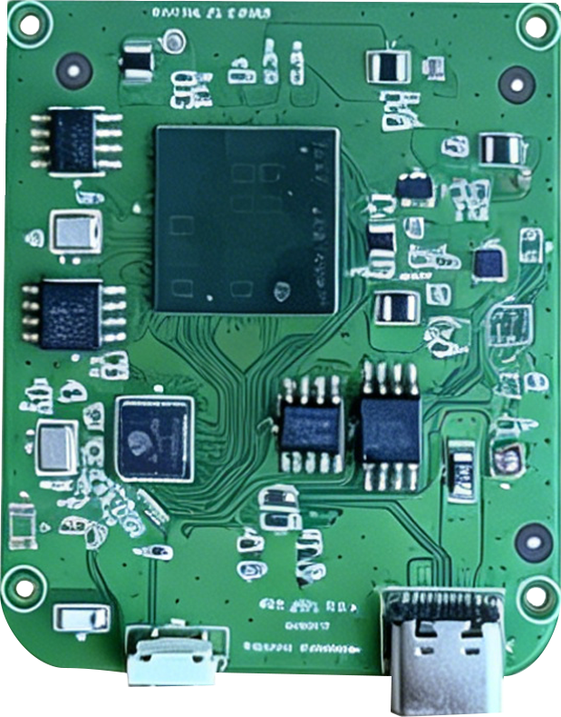

# 模组产品总览

[English Version](./README.md)

`modules/` 目录当前覆盖三条产品线：[RPX](./rpx_cn.md)、[WDR / MDR](./mdr_cn.md) + [ML6432Ax](./ml6432ax_cn.md)，以及 [F9](./f9a1_cn.md)。下面按照系列进行纵览，帮助读者快速理解产品关系，并跳转到对应的详细文档。

## 1. RPX 系列

  
  
RPX 系列代表模组

`RPX` 系列主要面向独立感知模组和紧凑型开发平台，当前包含 `6843` 产品分支以及 `6432` 类别中的 `RPI` 平台。

- [`MINI`](./mini_cn.md)、[`PRO(RTP)`](./pro_cn.md)、`RTL`、`CFH` 属于 `6843` 系列，适合人体存在检测、轨迹跟踪、空间占用感知和空间感知类应用。
- [`RPI`](./rpx_cn.md#3-rpi-6432-感知模块) 是一款紧凑型 `6432` 类感知平台，适合低功耗嵌入式集成和体征相关应用。
- 详细文档： [RPX 系列使用指南](./rpx_cn.md) | [English](./rpx.md)
- 独立模组文档： [MINI 模组简介](./mini_cn.md) | [English](./mini.md) | [PRO 模组简介](./pro_cn.md) | [English](./pro.md)

## 2. WDR / ML6432Ax 系列

  
  
WDR 系列代表系统图

`WDR` 是围绕 `ML6432Ax` 雷达板构建的系统级产品系列。在[详细硬件文档](./mdr_cn.md)里，控制板角色使用 `MDR-M` 进行说明，但对外的产品系列名称统一为 `WDR`。

- `WDR` 是完整模组，由 `ML6432A_BO` 雷达板、`MDR-M` 主控板和 `4G Cat1` 通信板组成。
- [`WDR-M`](./wdr-m_cn.md) 在详细硬件说明中以 `MDR-M` 表示，是负责供电、控制、调试和板间互连的主控承载板。
- [`WDR-4G`](./wdr-4g_cn.md) 是 `WDR` 系统中的蜂窝通信板。
- [`ML6432A_BO`](./ml6432a_bo_cn.md) 是适配 `WDR` 平台的优先直插式雷达板方案。
- [`ML6432A`](./ml6432a_cn.md) 在功能上同样属于 `ML6432Ax` 系列，但接入该系统时通常需要通过转接线连接。
- 系统总览： [MDR 模块简介](./mdr_cn.md) | [English](./mdr.md)
- 板级文档： [WDR-M 主控承载板简介](./wdr-m_cn.md) | [English](./wdr-m.md) | [WDR-4G 通信板简介](./wdr-4g_cn.md) | [English](./wdr-4g.md)
- 雷达板文档： [ML6432Ax 系列介绍](./ml6432ax_cn.md) | [English](./ml6432ax.md) | [ML6432A_BO 模组简介](./ml6432a_bo_cn.md) | [English](./ml6432a_bo.md) | [ML6432A 模组简介](./ml6432a_cn.md) | [English](./ml6432a.md)

## 3. F9 系列

`F9` 系列当前收录的是面向电动两轮车和三轮车尾部安全感知的毫米波雷达产品。

- `F9A1` 是标准后向安全防护雷达，支持 BSD、LCA、RCTA、RCW 等功能。
- `F9A1-D` 是面向特定适配车型结构的安装变体。
- 详细文档： [F9A1 技术规格书](./f9a1_cn.md) | [English](./f9a1.md)

## 4. 阅读建议

- 如果目标是查看独立 `6843` 模组细节，优先阅读 [MINI 模组简介](./mini_cn.md) 或 [PRO 模组简介](./pro_cn.md)；如果想看更完整的 RPX 产品图谱，再看 [rpx_cn.md](./rpx_cn.md)。
- 如果目标是集成完整的 `6432` 控制与通信平台，优先阅读 [mdr_cn.md](./mdr_cn.md)，再继续查看 [wdr-m_cn.md](./wdr-m_cn.md)、[wdr-4g_cn.md](./wdr-4g_cn.md)、[ml6432a_bo_cn.md](./ml6432a_bo_cn.md) 和 [ml6432a_cn.md](./ml6432a_cn.md) 了解板级细节。
- 如果目标是电动两轮车或三轮车的后向安全感知应用，优先阅读 [f9a1_cn.md](./f9a1_cn.md)。
