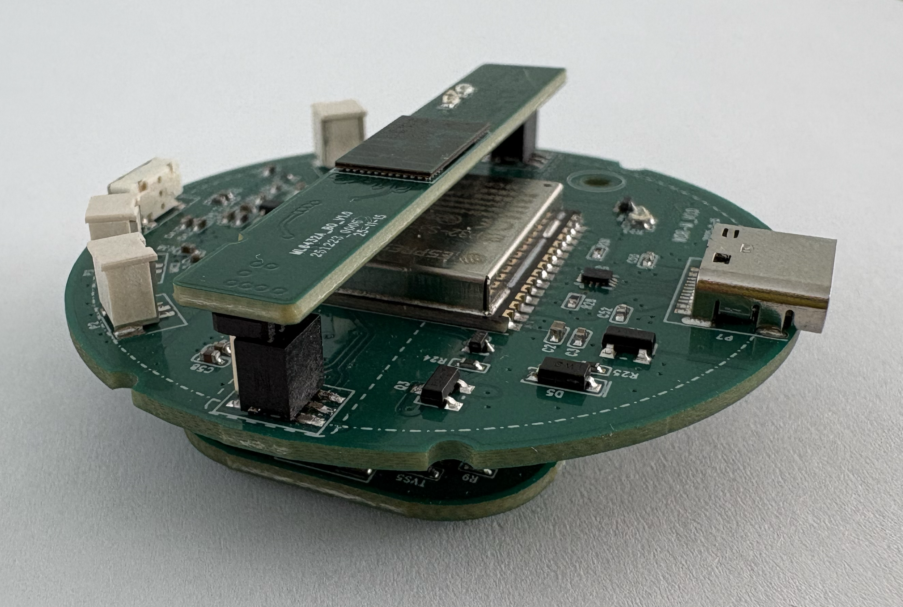
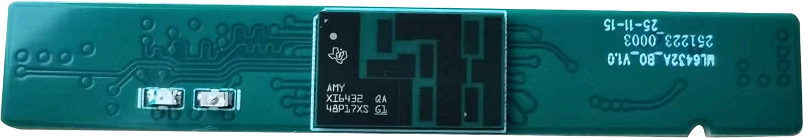
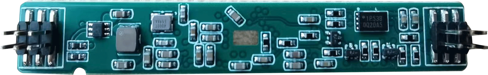
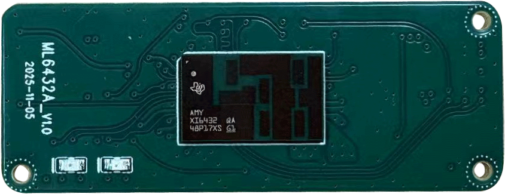
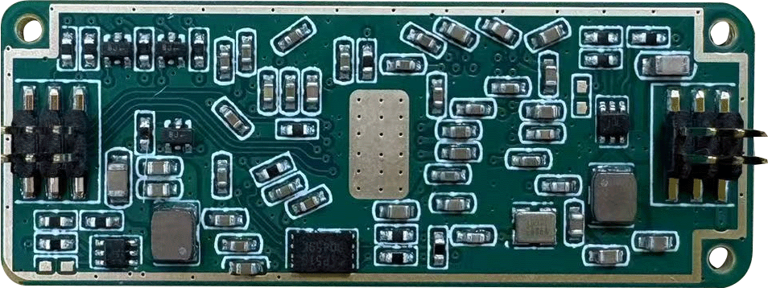
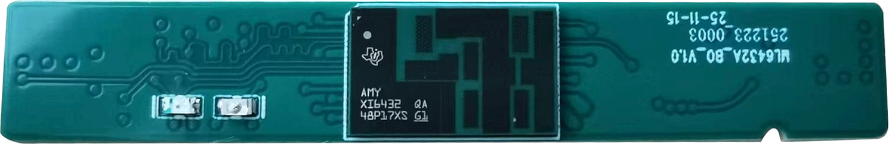
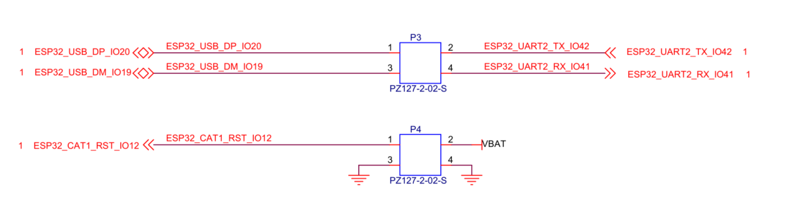

# MDR Module Introduction

## Table of Contents

- [1. Module Overview](#1-module-overview)
- [2. System Composition](#2-system-composition)
- [3. Radar Board Compatibility](#3-radar-board-compatibility)
- [4. Interconnect and Board-Level References](#4-interconnect-and-board-level-references)
- [5. External Interfaces on MDR-M](#5-external-interfaces-on-mdr-m)

## 1. Module Overview

The MDR module is a three-board millimeter-wave sensing and communication platform. It combines the `ML6432A_BO` radar board, the `MDR-M` main controller board, and a `4G Cat1` communication board into one integrated assembly. In this architecture, the radar board is responsible for sensing, the `MDR-M` board handles local control and system interconnect, and the Cat1 board provides cellular backhaul for remote data transmission.

Compared with a single radar board, the MDR module is intended for system-level integration. It provides a more complete hardware platform for edge sensing, controller coordination, and 4G connectivity in one compact mechanical structure.

In product discussions, `WDR` is used as a series name. When people refer to the "WDR development board," they often mean the `WDR-M` board specifically. In this document, board-level references use `MDR-M` as the concrete controller board name.

  
  
MDR module top view

  
  
MDR module side view

  
  
  
WDR series reference views

## 2. System Composition

The MDR module consists of the following hardware blocks.

| Board | Function | Notes |
| --- | --- | --- |
| `ML6432A_BO` radar board | Millimeter-wave sensing, radar front end, signal processing, and radar data output | The preferred plug-in radar option for MDR |
| `MDR-M` main controller board | Power distribution, local control, peripheral management, and board-to-board interconnect | Serves as the central carrier and control board |
| `4G Cat1` communication board | Cellular communication and remote connectivity | Provides network backhaul for field deployment |

From a system perspective, the `MDR-M` board bridges the radar board and the Cat1 board. It exposes the interfaces needed for local debugging, board-level control, and communication routing between sensing and connectivity subsystems.

## 3. Radar Board Compatibility

`MDR-M` supports the `ML6432Ax` series at the functional level. This means the sensing capability of the MDR module can be built around either `ML6432A` or `ML6432A_BO`, depending on the integration method required by the project.

The practical difference is mechanical integration:

- `ML6432A_BO` can be inserted directly into the `MDR-M` board through the board-to-board connector arrangement.
- `ML6432A` provides the same radar-side functional class, but it requires an adapter cable instead of direct insertion.

Both radar board variants share the same radar-side interface definition. If the user only needs standalone radar flashing or debugging, either `ML6432A` or `ML6432A_BO` can be used with the same `ML6432Ax` workflow.

| Variant | Front View | Back View | Integration Method |
| --- | --- | --- | --- |
| `ML6432A_BO` |  |  | Direct plug-in to `MDR-M` / `WDR-M` |
| `ML6432A` |  |  | Connection through adapter cable |

For full electrical specifications, interface definitions, and standalone radar board usage, refer to the [ML6432Ax series introduction](./ml6432ax.md).

  
  
ML6432A_BO radar board

  
  
  
Direct plug-in orientation between MDR-M and ML6432A_BO

This direct-plug arrangement is the main reason the `BO` variant is recommended when building the complete MDR module. When the non-BO variant is used, the system architecture remains supported, but the radar board must be connected through an external adapter cable rather than mounted directly on the controller board.

## 4. Interconnect and Board-Level References

The `4G Cat1` board and the radar board are both connected to `MDR-M` through dedicated board-level signals. The references below summarize the main internal interconnect patterns of the MDR module.

  
  
4G Cat1 board interface schematic

  
  
MDR-M to radar board connection reference

  
  
MDR-M to Cat1 board connection reference

These references are useful when validating plug-in direction, tracing UART or USB-related routing, or reviewing how the communication board and radar board are wired into the controller board.

## 5. External Interfaces on MDR-M

The `MDR-M` board also provides several service and debugging references that are useful during bring-up and integration:

- `P7` is a USB Type-C interface used for service or local connection.
- A status LED reference is provided for quick visual indication during debugging.
- A key input reference is provided for local interaction or control behavior.

  
  
USB Type-C reference on MDR-M

  
  
Status LED reference on MDR-M

  
  
Key reference on MDR-M

Together, these interfaces make the MDR module easier to assemble, debug, and deploy as a complete radar-and-communication platform.
