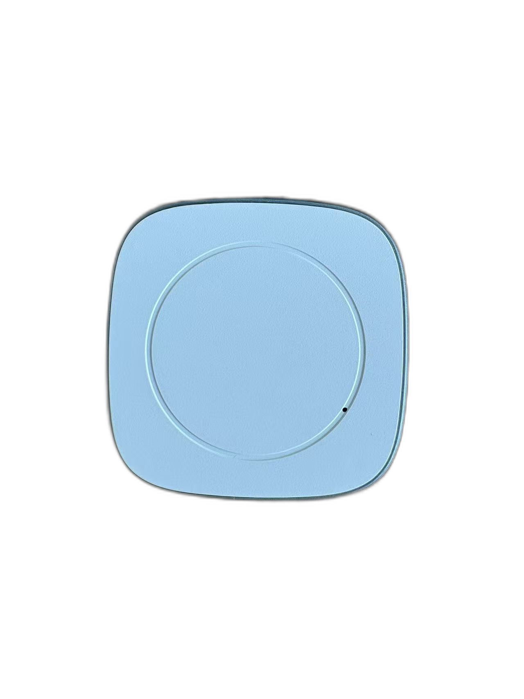
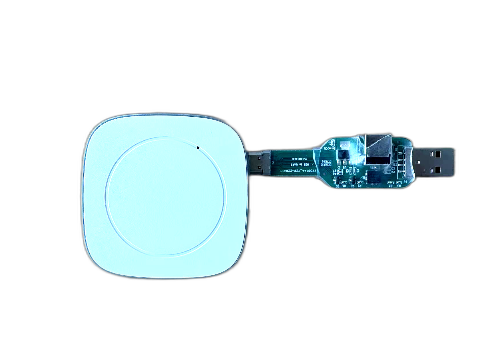
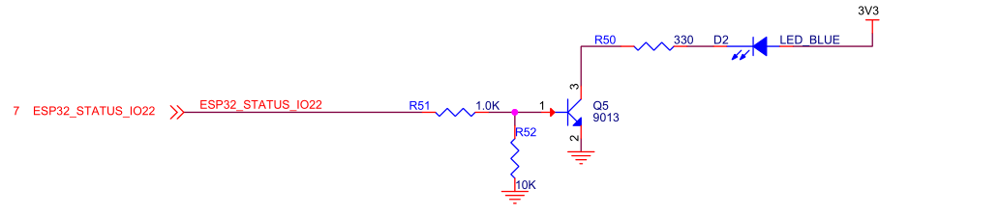
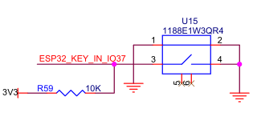

# MINI Module Introduction

[Chinese Version](./mini_cn.md)

## Table of Contents

- [1. Module Overview](#1-module-overview)
- [2. Appearance and Dimensions](#2-appearance-and-dimensions)
- [3. Technical Specifications and Key Features](#3-technical-specifications-and-key-features)
- [4. Development and Flashing Orientation](#4-development-and-flashing-orientation)
- [5. Interface Description](#5-interface-description)
- [5.1 Type-C Interface on the Flashing Debugger](#51-type-c-interface-on-the-flashing-debugger)
- [5.2 Status LED Interface Reference](#52-status-led-interface-reference)
- [5.3 Key Interface Reference](#53-key-interface-reference)
- [6. Related Documents](#6-related-documents)

## 1. Module Overview

`MINI (RPM)` is part of the `RPX 6843` sensing module family. The `6843` series is Wavvar's flagship module product line, built on TI's high-performance millimeter-wave radar technology for advanced spatial sensing scenarios that require stable motion tracking and accurate spatial measurement.

Typical applications include:

- Human presence detection and fall detection
- Dynamic trajectory tracking
- Occupancy detection
- Activity recognition
- Entry and exit monitoring
- In-bed / out-of-bed detection
- Point cloud data visualization

## 2. Appearance and Dimensions

  
  
MINI appearance reference

| Item | Specification |
| --- | --- |
| Dimensions | 65x65x18 mm |

## 3. Technical Specifications and Key Features

| Category | Item | Specification |
| --- | --- | --- |
| **Power** | External Supply | 5V⎓2A |
|  | Adapter | 100-240V AC input |
|  | System Power Consumption | < 10W |
| **Operating Parameters** | Installation Method | Ceiling mount or wall mount |
|  | Maximum Detection Range (Wall-mounted) | Depends on installation height, tilt angle, target reflection characteristics, and algorithm configuration; configurable |
|  | Field of View (FOV) | Approximately 120°-140° horizontally (estimated from the antenna pattern; actual coverage depends on installation method, enclosure structure, and algorithm configuration) |
|  | Operating Temperature | 0°C to 45°C (system ambient temperature) |
|  | Operating Humidity | < 95% (non-condensing) |
|  | Wall-mount Pitch Angle | 30° (downward tilt) |
| **Radar Characteristics** | RF Frequency Band | 60-64 GHz |
|  | Tx/Rx Channels | 3TX / 4RX (see Note 1) |
|  | Modulation | FMCW |
|  | Output Power per TX Channel (EIRP) | 15 dBm |
| **Connectivity and Integration** | Cloud Protocols | MQTT, HTTP, HTTPS |
|  | Wi-Fi | Wi-Fi 802.11 b/g/n (2.4 GHz) |
|  |  | Station / SoftAP / Station + SoftAP |
|  |  | Up to 150 Mbps (theoretical; actual performance depends on the network environment) |
|  | Local Communication | UART (data format is defined by firmware and can support binary or JSON) |
| **Hardware Architecture** | Processing Architecture | Dual-chip heterogeneous architecture (mmWave radar SoC + main MCU) |
|  | Radar Processing Unit | ARM Cortex-R4F + C674x DSP + Hardware Accelerator (HWA) |
|  | Main Controller | ESP32 dual-core processor |
|  | On-chip Memory | 520 KB (ESP32) + 1.75 MB (radar SoC) |
|  | PSRAM | 8 MB PSRAM (connected to ESP32) |
|  | Flash Storage | 8 MB (ESP32) + 4 MB (radar SoC, optional) |
|  | I/O and Indicators | 1x LED, 1x key, 1x LED (optional) |
|  | IMU (Optional) | Optional 6-axis gyroscope + 3-axis accelerometer |
|  | Ambient Light Sensor (Optional) | Optional support |

> Note 1: For the "Tx/Rx Channels" parameter, up to `2TX` simultaneous transmission is supported in `1.3 V` mode; `3TX` simultaneous transmission requires the `1V LDO bypass` operating mode.

## 4. Development and Flashing Orientation

To ensure successful flashing and serial communication, pay attention to the required `Type-C` orientation. When connecting the flashing debugger to a `Mini` device, align the `A` side of the debugger with the front side of the enclosure.

| Platform | Alignment Diagram |
| --- | --- |
| **Mini Device** (A-side aligned with the enclosure front) |  |

## 5. Interface Description

The `MINI` module interface description includes the flashing debugger `Type-C`, the status `LED`, and the key input.

### 5.1 Type-C Interface on the Flashing Debugger

The `USB-to-UART V1.3` debugger board is used for firmware flashing and serial console access. Both debugger variants use the same `Type-C` pin definition and communication capability.

If the port is used only for power delivery, the module does not distinguish between side `A` and side `B`. When used for communication, the module `Type-C` port is side-sensitive. The pin definition is as follows.

| Type-C | Definition |
| --- | --- |
| A5 | UART_RX |
| A6 | RTS |
| A7 | DTR |
| B8 | UART_TX |
| A1/A12/B1/B12 | GND |
| A4/A9/B4/B9 | 5V input |

The `USB-to-UART V1.3` flashing debugger pin definition is as follows.

| Pin | Color | Signal |
| --- | --- | --- |
| A5 | Orange | RX |
| A6 | Green | RTS |
| A7 | Blue | DTR |
| B8 | Yellow | TX |
| GND | Black | GND |
| VBUS | Red | 5V |

### 5.2 Status LED Interface Reference

The status `LED` is controlled by `ESP32_STATUS_IO22`. The circuit reference is shown below.

  
  
MINI status LED interface reference

### 5.3 Key Interface Reference

The key input is connected to `ESP32_KEY_IN_IO37` and is pulled up to `3V3` through a `10kΩ` resistor by default. Pressing the key triggers a low-level input.

  
  
MINI key interface reference

## 6. Related Documents

- [RPX Series Usage Guide](./rpx.md)
