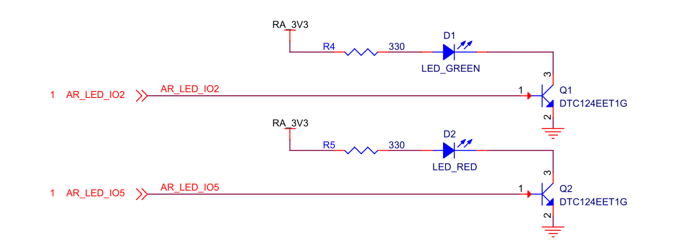
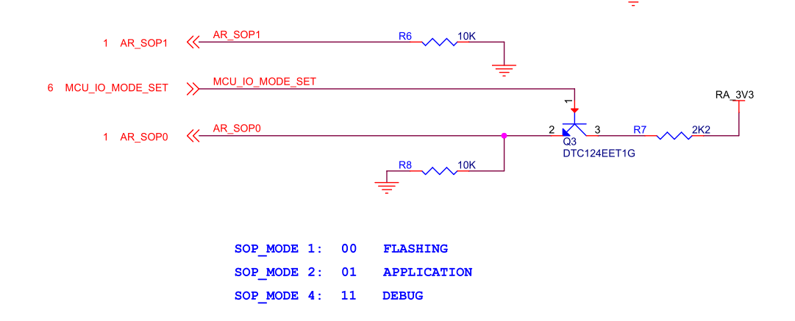

# ML6432A Module Introduction

[Chinese Version](./ml6432a_cn.md)

## Table of Contents

- [1. Module Introduction](#1-module-introduction)
- [2. Technical Specifications and Key Features](#2-technical-specifications-and-key-features)
- [3. Application Areas](#3-application-areas)
- [4. WDR/MDR Series Integration](#4-wdrmdr-series-integration)
- [5. Interface Description](#5-interface-description)
- [5.1 Status LED Reference](#51-status-led-reference)
- [6. Usage and Flashing Instructions](#6-usage-and-flashing-instructions)
- [6.1 Flashing Reference](#61-flashing-reference)
- [6.2 Boot Mode Configuration](#62-boot-mode-configuration)
- [6.3 Firmware Flashing Procedure](#63-firmware-flashing-procedure)
- [6.4 Module Usage Instructions](#64-module-usage-instructions)
- [6.5 Serial Port Connection](#65-serial-port-connection)
- [7. Related Documents](#7-related-documents)

## 1. Module Introduction

`ML6432A` is a high-performance, low-power millimeter-wave radar module developed on the TI `IWRL6432AOP` chip. The module integrates the radar RF front end, the digital processing unit, and the antenna in a compact and highly integrated design. It is intended for applications such as smart homes, human presence detection, vital-sign monitoring, and motion detection. The module supports `UART` and `SPI` interfaces, making it convenient for rapid development and system integration.

  
  
ML6432A

## 2. Technical Specifications and Key Features

| Category | Item | Specification | Remarks |
| --- | --- | --- | --- |
| **Basic Parameters** | Dimensions | 15 × 39 × 7.2 mm | Module size, subject to the mechanical drawing |
|  | Power Input | 3.3V | Single power input, recommended power capability ≥1A |
|  | Power Consumption | Depends on operating mode | Typical about 1W in Active mode; lower in low-power mode |
|  | Communication Interfaces | UART / SPI / CAN-FD / SOP | Supports multiple interfaces for communication and boot configuration |
| **Environmental Parameters** | Operating Temperature | 0 to +45°C |  |
|  | Storage Temperature | -55 to +150°C |  |
|  | Operating Humidity | ≤95% (non-condensing) |  |
| **External Interfaces** | P1 | 6-pin, SPI + UART communication interface |  |
|  | P2 | 6-pin, power + CAN + control interface |  |
| **P1 Interface Definition** | SPIA_MOSI | SPI master transmit |  |
|  | SPIA_MISO | SPI master receive |  |
|  | SPIA_CS | SPI chip select |  |
|  | SPIA_CLK | SPI clock |  |
|  | RS232_TX | UART transmit | TTL level |
|  | RS232_RX | UART receive | TTL level |
| **P2 Interface Definition** | 3.3V | Power input |  |
|  | GND | Power ground |  |
|  | NRESET | Module reset | Active low |
|  | MCU_IO_MODE_SET | Mode control | Functional expansion interface |
|  | CAN_FD_TX | CAN transmit |  |
|  | CAN_FD_RX | CAN receive |  |
| **Communication Capability** | SPI | Configurable communication interface |  |
|  | UART | Main debugging / data communication |  |
|  | CAN | Supports CAN-FD | Industrial applications |
| **RF Parameters** | Operating Frequency Band | 57 to 63.5 GHz |  |
|  | Tx/Rx Channels | 2Tx 3Rx |  |
|  | Transmit Power | 17 dBm | Typical EIRP per transmit channel (AOP, 0 dB back-off) |
| **Detection Performance** | Detection Range | 0.1 to 20 m | Typical for human moving targets |
|  | Micro-motion Detection | ≤6 m | Respiration / stationary detection |
|  | FOV | Typical horizontal ±70° / vertical ±60° | Depends on antenna and installation structure |
| **Storage Function** | Flash | On-board 16Mbit QSPI Flash | Approximately 2MB |
| **Clock System** | External Crystal | 40 MHz |  |
| **Control and Status** | Status Indicator | On-board LED | Network / running status |
|  | Control Signals | NRESET / SOP / mode control |  |
| **On-board Features** | Boot Mode | Flash / Application / Debug | Multiple boot modes |
|  | Interface Type | Multi-interface multiplexing | SPI / UART / CAN |
|  | LED (Optional) | 2x LED |  |

## 3. Application Areas

- Healthcare monitoring: non-contact vital-sign monitoring (respiration and heart rate)
- Building automation: automatic doors, occupancy detection, people tracking, and people counting
- Consumer electronics: laptops, smart appliances (air conditioners, refrigerators, smart toilets), and smartwatches
- Security and surveillance: video doorbells, IP cameras, and motion detectors
- Automotive electronics: in-cabin intrusion detection and related applications

## 4. WDR/MDR Series Integration

In system-integration scenarios, `ML6432A` and `ML6432A_BO` share the same radar-side electrical interface definition, but they differ in the installation method. `ML6432A` is also supported by `MDR-M` / `WDR-M` at the functional level, but it usually connects through an adapter cable rather than by direct insertion into the controller board.

The images below come from the `WDR/MDR` integration material and can be used as supplementary references.

  
  
  
Connector layout and P1/P2 position references

  
  
Signal schematic reference from the WDR/MDR integration material

For the complete `WDR/MDR` system-level description, refer to [mdr.md](./mdr.md).

## 5. Interface Description

The module connects to external systems through two `6-pin` connectors (`P1` and `P2`). These interfaces include power, reset, mode configuration, and `SPI`, `UART`, and `CAN FD` communication signals. The current `ML6432A` interface references are shown below.

  
  
Figure 1. ML6432A front view

  
  
Figure 2. ML6432A back view

  
  
Figure 3. ML6432A connector pin assignment

  
  
Figure 4. Interface schematic

### 5.1 Status LED Reference

The image below is the added `ML6432A` status `LED` reference, which can be used to quickly locate the on-board indicator position.

  
  
Figure 5. ML6432A status LED reference

## 6. Usage and Flashing Instructions

The module supports both `MMWK` flashing and standard flashing. For `MMWK` flashing, refer to the `MMWK` documentation. Before standard flashing, module debugging, or firmware programming, prepare the following drivers and tools according to the actual hardware configuration.

- CP210x serial driver: [Download](https://www.silabs.com/software-and-tools/usb-to-uart-bridge-vcp-drivers?tab=downloads)
- CH340 serial driver: [Download](https://www.wch.cn/downloads/CH341SER_EXE.html)
- Friendly serial debugging assistant: [Download](https://www.alithon.com/downloads)
- UniFlash programming tool (required): [Download](https://www.ti.com/tool/UNIFLASH?keyMatch=UNIFLASH&tisearch=universal_search&usecase=software)

### 6.1 Flashing Reference

The image below is the added `ML6432A` flashing reference, which can be used as an auxiliary guide when connecting the flashing tool and programming firmware.

  
  
Figure 6. ML6432A flashing reference

### 6.2 Boot Mode Configuration

The module boot mode is controlled by the `MCU_IO_MODE_SET` (`P2.5`) pin. Different logic levels correspond to different operating states.

- Flashing mode configuration: keep pin `P2.5` floating or pull it low. After power-on, the device enters flashing mode. Note: leaving the pin floating or pulling it directly to `GND` will both enter flashing mode.
- Application boot mode (normal operating mode) configuration: drive pin `P2.5` high. After power-on, the device enters application boot mode. It is recommended to pull the pin up to the `3.3V` input through a `10kΩ` resistor.

### 6.3 Firmware Flashing Procedure

- Configure the device for flashing mode.
- Connect the device to the computer through the serial tool.
- Use `UniFlash` to program the firmware.

For detailed operating steps, refer to the official `TI` document: [Documentation](https://software-dl.ti.com/ccs/esd/uniflash/docs/v9_3/uniflash_quick_start_guide.html)

### 6.4 Module Usage Instructions

After the firmware is programmed:

- Switch the device to application boot mode.
- Connect to the device through the serial port.
- Use the serial tool to view runtime data, send configuration files, or issue debugging commands.

### 6.5 Serial Port Connection

The hardware connection is as follows.

| Device Port | Serial Tool |
| --- | --- |
| 3V3 | 3.3V output |
| GND | GND |
| RS232_RX | TX |
| RS232_TX | RX |

When the serial debugging adapter is connected to the computer through `USB`, the system recognizes it as a serial device. The assigned port name depends on the host system. On `Windows`, it is typically shown as a `COM` port such as `COM20`.

## 7. Related Documents

- [MDR Module Introduction](./mdr.md)
- [WDR-M Main Controller Carrier Board Introduction](./wdr-m.md)
- [ML6432A_BO Module Introduction](./ml6432a_bo.md)
