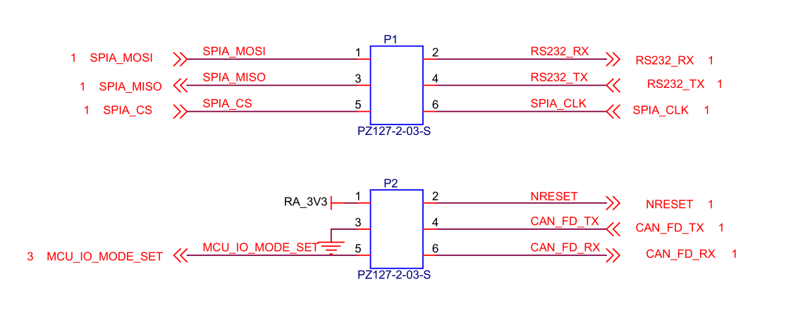
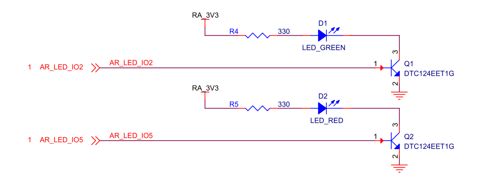
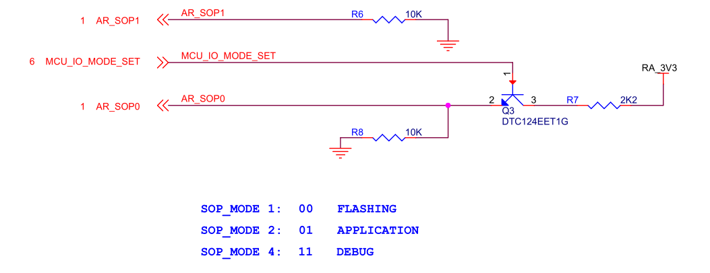

# ML6432A_BO 模组简介

## 目录

- [1. 模组简介](#1-模组简介)
- [2. 技术规格和主要特性](#2-技术规格和主要特性)
- [3. 应用领域](#3-应用领域)
- [4. WDR/MDR 系列集成说明](#4-wdrmdr-系列集成说明)
- [5. 接口说明](#5-接口说明)
- [5.1 接口参考图](#51-接口参考图)
- [5.2 状态 LED 参考](#52-状态-led-参考)
- [6. 使用与烧录说明](#6-使用与烧录说明)
- [6.1 烧录参考图](#61-烧录参考图)
- [6.2 启动模式配置说明](#62-启动模式配置说明)
- [6.3 固件烧录步骤](#63-固件烧录步骤)
- [6.4 模组使用说明](#64-模组使用说明)
- [6.5 串口连接说明](#65-串口连接说明)
- [7. 相关文档](#7-相关文档)

## 1. 模组简介

`ML6432A_BO` 是基于 TI `IWRL6432AOP` 芯片开发的高性能低功耗毫米波雷达模组。模组集成了雷达射频前端、数字处理单元及天线，具有尺寸紧凑、集成度高等特点。本模组主要面向智能家居、人员存在检测、体征检测、运动检测等应用领域。支持 `UART`、`SPI` 和 `CAN-FD` 接口，方便用户进行快速开发和集成，并适合作为 `MDR-M` / `WDR-M` 的直插式雷达板方案。

  
  
ML6432A_BO

## 2. 技术规格和主要特性

| 类别 | 项目 | 规格 | 备注 |
|---|---|---|---|
| **基础参数** | 尺寸 | 7.6 × 48 × 7.2 mm | 模组尺寸，以结构图纸为准 |
|  | 供电输入 | 3.3V | 单电源输入，建议电源能力 ≥1A |
|  | 功耗 | 与工作模式相关 | Active 模式典型约 1W，低功耗模式更低 |
|  | 通信接口 | UART / SPI / CAN-FD / SOP | 支持多接口通信与启动配置 |
| **环境参数** | 工作温度 | 0 ～ +45°C |  |
|  | 存储温度 | -55 ～ +150°C |  |
|  | 工作湿度 | ≤95%（无冷凝） |  |
| **对外接口** | 板对板连接器 | 直插式系统连接 | 适配 `WDR-M` |
|  | 信号类别 | SPI + UART + CAN + 控制接口 |  |
| **P1 接口定义** | SPIA_MOSI | SPI 主机发送 | 通过板对板连接引出 |
|  | SPIA_MISO | SPI 主机接收 | 通过板对板连接引出 |
|  | SPIA_CS | SPI 片选 | 通过板对板连接引出 |
|  | SPIA_CLK | SPI 时钟 | 通过板对板连接引出 |
|  | RS232_TX | 串口发送 | TTL 电平 |
|  | RS232_RX | 串口接收 | TTL 电平 |
| **P2 接口定义** | 3.3V | 电源输入 | 通过板对板连接引出 |
|  | GND | 电源地 |  |
|  | NRESET | 模组复位 | 低电平有效 |
|  | MCU_IO_MODE_SET | 模式控制 | 功能扩展接口 |
|  | CAN_FD_TX | CAN 发送 |  |
|  | CAN_FD_RX | CAN 接收 |  |
| **通信能力** | SPI | 可配置通信接口 |  |
|  | UART | 主调试 / 数据通信 |  |
|  | CAN | 支持 CAN-FD | 工业应用 |
| **射频参数** | 工作频段 | 57 ～ 63.5 GHz |  |
|  | 收发通路 | 2Tx 3Rx |  |
|  | 发射功率 | 17 dBm | 单发射通道典型 EIRP（AOP，0 dB back-off） |
| **探测性能** | 探测距离 | 0.1 ～ 20 m | 典型人体移动目标 |
|  | 微动检测 | ≤6 m | 呼吸/静止检测 |
|  | FOV | 典型水平 ±70° / 垂直 ±60° | 取决于天线与安装结构 |
| **存储功能** | Flash | 板载 16Mbit QSPI Flash | 约 2MB |
| **时钟系统** | 外部晶振 | 40 MHz |  |
| **控制与状态** | 状态指示 | 板载 LED | 网络/运行状态 |
|  | 控制信号 | NRESET / SOP / 模式控制 |  |
| **板载特性** | 启动方式 | Flash / Application / Debug | 多模式启动 |
|  | 接口类型 | 多接口复用 | SPI / UART / CAN |
|  | LED（可选） | 2x Led |  |

## 3. 应用领域

- 健康监护：非接触式生命体征监测（呼吸与心率）
- 楼宇自动化：自动门、占用检测、人员追踪与计数
- 个人电子产品：笔记本电脑、智能家电（空调、冰箱、智能马桶）、智能手表
- 安防监控：可视门铃、IP 网络摄像头、运动检测器
- 汽车电子：车内入侵检测等

## 4. WDR/MDR 系列集成说明

在系统集成场景下，`ML6432A_BO` 与 `ML6432A` 在雷达侧保持相同的电气接口类别，但安装方式不同。`ML6432A_BO` 是面向 `MDR-M` / `WDR-M` 的优先直插版本，在构建完整 `WDR/MDR` 模块时更适合作为直插式雷达板方案。

  
  
  
MDR-M 与 ML6432A_BO 的直插方向参考

如需查看完整的 `WDR/MDR` 系统级说明，请参考 [mdr_cn.md](./mdr_cn.md)。

## 5. 接口说明

模组通过板对板连接方式接入 `WDR/MDR` 系统，同时保留与 `ML6432A` 相同的雷达侧接口类别。由于 `ML6432A_BO` 的对外接口排列与 `ML6432A` 不一致，本节先保留 `BO` 版本的外观与接口参考图。

  
  
图 1 ML6432A_BO 正面

  
  
图 2 ML6432A_BO 背面

  
  
图 3 ML6432A_BO 接口线序

### 5.1 接口参考图

下图为你新增的 `ML6432A_BO` 接口参考图，可用于确认 `BO` 版本的板对板接口位置与连接方式。

  
  
图 4 ML6432A_BO 接口参考图

### 5.2 状态 LED 参考

下图为你新增的 `ML6432A_BO` 状态 `LED` 参考图，可用于快速定位板载指示灯位置。

  
  
图 5 ML6432A_BO 状态 LED 参考图

## 6. 使用与烧录说明

模组支持使用 `MMWK` 烧录和标准烧录。通过 `MMWK` 烧录请参考 `MMWK` 文档。进行标准烧录、模组调试或固件烧写前，需准备以下驱动及工具（根据实际硬件下载对应驱动）。

- CP210x 串口驱动：[下载地址](https://www.silabs.com/software-and-tools/usb-to-uart-bridge-vcp-drivers?tab=downloads)
- CH340 串口驱动：[下载地址](https://www.wch.cn/downloads/CH341SER_EXE.html)
- 友善串口调试助手：[下载地址](https://www.alithon.com/downloads)
- UniFlash 下载工具（必选）：[下载地址](https://www.ti.com/tool/UNIFLASH?keyMatch=UNIFLASH&tisearch=universal_search&usecase=software)

### 6.1 烧录参考图

下图为你新增的 `ML6432A_BO` 烧录参考图，可在连接烧录器和执行固件烧录时作为辅助参考。

  
  
图 6 ML6432A_BO 烧录参考图

### 6.2 启动模式配置说明

模组通过 `MCU_IO_MODE_SET`（`P2.5`）引脚控制启动模式，不同电平对应不同工作状态。

- 刷机模式配置方法：`P2.5` 引脚保持悬空或接低电平，设备开机后会进入刷机模式。（说明：悬空或直接拉至 `GND` 均可进入刷机模式）
- 应用启动模式（正常工作模式）配置方法：`P2.5` 引脚接高电平，设备开机后会进入应用启动模式，建议将引脚通过 `10kΩ` 电阻拉高到 `3.3V` 输入。

### 6.3 固件烧录步骤

- 将设备配置为刷机模式；
- 通过串口助手将设备连接至电脑；
- 使用 `UniFlash` 工具进行固件烧录。

操作步骤可参考 `TI` 官方文档：[文档地址](https://software-dl.ti.com/ccs/esd/uniflash/docs/v9_3/uniflash_quick_start_guide.html)

### 6.4 模组使用说明

固件烧录完成后：

- 将设备切换至应用启动模式；
- 通过串口连接设备；
- 可在串口工具中查看设备运行数据、发送配置文件或调试指令。

### 6.5 串口连接说明

硬件连接关系如下。

<table style="margin: 0 auto; text-align: center;">
  <thead>
    <tr>
      <th>设备端口</th>
      <th>串口工具</th>
    </tr>
  </thead>
  <tbody>
    <tr>
      <td>3V3</td>
      <td>3.3V 输出</td>
    </tr>
    <tr>
      <td>GND</td>
      <td>GND</td>
    </tr>
    <tr>
      <td>RS232_RX</td>
      <td>TX</td>
    </tr>
    <tr>
      <td>RS232_TX</td>
      <td>RX</td>
    </tr>
  </tbody>
</table>

连接电脑时，将串口调试助手 `USB` 插入电脑后，系统会识别为串口设备。设备分配到的端口名称取决于主机系统；在 `Windows` 系统中，通常会显示为类似 `COM20` 的 `COM` 口。

## 7. 相关文档

- [MDR 模块简介](./mdr_cn.md)
- [WDR-M 主控承载板简介](./wdr-m_cn.md)
- [ML6432A 模组简介](./ml6432a_cn.md)
