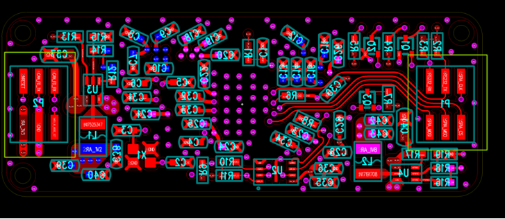
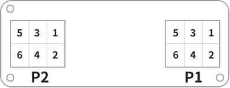
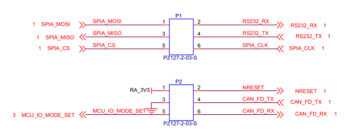
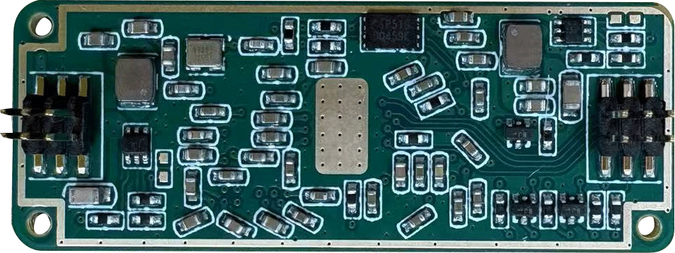
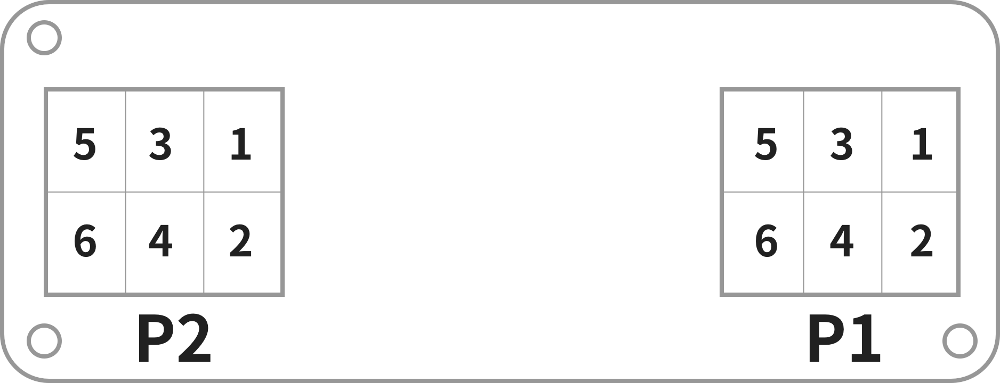
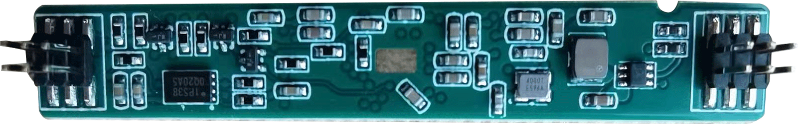
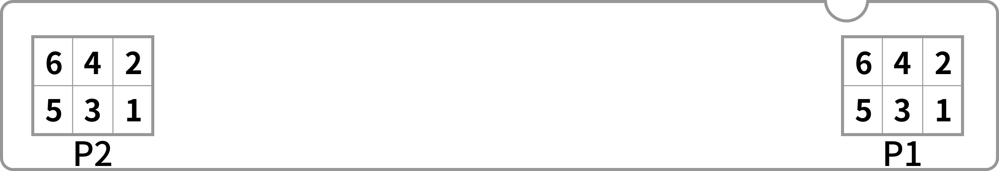
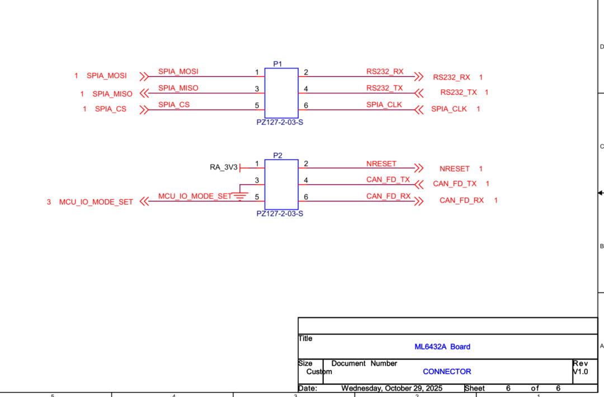

# 6432 Module Introduction

## Table of Contents

- [1. Module Overview](#1-module-overview)
- [2. Technical Specifications and Key Features](#2-technical-specifications-and-key-features)
- [3. Application Areas](#3-application-areas)
- [4. WDR/MDR Series Integration](#4-wdrmdr-series-integration)
- [5. Interface Description](#5-interface-description)
- [6. Programming and Usage Instructions](#6-programming-and-usage-instructions)
- [6.1 Boot Mode Configuration](#61-boot-mode-configuration)
- [6.2 Firmware Flashing Procedure](#62-firmware-flashing-procedure)
- [6.3 Module Operation](#63-module-operation)
- [6.4 Serial Port Connection](#64-serial-port-connection)

## 1. Module Overview

The ML6432A series is a high-performance, low-power millimeter-wave radar module developed based on the TI IWR6432AOP chip. The module integrates the radar RF front end, digital processing unit, and antenna into a compact, highly integrated design. It is primarily intended for applications such as smart home systems, human presence detection, vital sign monitoring, and motion sensing. The module supports UART and SPI interfaces, enabling fast development and straightforward system integration. The series includes the ML6432A and ML6432A_BO, as shown below.

  
  
ML6432A

  
  
ML6432A_BO

## 2. Technical Specifications and Key Features

<table style="margin: 0 auto; text-align: center;">
  <thead>
    <tr>
      <th>Category</th>
      <th>Parameter</th>
      <th>Specification</th>
      <th>Notes</th>
    </tr>
  </thead>
  <tbody>
    <tr>
      <td rowspan="5">Basic Parameters</td>
      <td>Dimensions</td>
      <td>15*39*7.2 mm</td>
      <td>ML6432A</td>
    </tr>
    <tr>
      <td>Dimensions</td>
      <td>7.6*48*7.2 mm</td>
      <td>ML6432A_BO</td>
    </tr>
    <tr>
      <td>Communication Interfaces</td>
      <td>UART, SPI, CAN, SOP IO</td>
      <td></td>
    </tr>
    <tr>
      <td>Power Input</td>
      <td>3.3 V 4 A</td>
      <td></td>
    </tr>
    <tr>
      <td>Power Consumption</td>
      <td>~200-300 mW</td>
      <td></td>
    </tr>
    <tr>
      <td rowspan="3">RF Parameters</td>
      <td>Operating Frequency</td>
      <td>57 GHz-64 GHz</td>
      <td></td>
    </tr>
    <tr>
      <td>Tx/Rx Channels</td>
      <td>2T3R</td>
      <td></td>
    </tr>
    <tr>
      <td>Transmit Power</td>
      <td>11 dBm</td>
      <td></td>
    </tr>
    <tr>
      <td rowspan="2">Detection Performance</td>
      <td>Detection Range</td>
      <td>0.1 m-20 m</td>
      <td>For human motion (large targets); micro-motion detection &lt; 6 m</td>
    </tr>
    <tr>
      <td>Field of View</td>
      <td>Horizontal +/-70 deg / Vertical +/-60 deg</td>
      <td></td>
    </tr>
  </tbody>
</table>

## 3. Application Areas

- Healthcare monitoring: non-contact vital sign monitoring, including respiration and heart rate
- Building automation: automatic doors, occupancy detection, people tracking, and people counting
- Consumer electronics: laptops, smart appliances (air conditioners, refrigerators, smart toilets), and smartwatches
- Security and surveillance: video doorbells, IP cameras, and motion detectors
- Automotive electronics: in-cabin intrusion detection and related applications

## 4. WDR/MDR Series Integration

The `ML6432Ax` series is also used as the radar-board family in the `WDR/MDR` product line. In that system context, both `ML6432A` and `ML6432A_BO` remain electrically compatible on the radar side, but they differ in the way they are installed into the controller platform.

- `ML6432A_BO` is the preferred direct-plug option for `MDR-M` / `WDR-M`.
- `ML6432A` uses the same radar-side interface class, but it is typically connected through an adapter cable instead of plugging directly into the controller board.

Additional integration references from the WDR/MDR material are shown below.

  
  
  
Connector layout and P1/P2 position references

  
  
Signal schematic reference used in WDR/MDR integration material

For system-level information about the complete WDR/MDR assembly, refer to [mdr.md](./mdr.md).

## 5. Interface Description

The module connects to external systems through two 6-pin connectors (P1 and P2). The interfaces include power, reset, mode configuration, and SPI, UART, and CAN FD communication signals. The ML6432A and ML6432A_BO use different connector pin assignments, as shown below.

  
  
ML6432A front view

  
  
ML6432A back view

  
  
 ML6432A connector pin assignment

  
  
 ML6432A_BO front view

  
  
 ML6432A_BO back view

  
  
 ML6432A_BO connector pin assignment

  
  
 Interface schematic

## 6. Programming and Usage Instructions

The module supports both MMWK-based programming and standard programming. For MMWK-based programming, please refer to the MMWK documentation. Before performing standard programming, module debugging, or firmware flashing, prepare the following drivers and tools according to your hardware configuration.

- CP210x serial driver: [Download](https://www.silabs.com/software-and-tools/usb-to-uart-bridge-vcp-drivers?tab=downloads)
- CH340 serial driver: [Download](https://www.wch.cn/downloads/CH341SER_EXE.html)
- Friendly serial debugging assistant: [Download](https://www.alithon.com/downloads)
- UniFlash programming tool (required): [Download](https://www.ti.com/tool/UNIFLASH?keyMatch=UNIFLASH&tisearch=universal_search&usecase=software)

### 6.1 Boot Mode Configuration

The module boot mode is controlled through the MCU_IO_MODE_SET (P2.5) pin. Different logic levels correspond to different operating states.

- Programming mode: leave P2.5 floating or pull it low before power-up to enter programming mode. Note: both floating and directly pulling the pin to GND will place the device into programming mode.
- Application boot mode (normal operation): drive P2.5 high before power-up to enter application boot mode. It is recommended to pull the pin up to 3.3 V through a 10 kOhm resistor.

### 6.2 Firmware Flashing Procedure

- Configure the device for programming mode.
- Connect the device to the computer through the serial tool.
- Use UniFlash to flash the firmware.

For detailed operating steps, refer to the official TI documentation: [Documentation](https://software-dl.ti.com/ccs/esd/uniflash/docs/v9_3/uniflash_quick_start_guide.html)

### 6.3 Module Operation

After firmware flashing is complete:

- Switch the device to application boot mode.
- Connect to the device through the serial interface.
- Use the serial tool to view runtime data, send configuration files, or issue debugging commands.

### 6.4 Serial Port Connection

The hardware connections are listed below.

<table style="margin: 0 auto; text-align: center;">
  <thead>
    <tr>
      <th>Device Pin</th>
      <th>Serial Tool</th>
    </tr>
  </thead>
  <tbody>
    <tr>
      <td>3V3</td>
      <td>3.3 V output</td>
    </tr>
    <tr>
      <td>GND</td>
      <td>GND</td>
    </tr>
    <tr>
      <td>RS232_RX</td>
      <td>TX</td>
    </tr>
    <tr>
      <td>RS232_TX</td>
      <td>RX</td>
    </tr>
  </tbody>
</table>

When the USB serial debugging tool is connected to the computer, the operating system will recognize it as a serial device. The assigned port name depends on the host system. On Windows, it typically appears as a COM port such as `COM20`.
