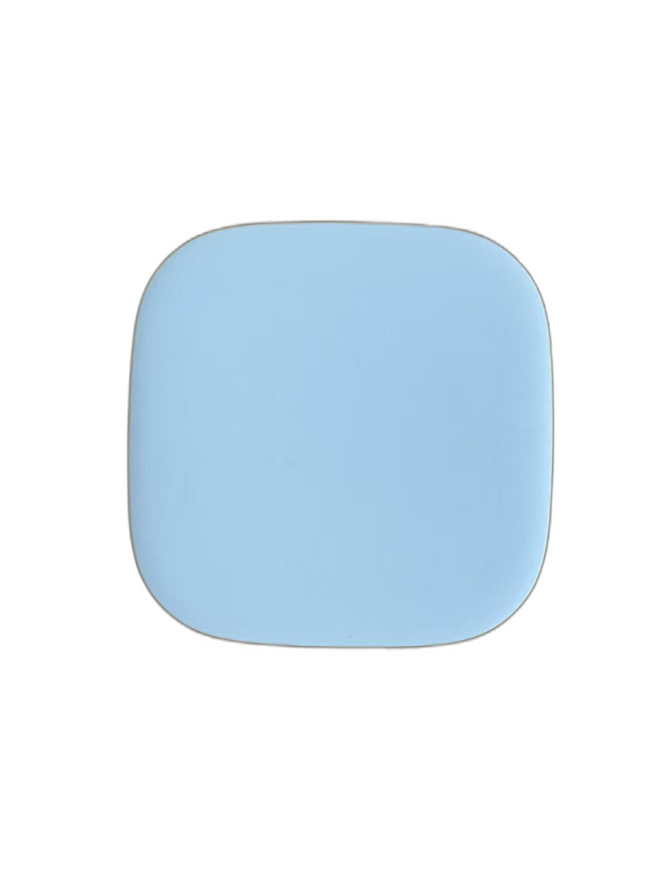
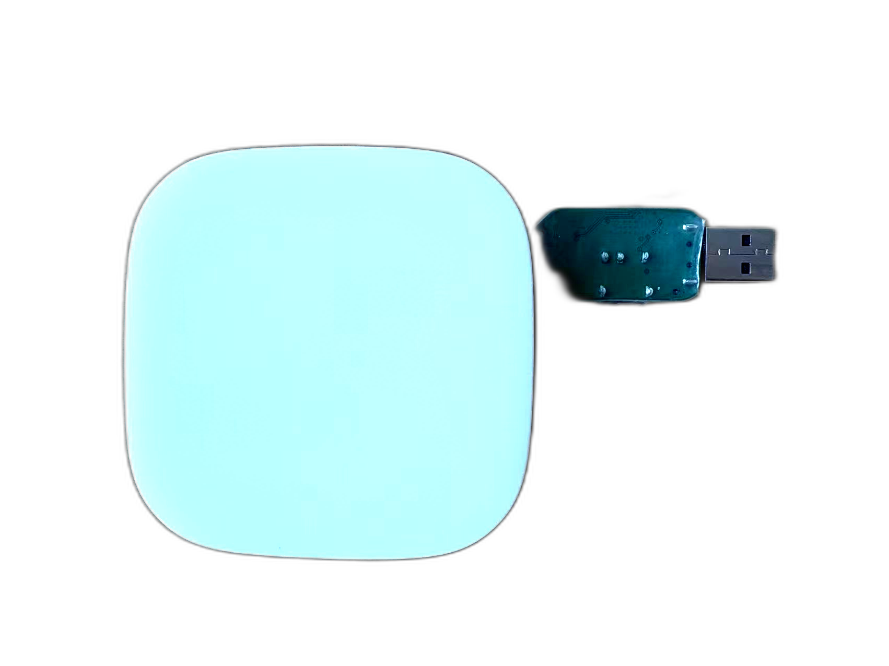
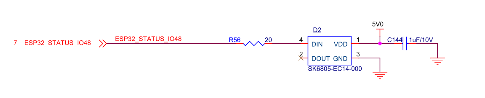
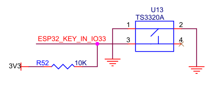

# PRO 模组简介

## 目录

- [1. 模组概述](#1-模组概述)
- [2. 外观与尺寸](#2-外观与尺寸)
- [3. 技术规格和主要特性](#3-技术规格和主要特性)
- [4. 开发与烧录调试方向](#4-开发与烧录调试方向)
- [5. 接口说明](#5-接口说明)
- [5.1 烧录调试器 Type-C 接口说明](#51-烧录调试器-type-c-接口说明)
- [5.2 状态 RGB LED 接口参考](#52-状态-rgb-led-接口参考)
- [5.3 按键接口参考](#53-按键接口参考)
- [6. 相关文档](#6-相关文档)

## 1. 模组概述

`PRO(RTP)` 属于 `RPX 6843` 系列感知模块。`6843` 系列是 `Wavvar` 的旗舰模块产品线，搭载 `TI` 的高性能毫米波雷达技术，适用于需要稳定运动跟踪和精确空间测量的高级空间感知场景。

与 `MINI` 相比，`PRO` 在主控侧采用 `ESP32-S3` 芯片；其余功能能力与 `MINI` 保持一致。

典型应用包括：

- 人体存在检测与跌倒检测
- 动态轨迹跟踪
- 空间占用检测
- 活动识别
- 出入监测
- 在床 / 离床检测
- 点云数据可视化

## 2. 外观与尺寸

  
  
PRO 模组外观参考

| 项目 | 规格 |
| --- | --- |
| 尺寸 | 83x83x17 mm |

## 3. 技术规格和主要特性

| 类别 | 项目 | 规格 |
| --- | --- | --- |
| **供电** | 外部供电 | 5V⎓2A |
|  | 适配器 | 100–240V AC 输入 |
|  | 整机功耗 | < 10W |
| **运行参数** | 安装方式 | 吸顶安装或壁挂安装 |
|  | 最大检测距离（壁挂） | 与安装高度、俯仰角、目标反射特性及算法配置有关，可配置 |
|  | 视场角（FOV） | 水平约 120°–140°（基于天线方向图估算，实际覆盖范围受安装方式、外壳结构及算法配置影响） |
|  | 工作温度 | 0°C 至 45°C（整机环境温度） |
|  | 工作湿度 | < 95%（无冷凝） |
|  | 壁挂俯仰角 | 30°（下俯角度） |
| **雷达特性** | 射频频段 | 60–64 GHz |
|  | 发射/接收通道 | 3TX / 4RX（见注 1） |
|  | 调制方式 | FMCW |
|  | 单发射通道输出功率（EIRP） | 15 dBm |
| **连接与集成** | 云端协议 | MQTT、HTTP、HTTPS |
|  | WiFi | Wi-Fi 802.11 b/g/n（2.4 GHz） |
|  | | Station / SoftAP / Station + SoftAP |
|  | | 最大 150 Mbps（理论值，实际取决于网络环境） |
|  | 本地通信 | UART（数据格式由固件定义，可支持二进制或 JSON） |
|  | 蜂窝网络（可选） | LTE Cat.1 bis（4G，全网通） |
|  | | 下行最高 10 Mbps / 上行最高 5 Mbps （见注 2） | 
| **硬件架构** | 处理架构 | 双芯片异构架构（毫米波雷达 SoC + 主控 MCU） |
|  | 雷达处理单元 | ARM Cortex-R4F + C674x DSP + 硬件加速器（HWA） |
|  | 主控单元 | ESP32-S3（Xtensa LX7 双核，最高 240 MHz） |
|  | 片上内存 | 512 KB（主控 MCU） + 1.75 MB（雷达 SoC） |
|  | PSRAM | 8 MB PSRAM（挂接主控 MCU） |
|  | Flash 存储 | 8 MB（主控 MCU） + 4 MB（雷达 SoC，可选） |
|  | I/O 与指示器 | 1× RGB LED、1× 按键、1× LED（可选） |
|  | IMU（可选） | 可选 6 轴陀螺仪 + 3 轴加速度计 |
|  | 环境光传感器（可选） | 可选支持 |
|  | 语音(可选) | 可选支持(1x 喇嘛 1x mic) |

> 注 1：本条“发射/接收通道”参数说明为：`1.3 V` 模式下最多支持 `2TX` 同时发射；`3TX` 同时发射需 `1V LDO bypass` 特定模式。

> 注 2: 理论峰值，实际性能取决于网络覆盖、信号质量及运营商配置。

## 4. 开发与烧录调试方向

为确保烧录和串口通信成功，请注意 `Type-C` 接口的方向要求。`Pro` 设备在连接烧录调试器时，应将烧录调试器的 `B` 面与机身正面保持同向。

| 平台 | 对位示意图 |
| --- | --- |
| **Pro 设备**（B 面与机身正面同向） |  |

## 5. 接口说明

`PRO` 模组接口说明包含烧录调试器 `Type-C`、状态 `RGB LED` 以及按键输入三个部分。

### 5.1 烧录调试器 Type-C 接口说明

`USB` 转 `UART V1.3` 调试板用于固件烧录和串口控制台访问。两个版本的调试板具有相同的 `Type-C` 引脚定义和通信能力。

如果仅用于供电，模块不区分 `A` 面和 `B` 面。若用于通信，模块的 `Type-C` 接口则对正反面敏感。引脚定义如下。

| Type-C | 编号 |
| --- | --- |
| A5 | UART_RX |
| A6 | RTS |
| A7 | DTR |
| B8 | UART_TX |
| A1/A12/B1/B12 | GND |
| A4/A9/B4/B9 | 5V 输入 |

`USB-to-UART V1.3` 烧录调试器引脚定义如下。

| 引脚 | 颜色 | 信号 |
| --- | --- | --- |
| A5 | 橙色 | RX |
| A6 | 绿色 | RTS |
| A7 | 蓝色 | DTR |
| B8 | 黄色 | TX |
| GND | 黑色 | GND |
| VBUS | 红色 | 5V |

### 5.2 状态 RGB LED 接口参考

`PRO` 板上提供 `RGB` 状态 `LED`，主控侧采用 `ESP32-S3`。当前参考图如下。

  
  
PRO 状态 RGB LED 接口参考

### 5.3 按键接口参考

`PRO` 板上提供按键输入接口，当前参考图如下。

  
  
PRO 按键接口参考

## 6. 相关文档

- [RPX 系列使用指南](./rpx_cn.md)
