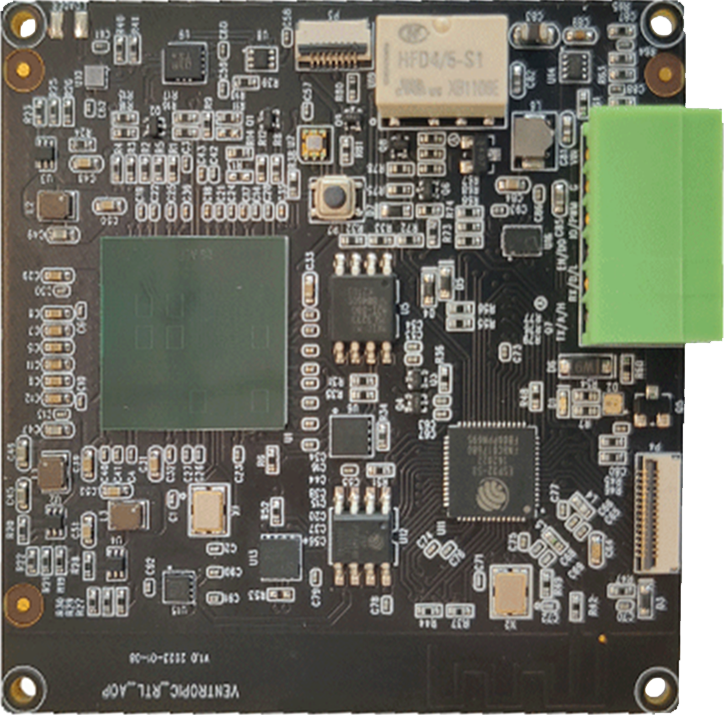
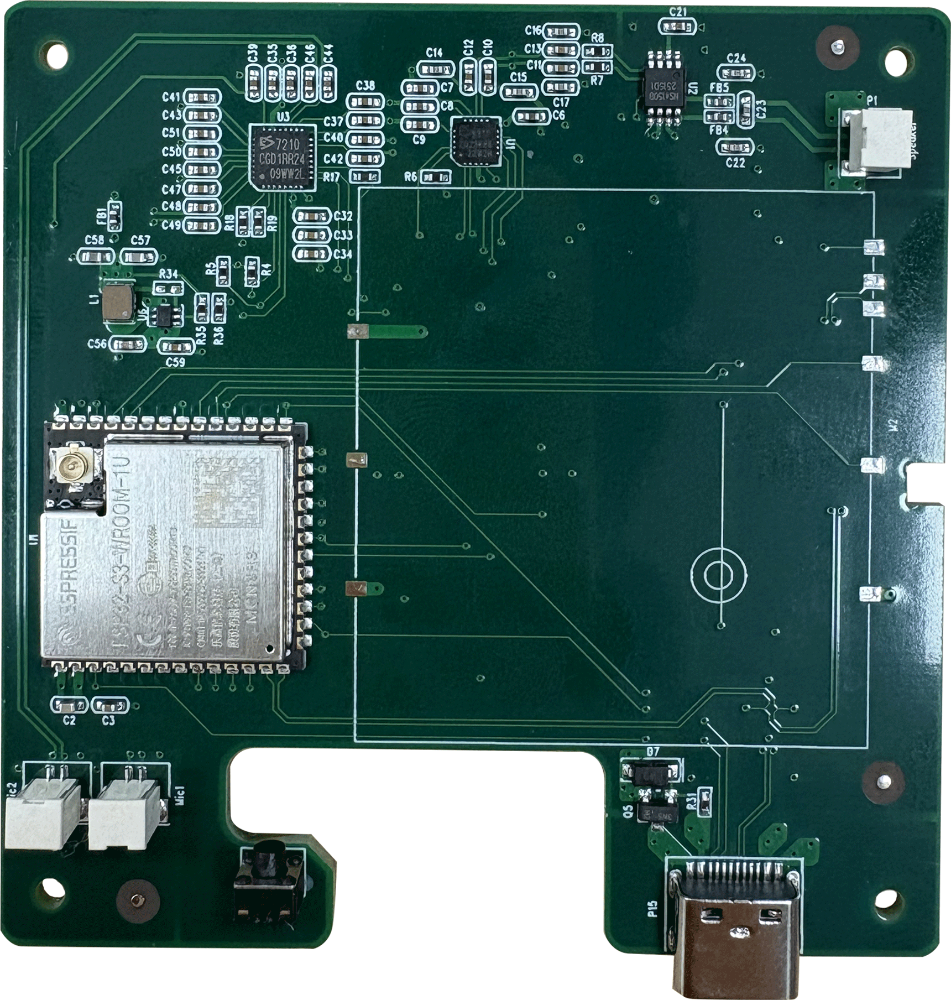
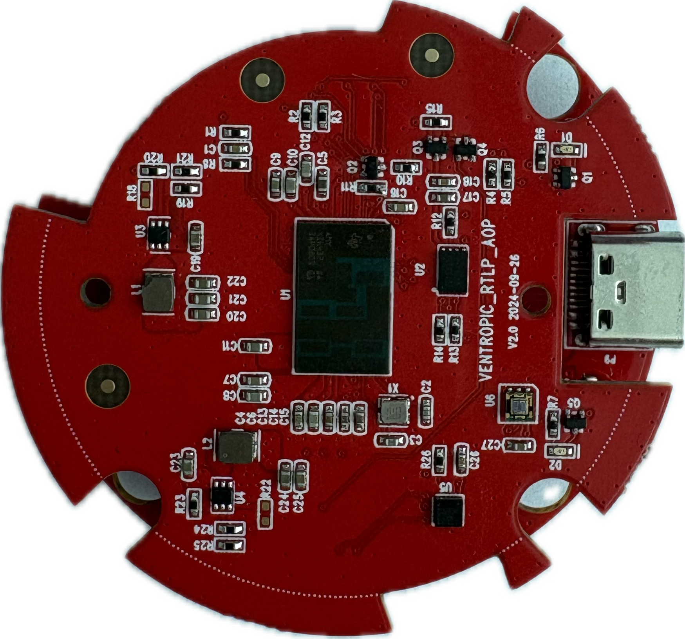
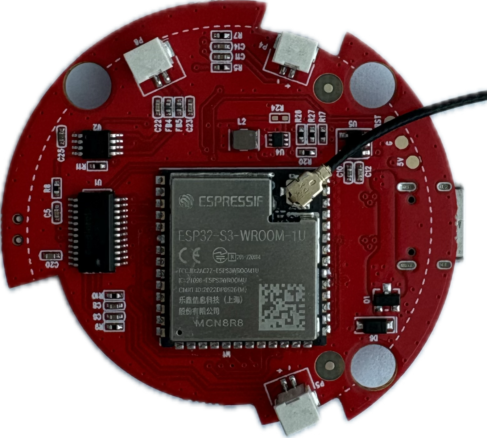
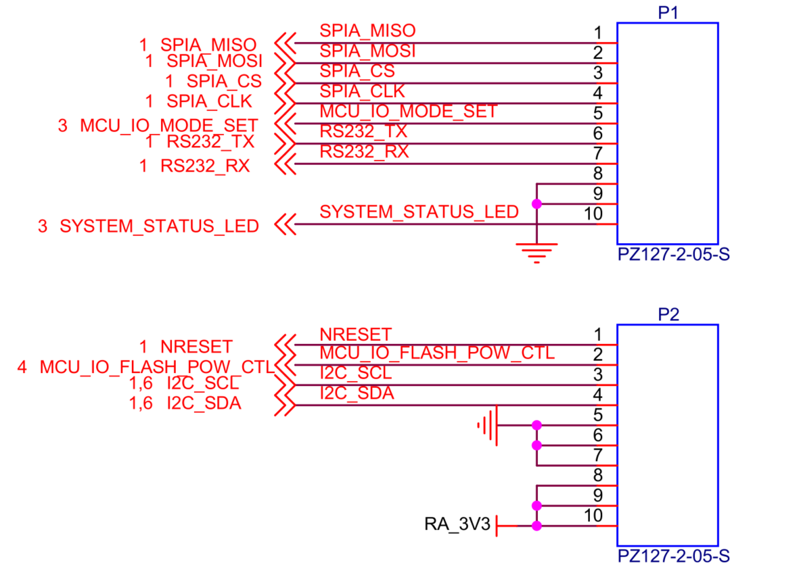
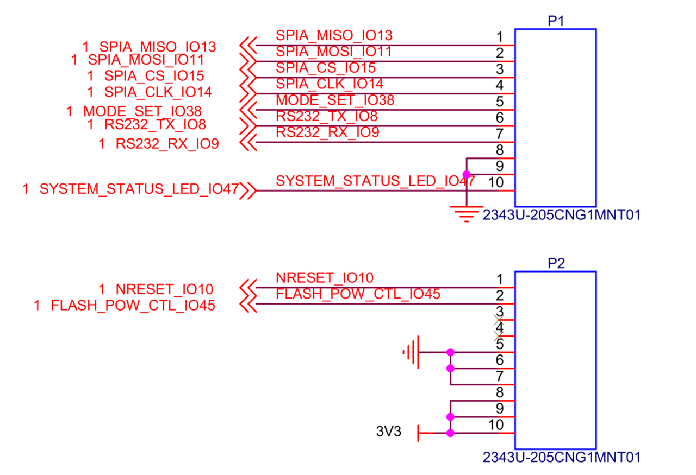
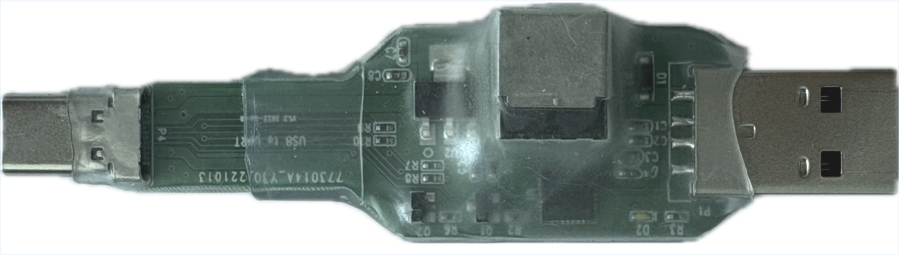
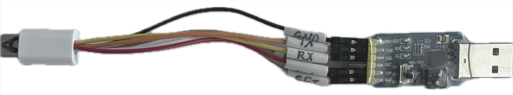
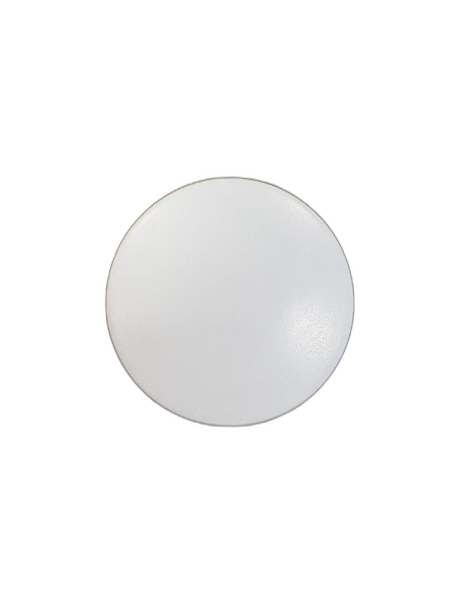

# RPX 模块使用指南

[English Version](./rpx.md)

**版本：** 1.2 
**作者：** Wavvar Technologies 
**日期：** 2025 年 8 月 

## 1. 概述

本文档聚焦 `RPX` 系列模块，包括 `6843` 系列产品以及 `6432` 类别中的 `RPI` 平台。

`WDR` 属于另一条产品系列，因此单独维护文档。关于 `WDR/MDR` 系统级说明，请参考 [./mdr_cn.md](./mdr_cn.md)；关于独立 `ML6432Ax` 雷达板说明，请参考 [./ml6432ax_cn.md](./ml6432ax_cn.md)。

## 2. 6843 系列感知模块

6843 系列是我们的旗舰模块产品线，搭载 TI 的高性能毫米波雷达技术，适用于需要稳定运动跟踪和精确空间测量的高级空间感知场景。

| MINI | RTP | RTL | CFH |
| --- | --- | --- | --- |
|  |  |  |  |
| **模组尺寸：** 47×56×6.8mm | **模组尺寸：** 65×65×10.5mm | **模组尺寸：** 56×56×12mm | **模组尺寸：** 70×71.5×11mm |

### 2.1 目标应用

- 人体存在检测与跌倒检测
- 动态轨迹跟踪
- 空间占用检测
- 活动识别
- 出入监测
- 在床 / 离床检测
- 点云数据可视化

### 2.2 规格参数

| 类别 | 项目 | 规格 |
| --- | --- | --- |
| **供电** | 外部供电 | 5V⎓2A |
|  | 适配器 | 100-240V AC 输入 |
|  | 功耗 | < 10W |
| **运行参数** | 主要安装方式 | 吸顶安装或壁挂安装 |
|  | 最大检测距离（壁挂） | 最远可达 30m |
|  | 视场角（FOV） | 140°（推荐 120° 以获得最佳性能） |
|  | 工作温度 | 0°C 至 45°C |
|  | 工作湿度 | < 95%（无冷凝） |
|  | 壁挂俯仰角 | 15°、30°、45°（大于 30° 可定制） |
| **雷达特性** | 射频频段 | 60-64 GHz |
|  | 发射/接收通道 | 3T4R |
|  | 调制方式 | FMCW |
|  | 发射功率 | 单通道 15 dBm |
| **连接与集成** | 云端协议 | MQTT、HTTP、HTTPS |
|  | 本地通信 | 串口 UART（二进制或 JSON 格式；高度可定制） |
| **硬件架构** | MCU 核心 | 双核 + 三核架构 |
|  | 协处理器 | 硬件加速器（HWA）+ DSP |
|  | 内存（RAM） | 520 KB + 8 MB（RFC-P02-06 运行于 512KB + 8MB） |
|  | Flash 存储 | 8 MB |
|  | I/O 与指示器 | 2× LED、1× 按键 |
|  | IMU（可选） | 9 轴陀螺仪/加速度计 |
|  | 环境光传感器 | 可选支持 |
|  | 音频输入（可选） | 单通道麦克风 |
|  | 音频输出（可选） | 8Ω 扬声器 |

### 2.3 硬件接口与控制

`RTP` 和 `RPI` 模块均集成了状态 LED 与按键，并由 ESP32-S3 微控制器和雷达 SoC 分别独立管理。`RTP` 模块的 GPIO 映射如下。

| 模块 | 组件 | 控制芯片 | LED 类型 / 说明 | GPIO |
| --- | --- | --- | --- | --- |
| RTP | LED1 | ESP32-S3 | RGB LED | ESP32_LED_IO48 |
| RTP | LED2 | 雷达芯片 | LED | AR_GPIO_2 |
| RTP | 按键 | ESP32-S3 | - | ESP32_KEY_IO33 |

## 3. RPI 6432 感知模块

在 RPX 系列中，`RPI` 是一款紧凑型 `6432` 类感知平台，适合低功耗人体存在检测及体征相关应用。

| 正面视图 | 背面视图 | 尺寸 |
| --- | --- | --- |
|  |  | 49×7mm |

关于基于 `ML6432A` / `ML6432A_BO` 的 `WDR/MDR` 系列，请参考 [./mdr_cn.md](./mdr_cn.md) 和 [./ml6432ax_cn.md](./ml6432ax_cn.md)。

### 3.1 目标应用

- 非接触式体征相关监测
- 紧凑型嵌入式产品中的存在检测
- 楼宇自动化与空间占用感知
- 消费电子集成
- 安防与运动触发类应用

### 3.2 规格参数

| 类别 | 项目 | 规格 |
| --- | --- | --- |
| **供电** | 输入要求 | 3.3V，峰值 4A |
|  | 典型功耗 | ~200 - 300 mW |
| **雷达特性** | 射频频段 | 57 - 64 GHz |
|  | 发射/接收通道 | 2T3R |
|  | 发射功率 | 11 dBm |
|  | 检测范围 | 0.1m - 20m（移动人员 / 大目标）；微动检测 < 6m |
|  | 视场角（FOV） | 水平 ±70° / 垂直 ±60° |
| **连接性** | 支持接口 | UART、SPI、CAN FD、SOP I/O |

### 3.3 硬件接口与状态指示

`RPI` 顶板包含两个状态 LED。其中一个由底板上的 ESP32-S3 通过排针驱动，另一个由雷达芯片直接控制。

| 模块 | 组件 | 控制器 | 类型 | GPIO 引脚 |
| --- | --- | --- | --- | --- |
| RPI | LED1 (D1) | ESP32-S3 | LED | ESP32_LED_IO47 |
| RPI | LED2 (D2) | 雷达芯片 | LED | AR_IO5 |
| RPI | 按键 | ESP32-S3（底板） | - | ESP32_KEY_IO40 |

**RPI 连接器引脚定义** 
`RPI` 模块由顶板和底板组成，两者通过两组 10 针排针连接。连接器引脚定义如下图所示。

| RPI 顶板连接器引脚定义 | RPI 底板连接器引脚定义 |
| --- | --- |
|  |  |

## 4. 硬件开发指南

要开始基于 Wavvar 模块进行开发和测试，必须先通过我们的烧录调试器将硬件正确连接到计算机。以下各节说明如何建立这些连接，并安装所需的软件环境。

### 4.1 开发环境搭建（RTP 与 RPI）

**SDK 安装：** 如需进行定制软件开发，请参考 Espressif 官方文档配置 ESP-IDF 环境，并编译 `hello_world` 示例： 
[Espressif ESP-IDF Get Started](https://docs.espressif.com/projects/esp-idf/en/release-v5.4/esp32/get-started/index.html)

### 4.2 烧录调试器适配器

USB 转 UART V1.3 调试板用于固件烧录和串口控制台访问，提供两种配置：**5V/2A** 和 **5V/500mA**。这两个版本具有相同的 Type-C 引脚定义和通信能力。

*注意：在 4G/LTE 网络上主动工作的 RTP 设备需要更高峰值电流，必须使用 **5V/2A** 版本供电。*

**供电输入说明：**

- `RPI` 模块可在标准 **5V/1A** 电源下稳定运行。
- 其他所有 Wavvar 模块及集成产品均需要 **5V/2A** 电源。

下图所示的 **5V/2A** 调试器版本带有辅助供电端子，可接入外部 5V/2A 直流适配器。

下图展示 **5V/500mA** 版本。

### 4.3 调试器方向与硬件对位

为确保烧录和串口通信成功，请注意 Type-C 接口的方向要求。

- **RTP 模块对位：** 将烧录调试器的 **A 面** 与模块的 **A 面** 对齐。
- **RPI 模块对位：** 将烧录调试器的 **A 面** 与顶板的 **A 面** 对齐。
- **Mini 与 Pro 设备方向：**

| 平台 | 对位示意图 |
| --- | --- |
| **Mini 设备**（A 面与机身正面同向） |  |
| **Pro 设备**（B 面与机身正面同向） |  |

### 4.4 烧录调试器上的 Type-C 接口说明

如果仅用于供电，模块不区分 A 面和 B 面。若用于通信，模块的 Type-C 接口则对正反面敏感。引脚定义如下。

| Type-C | 编号 |
| --- | --- |
| A5 | UART_RX |
| A6 | RTS |
| A7 | DTR |
| B8 | UART_TX |
| A1/A12/B1/B12 | GND |
| A4/A9/B4/B9 | 5V 输入 |

### 4.5 USB-to-UART V1.3 烧录调试器引脚定义

| 引脚 | 颜色 | 信号 |
| --- | --- | --- |
| A5 | 橙色 | RX |
| A6 | 绿色 | RTS |
| A7 | 蓝色 | DTR |
| B8 | 黄色 | TX |
| GND | 黑色 | GND |
| VBUS | 红色 | 5V |

## 5. 定制外壳与工业设计

Wavvar 提供端到端的产品落地服务。除上述感知模块外，我们还提供工业设计和机械设计支持，帮助客户完成整机集成。

| MINI 外壳 | PRO 外壳 | RPI 外壳 |
| --- | --- | --- |
|  |  |  |

## 6. 旧版 DS 模块支持

对于正在使用或维护我们上一代产品的客户，DS 模块可提供基础评估能力。

### 6.1 评估与原型开发

对于基础模块开发，我们建议参考 Texas Instruments 官方文档： 
[TI AWR6843AOPEVM Evaluation Module Guide](https://www.ti.com.cn/tool/cn/AWR6843AOPEVM)

**SOP 模式配置（烧录模式）：** 
*注意：* 为避免对邻近 SMD 元件造成连带热损伤，我们强烈不建议焊接 SOP 引脚。建议在烧录时使用弹簧针，或通过临时机械压接方式短接端子。
