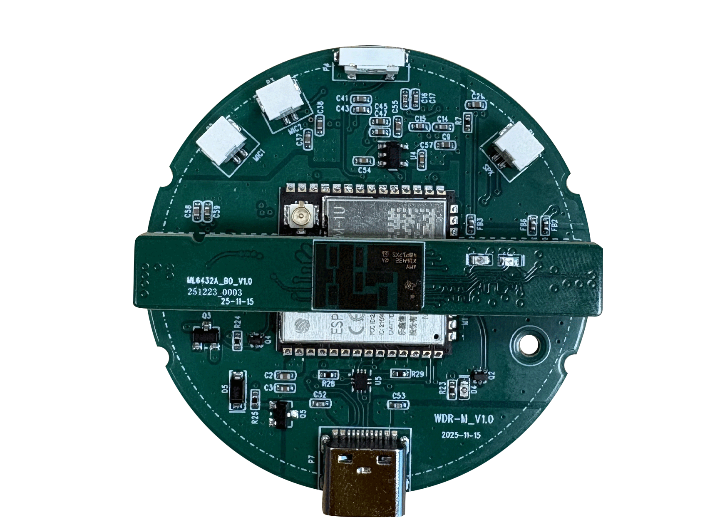
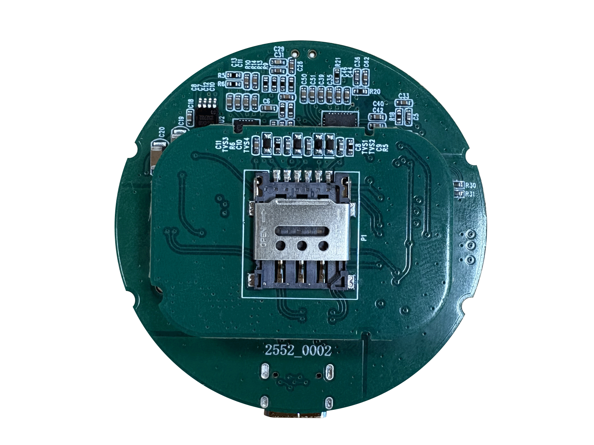
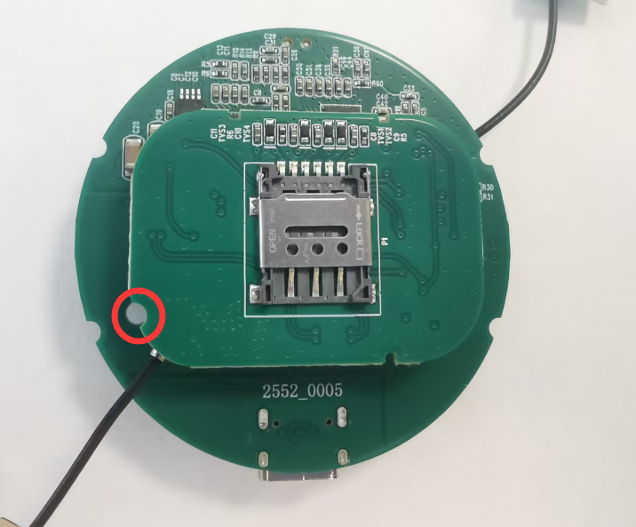
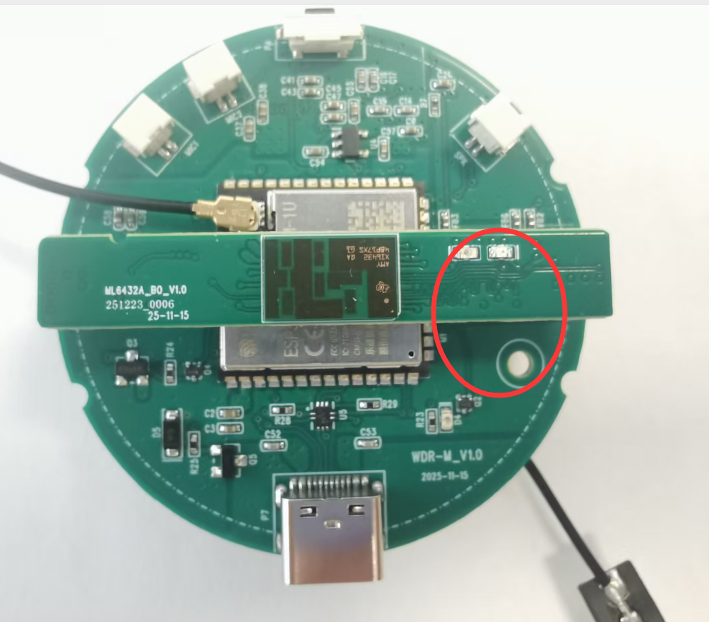
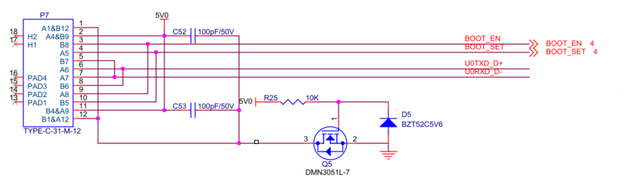
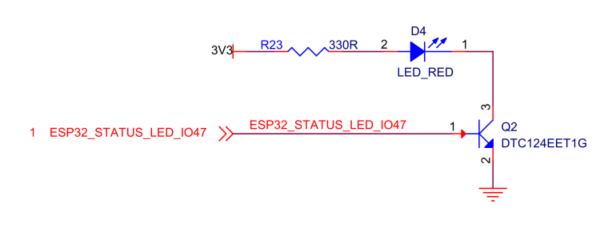
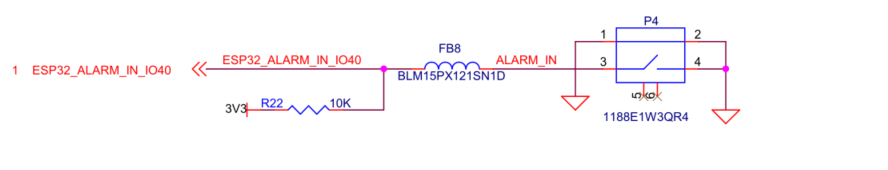
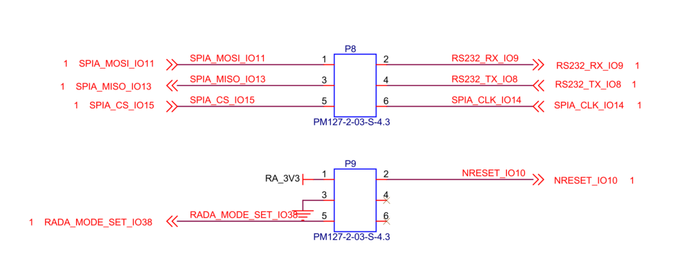
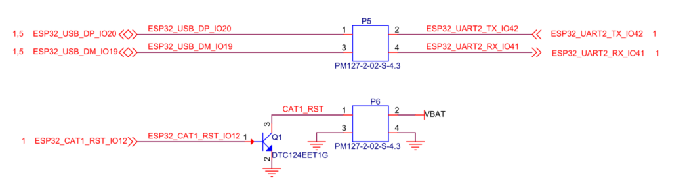

# WDR-M Main Controller Carrier Board Introduction

[Chinese Version](./wdr-m_cn.md)

## Table of Contents

- [1. Board Overview](#1-board-overview)
- [2. Technical Specifications and Key Features](#2-technical-specifications-and-key-features)
- [3. System Role and Compatibility](#3-system-role-and-compatibility)
- [4. Interface Description](#4-interface-description)
- [4.1 USB Type-C Interface Reference](#41-usb-type-c-interface-reference)
- [4.2 Status LED Interface Reference](#42-status-led-interface-reference)
- [4.3 Key Interface Reference](#43-key-interface-reference)
- [4.4 External Radar Interface Description](#44-external-radar-interface-description)
- [5. Interconnect and Board-Level Reference Diagrams](#5-interconnect-and-board-level-reference-diagrams)
- [6. Related Documents](#6-related-documents)

## 1. Board Overview

`WDR-M` is the main controller carrier board in the `WDR` system. In detailed hardware descriptions, this role is consistently denoted as `MDR-M` to identify the specific board-level structure. A complete `WDR` module is composed of the `ML6432A_BO` radar board, the `MDR-M` main controller board, and the `WDR-4G` communication board. Within this architecture, `WDR-M` handles power distribution, local control, peripheral management, and board-to-board interconnection.

  
  
MDR module top view

  
  
  
WDR series appearance reference

## 2. Technical Specifications and Key Features

| Category | Item | Specification |
| --- | --- | --- |
| **Power** | External Supply | 5V⎓2A |
|  | Adapter | 100-240V AC input |
|  | System Power Consumption | Typical: < 2W |
|  |  | Peak: < 5W (including peripherals) |
| **Operating Parameters** | Installation Method | Ceiling mount or wall mount |
|  | Operating Temperature | 0°C to 45°C (system ambient temperature) |
|  | Operating Humidity | < 95% (non-condensing) |
| **Connectivity and Integration** | Cloud Protocols | MQTT, HTTP, HTTPS |
|  | Wi-Fi | Wi-Fi 802.11b/g/n, 20/40 MHz |
|  |  | Station / SoftAP / Station + SoftAP |
|  |  | Up to 150 Mbps (802.11n, 40 MHz, theoretical; actual performance depends on the network environment) |
|  | Bluetooth | Bluetooth 5 (LE) |
|  | Local Communication | USB (configurable, see Note 1) |
| **Hardware Architecture** | Processing Architecture | Dual-chip heterogeneous architecture (external radar board + main MCU) |
|  | Main MCU | ESP32-S3 (dual-core Xtensa LX7, up to 240 MHz) |
|  | On-chip Memory | 512 KB |
|  | PSRAM | 8 MB |
|  | Flash Storage | 8 MB (main MCU) |
|  | I/O and Indicators | 1x status LED, 1x key |
|  | External Radar (Optional) | External radar chip / radar board connected into the WDR system through the interface |
|  | Cellular Network (Optional) | External WDR-4G add-on (see Note 1) |

> Note 1: When the external 4G board is used, it occupies the USB channel, so the 4G add-on and external USB access are mutually exclusive. USB and TTL serial are also mutually exclusive.

## 3. System Role and Compatibility

From a system-architecture perspective, `WDR-M` sits in the middle layer and connects the radar board with the `WDR-4G` communication board, while also providing the interfaces needed for local debugging, board-level control, and communication routing.

At the functional-support level, `WDR-M` supports the `ML6432Ax` series. The main difference lies in the mechanical integration method:

| Compatible Radar Board | Integration Method | Description |
| --- | --- | --- |
| `ML6432A_BO` | Direct plug-in connection | Can be inserted directly into `WDR-M` through a board-to-board connection |
| `ML6432A` | Adapter-cable connection | Functionally supported as well, but requires an adapter cable |

Both radar-board variants use the same radar-side interface definition. If only standalone radar-board flashing or debugging is required, both `ML6432A` and `ML6432A_BO` can be used with the same `ML6432Ax` workflow.

  
  
  
Direct plug-in orientation reference between WDR-M and ML6432A_BO

## 4. Interface Description

The main interfaces on the `WDR-M` board include `USB Type-C`, the status `LED`, key input, and the external radar access method.

### 4.1 USB Type-C Interface Reference

`P7` is the `USB Type-C` interface, which can be used for local connection or debugging and maintenance.

  
  
Figure 1. USB Type-C interface reference on WDR-M

### 4.2 Status LED Interface Reference

The `WDR-M` board provides a status `LED` indicator for quick observation of the current debug status.

  
  
Figure 2. Status LED reference on WDR-M

### 4.3 Key Interface Reference

The `WDR-M` board provides a key input, which can be used for local control or interaction behavior design.

  
  
Figure 3. Key reference on WDR-M

### 4.4 External Radar Interface Description

The `WDR-M` board does not integrate a radar chip locally. The radar function is connected as an external board. During system integration, the external radar board works together with `WDR-M` and the `4G Cat1` communication board. At the document level, `WDR-M` mainly retains the controller-side and interface-side description and does not expand on onboard radar parameters.

## 5. Interconnect and Board-Level Reference Diagrams

Both the `4G Cat1` communication board and the radar board connect to `WDR-M` through dedicated board-level signals. The diagrams below illustrate the main interconnect relationships between `WDR-M`, the radar board, and the communication board.

  
  
Figure 4. WDR-M to radar board connection reference

  
  
Figure 5. WDR-M to 4G Cat1 communication board connection reference

These references are suitable for checking plug-in direction, tracing `UART` or `USB` related signals, or reviewing how the communication board and radar board connect into `WDR-M`.

## 6. Related Documents

- [MDR Module Introduction](./mdr.md)
- [ML6432Ax Series Introduction](./ml6432ax.md)
- [WDR-4G Communication Board Introduction](./wdr-4g.md)
- [PRO Module Introduction](./pro.md)
