# WDR-M Main Controller Carrier Board Introduction

[Chinese Version](./wdr-m_cn.md)

## Table of Contents

- [1. Board Overview](#1-board-overview)
- [2. Technical Specifications and Key Features](#2-technical-specifications-and-key-features)
- [3. System Role and Compatibility](#3-system-role-and-compatibility)
- [4. Interface Description](#4-interface-description)
- [4.1 USB Type-C Interface Reference](#41-usb-type-c-interface-reference)
- [4.2 Status LED Interface Reference](#42-status-led-interface-reference)
- [4.3 Key Interface Reference](#43-key-interface-reference)
- [4.4 Audio Schematic Description](#44-audio-schematic-description)
- [4.4.1 Audio Playback and Amplifier Path](#441-audio-playback-and-amplifier-path)
- [4.4.2 Microphone Capture Path](#442-microphone-capture-path)
- [4.5 External Radar Interface Description](#45-external-radar-interface-description)
- [5. Interconnect and Board-Level Reference Diagrams](#5-interconnect-and-board-level-reference-diagrams)
- [5.4 ESP32-S3-WROOM-1U-N8R8 Pin Description](#54-esp32-s3-wroom-1u-n8r8-pin-description)
- [6. Related Documents](#6-related-documents)

## 1. Board Overview

`WDR-M` is the main controller carrier board in the `WDR` system. A complete `WDR` module is composed of the `ML6432A_BO` radar board, the `WDR-M` main controller board, and the `WDR-4G` communication board. Within this architecture, `WDR-M` handles power distribution, local control, peripheral management, and board-to-board interconnection.

  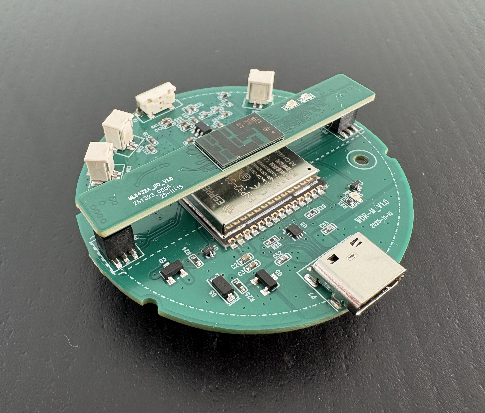
  
WDR module top view

  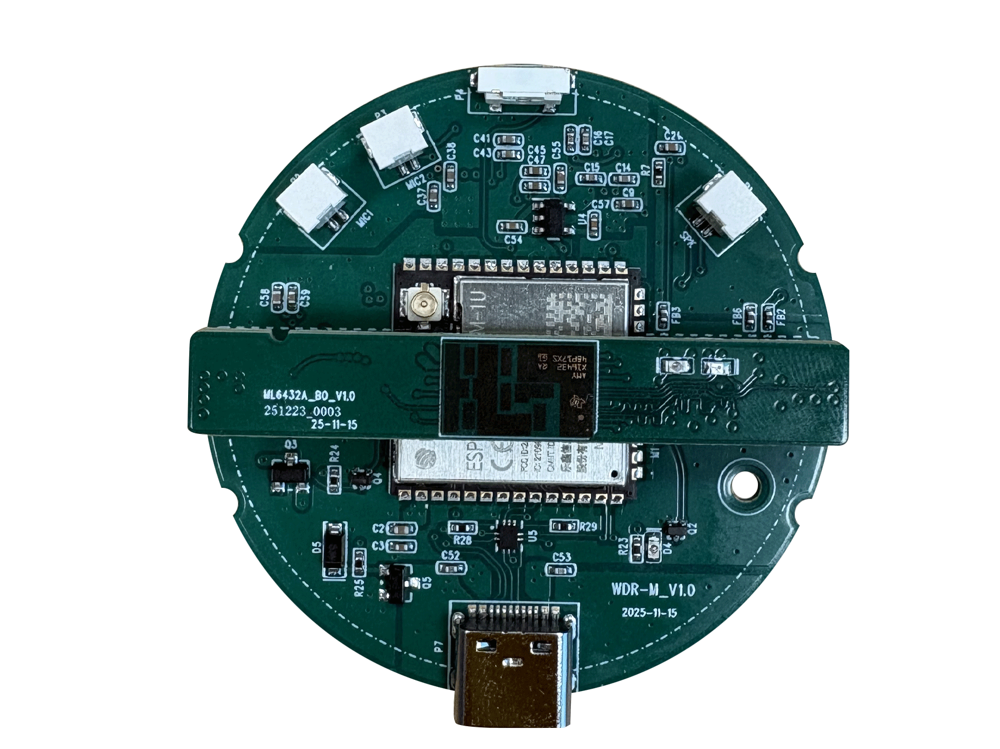
  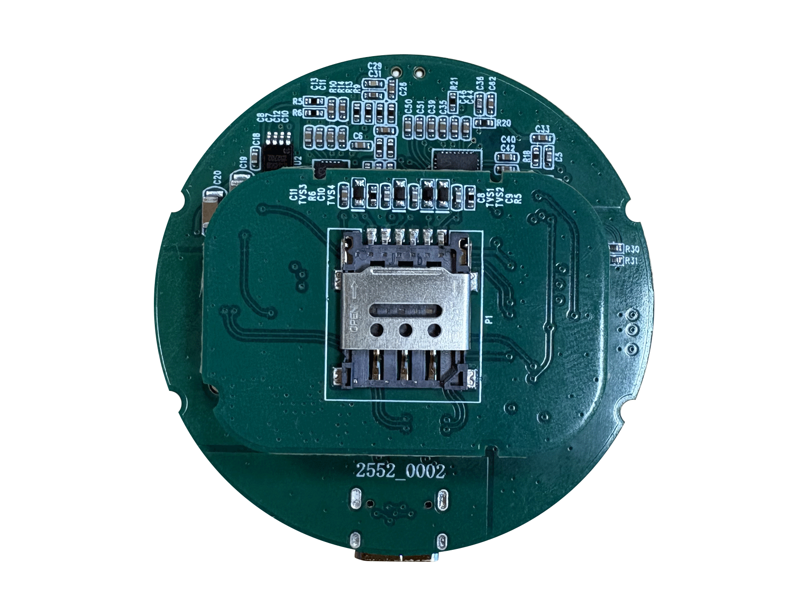
  
WDR series appearance reference

## 2. Technical Specifications and Key Features

| Category | Item | Specification |
| --- | --- | --- |
| **Power** | External Supply | 5V⎓2A |
|  | Adapter | 100-240V AC input |
|  | System Power Consumption | Typical: < 2W |
|  |  | Peak: < 5W (including peripherals) |
| **Operating Parameters** | Installation Method | Ceiling mount or wall mount |
|  | Operating Temperature | 0°C to 45°C (system ambient temperature) |
|  | Operating Humidity | < 95% (non-condensing) |
| **Connectivity and Integration** | Cloud Protocols | MQTT, HTTP, HTTPS |
|  | Wi-Fi | Wi-Fi 802.11b/g/n, 20/40 MHz |
|  |  | Station / SoftAP / Station + SoftAP |
|  |  | Up to 150 Mbps (802.11n, 40 MHz, theoretical; actual performance depends on the network environment) |
|  | Bluetooth | Bluetooth 5 (LE) |
|  | Local Communication | USB (configurable, see Note 1) |
| **Hardware Architecture** | Processing Architecture | Dual-chip heterogeneous architecture (external radar board + main MCU) |
|  | Main MCU | ESP32-S3 (dual-core Xtensa LX7, up to 240 MHz) |
|  | On-chip Memory | 512 KB |
|  | PSRAM | 8 MB |
|  | Flash Storage | 8 MB (main MCU) |
|  | I/O and Indicators | 1x status LED, 1x key |
|  | Audio Capability | Supports `I2S` / `I2C` audio codec control, `2x MIC` inputs, and `1x` speaker output |
|  | External Radar (Optional) | External radar chip / radar board connected into the WDR system through the interface |
|  | Cellular Network (Optional) | External WDR-4G add-on (see Note 1) |

> Note 1: When the external 4G board is used, it occupies the USB channel, so the 4G add-on and external USB access are mutually exclusive. USB and TTL serial are also mutually exclusive.

## 3. System Role and Compatibility

From a system-architecture perspective, `WDR-M` sits in the middle layer and connects the radar board with the `WDR-4G` communication board, while also providing the interfaces needed for local debugging, board-level control, and communication routing.

At the functional-support level, `WDR-M` supports the `ML6432Ax` series. The main difference lies in the mechanical integration method:

| Compatible Radar Board | Integration Method | Description |
| --- | --- | --- |
| `ML6432A_BO` | Direct plug-in connection | Can be inserted directly into `WDR-M` through a board-to-board connection |
| `ML6432A` | Adapter-cable connection | Functionally supported as well, but requires an adapter cable |

Both radar-board variants use the same radar-side interface definition. If only standalone radar-board flashing or debugging is required, both `ML6432A` and `ML6432A_BO` can be used with the same `ML6432Ax` workflow.

  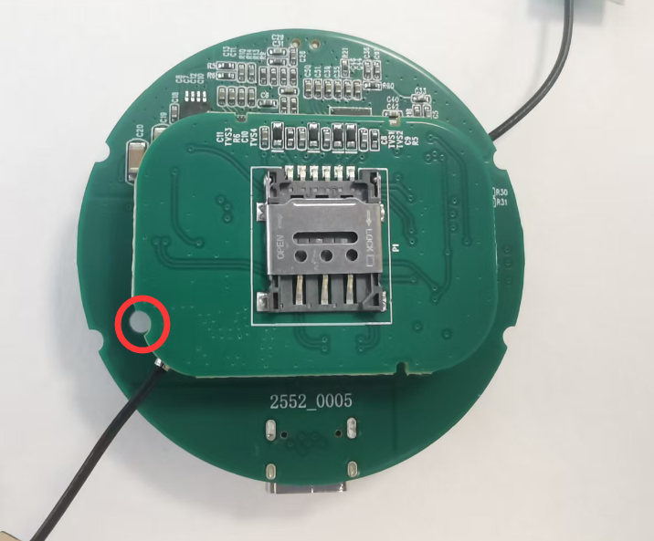
  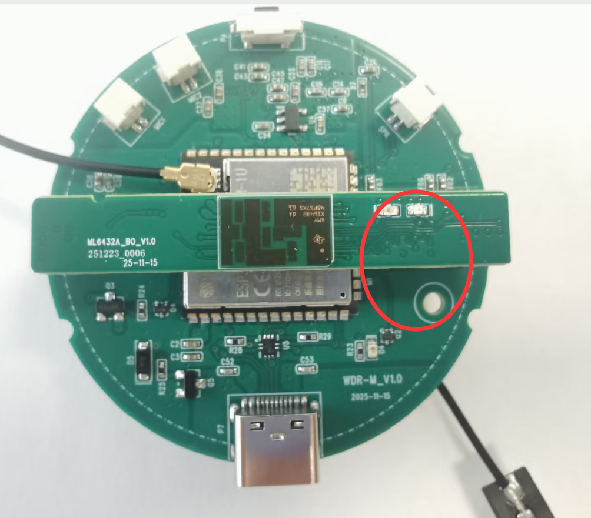
  
Direct plug-in orientation reference between WDR-M and ML6432A_BO

## 4. Interface Description

The main interfaces on the `WDR-M` board include `USB Type-C`, the status `LED`, key input, the audio path, and the external radar access method.

### 4.1 USB Type-C Interface Reference

`P7` is the `USB Type-C` interface, which can be used for local connection or debugging and maintenance.

  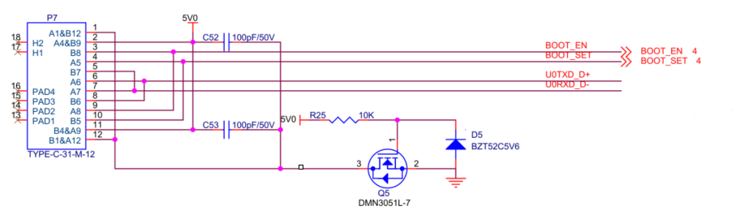
  
Figure 1. USB Type-C interface reference on WDR-M

### 4.2 Status LED Interface Reference

The `WDR-M` board provides a status `LED` indicator for quick observation of the current debug status.

  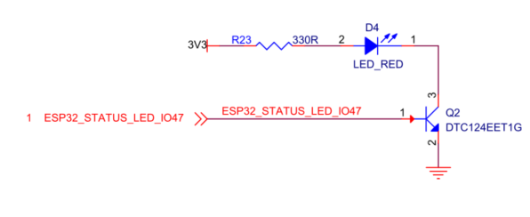
  
Figure 2. Status LED reference on WDR-M

### 4.3 Key Interface Reference

The `WDR-M` board provides a key input, which can be used for local control or interaction behavior design.

  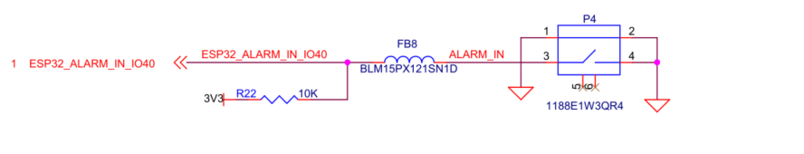
  
Figure 3. Key reference on WDR-M

### 4.4 Audio Schematic Description

Based on the newly added schematics, `WDR-M` reserves a complete audio subsystem. The main controller configures the audio devices over `I2C` and carries digital audio data over `I2S`. At a high level, the design is divided into two parts:

- A codec and power-amplifier path for speaker playback
- A multi-channel capture path for microphone input

### 4.4.1 Audio Playback and Amplifier Path

`wdr-m-audio1.png` shows the playback-side design of `WDR-M`. In this schematic, `ES8311` is used as the audio codec. It is configured from `ESP32-S3` over `I2C` (`SCL` / `SDA`), while playback data is transferred over `I2S` (`MCLK` / `SCLK` / `LRCK` / `DIN`).

  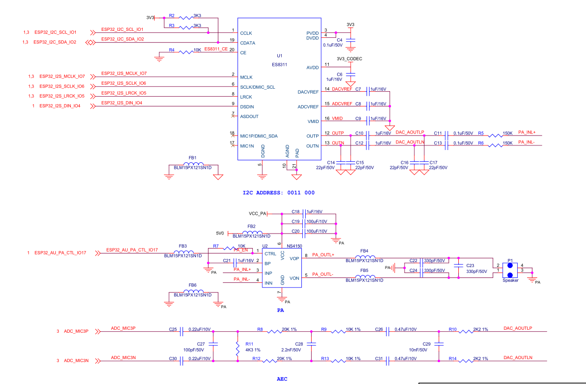
  
Figure 4. WDR-M audio playback and amplifier path schematic

For port mapping, `P1` is the speaker connection port.

### 4.4.2 Microphone Capture Path

`wdr-m-audio2.png` shows the recording-side design of `WDR-M`. In this schematic, `ES7210` is used as the audio `ADC` / microphone front end. The main controller configures it over `I2C` and reads captured audio data back over `I2S` (`MCLK` / `SCLK` / `LRCK` / `DOUT`).

  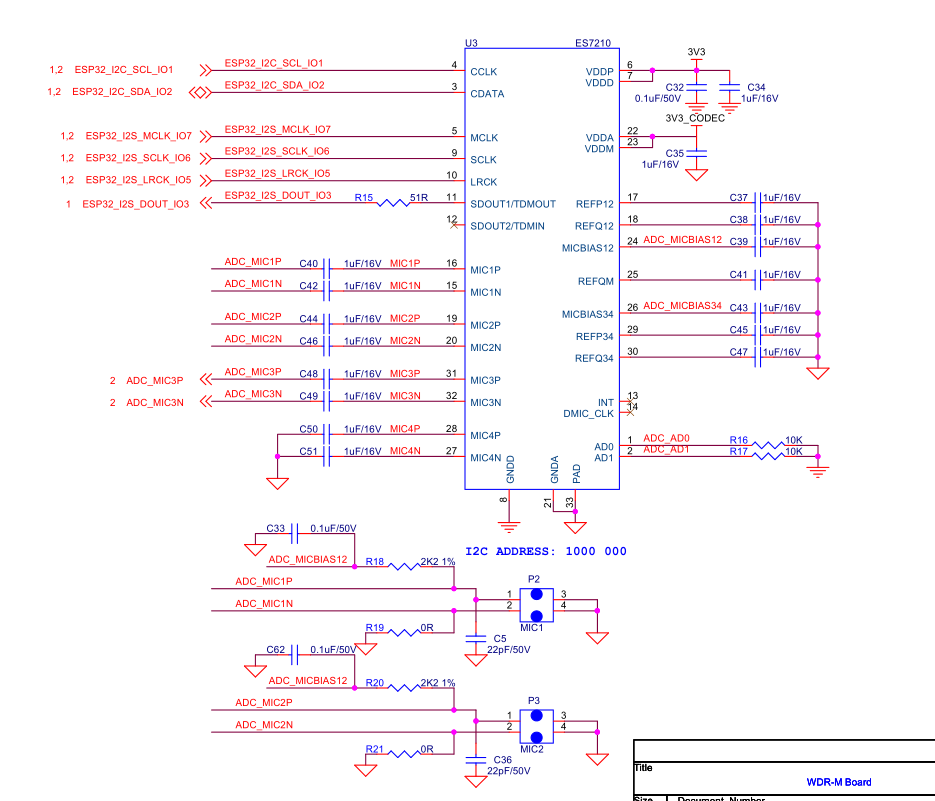
  
Figure 5. WDR-M microphone capture path schematic

For port mapping, `P2` and `P3` are the microphone connection ports.

From a system-integration perspective, these two schematics together show that `WDR-M` is not only the main control and interconnect board of the radar system, but also has the hardware foundation for voice prompts, sound capture, and voice-interaction oriented features.

### 4.5 External Radar Interface Description

The `WDR-M` board does not integrate a radar chip locally. The radar function is connected as an external board. During system integration, the external radar board works together with `WDR-M` and the `4G Cat1` communication board. At the document level, `WDR-M` mainly retains the controller-side and interface-side description and does not expand on onboard radar parameters.

## 5. Interconnect and Board-Level Reference Diagrams

Both the `4G Cat1` communication board and the radar board connect to `WDR-M` through dedicated board-level signals. The diagrams below illustrate the main interconnect relationships between `WDR-M`, the radar board, and the communication board.

  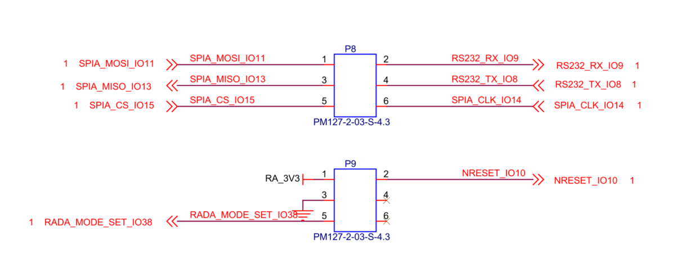
  
Figure 6. WDR-M to radar board connection reference

  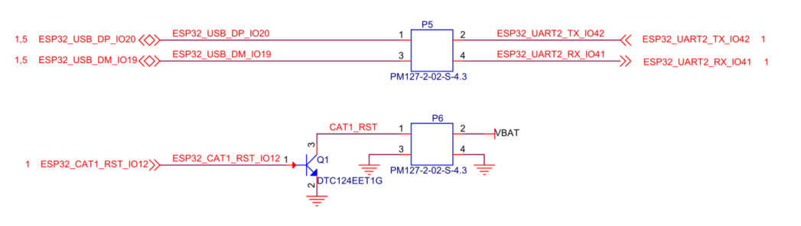
  
Figure 7. WDR-M to 4G Cat1 communication board connection reference

These references are suitable for checking plug-in direction, tracing `UART` or `USB` related signals, or reviewing how the communication board and radar board connect into `WDR-M`.

### 5.1 Pin Description

`WDR-M` uses the `ESP32-S3-WROOM-1U-N8R8` as the main controller module. The following table lists the main exposed pins and their functions.

| Module IO | Type | Function |
| ---- | ---- | ---- |
| IO0  | I/O  | BOOT_SET (boot mode) |
| IO1  | I/O  | I2C_SDA |
| IO2  | I/O  | I2C_SCL |
| IO3  | I/O  | I2S_DOUT / JTAG control |
| IO4  | I/O  | I2S_DIN |
| IO5  | I/O  | I2S_LRCK |
| IO6  | I/O  | I2S_SCLK |
| IO7  | I/O  | I2S_MCLK |
| IO8  | I/O  | RS232_TX |
| IO9  | I/O  | RS232_RX |
| IO10 | I/O  | NRESET |
| IO11 | I/O  | SPIA_MOSI |
| IO12 | I/O  | CAT1_RST |
| IO13 | I/O  | SPIA_MISO |
| IO14 | I/O  | SPIA_CLK |
| IO15 | I/O  | SPIA_CS |
| IO16 | I/O  | S_IN_SW |
| IO17 | I/O  | AU_PA_CTL |
| IO18 | I/O  | Internal reserved, do not multiplex |
| IO19 | I/O  | USB_DM |
| IO20 | I/O  | USB_DP |
| IO21 | I/O  | IOT_PWCTL |
| IO35 | I/O  | Used internally by the module's PSRAM, do not multiplex |
| IO36 | I/O  | Used internally by the module's PSRAM, do not multiplex |
| IO37 | I/O  | Used internally by the module's PSRAM, do not multiplex |
| IO38 | I/O  | RADA_MODE_SET |
| IO39 | I/O  | Internal reserved, do not multiplex |
| IO40 | I/O  | ALARM_IN |
| IO41 | I/O  | UART2_RX |
| IO42 | I/O  | UART2_TX |
| IO43 | UART | DEBUG_TX |
| IO44 | UART | DEBUG_RX |
| IO45 | I/O  | RADA_POW_CTL |
| IO46 | I/O  | MSG_EN |
| IO47 | I/O  | STATUS_LED |
| IO48 | I/O  | Internal reserved, do not multiplex |

## 6. Related Documents

- [ML6432Ax Series Introduction](./ml6432ax.md)
- [WDR-4G Communication Board Introduction](./wdr-4g.md)
- [PRO Module Introduction](./pro.md)
